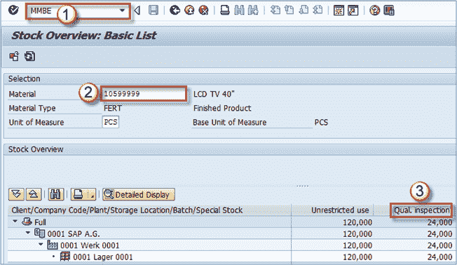
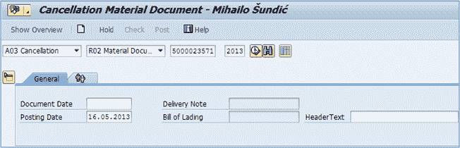
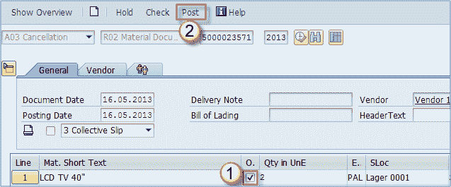
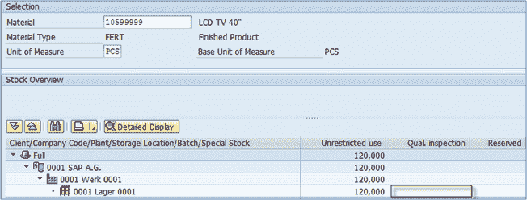

# 如何在 SAP 中冲销（取消）收货 MMBE

> 原文： [https://www.guru99.com/how-to-cancel-goods-receipt.html](https://www.guru99.com/how-to-cancel-goods-receipt.html)

在 MIGO 中过帐收货后，可以在 **MMBE** 事务代码中检查库存水平。

1.  执行交易。
2.  对于要求的物料，将显示工厂的库存水平，存储地点和库存类型（非限制，质量，冻结）。
3.  在“质量检查”列中，您可以看到我们的物料在此处过帐 2 PAL = 24 PCS。我们从以前的一些收货中也有非限制库存。

假设我们犯了一个错误，在这种特殊情况下，我们希望将我们的物料直接过帐到非限制库存。 因此，我们需要取消发布以撤消该过程，然后再次正确执行。

**我们可以使用 MIGO 交易取消过帐。**

**步骤 1）**

选择 **A03 取消**， **R02 物料凭证**，输入从采购订单过帐 GR（收货）后创建的物料凭证。 **执行**。

**步骤 2）**

1.  检查指示项目确定。
2.  发布。

**步骤 3）**

如果我们的收货取消生效，请签入 **MMBE** 。 如您所见，质量检查列为空。 这意味着我们已经成功撤销/取消了收货过帐。

这也意味着我们可以使用 **MIGO** 中的采购订单编号重新过帐收货，这次设置正确。