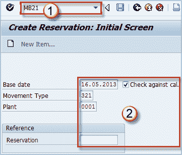
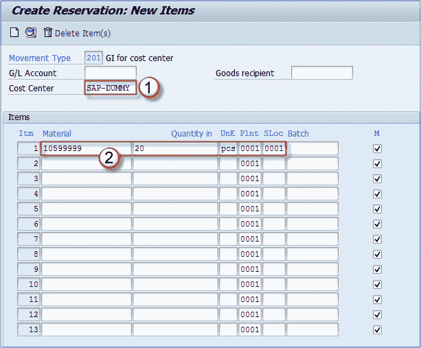
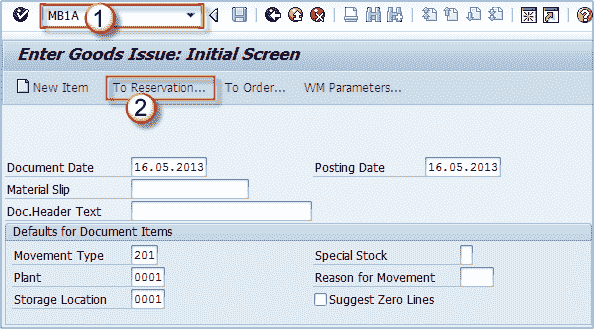
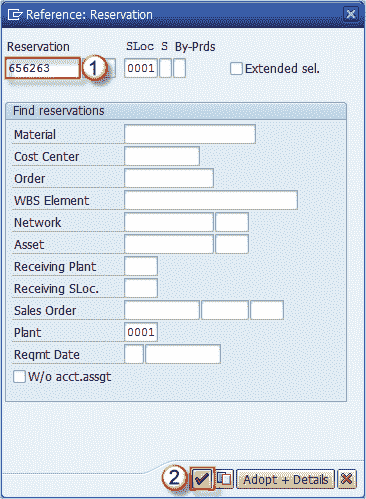
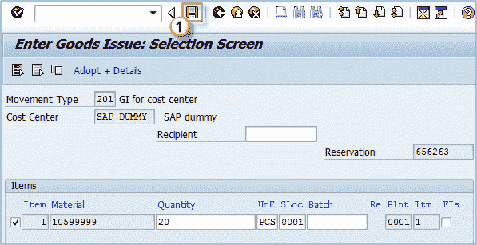
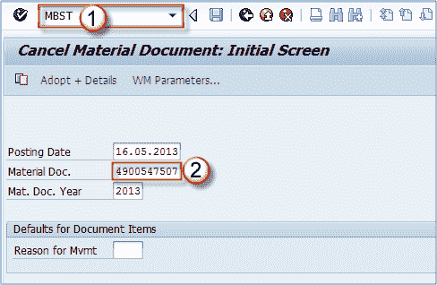
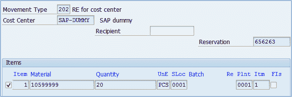
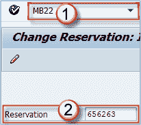
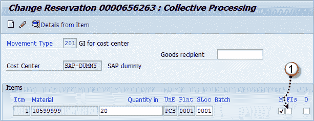

# SAP MB21，MB1A，MBST，MB22 中的库存预留

> 原文： [https://www.guru99.com/reservation-of-inventory.html](https://www.guru99.com/reservation-of-inventory.html)

保留是系统文档，显示对生产，成本中心和任何其他需求的一定数量商品的需求。

预留在计划/ MRP / ATP 中很重要，因为系统在过帐之前会预留所需数量。 如果系统中没有预订，我们可能会遇到一个问题，我们需要将货物用于生产订单，但是由于销售订单是在几分钟前取走的，所以我们无法过帐发货。 当我们创建预订时，系统不允许任何其他文件为其他目的预订货物。 这也取决于 MRP / ATP 的系统设置。 即使销售订单或交货已经预订了商品，您也可以给预订保留始终从库存中取出商品的特权（不是很好的解决方案）。 但是，您也可以自定义系统，以使销售订单在执行可用性检查时不检查预订。

出于多种原因，您可以为物料创建保留。 如果 MRP 设置暗示这种系统行为，则系统也可以创建保留。

这可以由系统自动完成，也可以使用 **MB21** 事务代码来完成。

**步骤 1）**

1.  执行事务 MB21。
2.  根据需要填写字段。

可以为成本中心（移动类型 201），生产订单（移动类型 261），库存转储（311），销售订单，项目，网络等的消耗进行预订。

根据需要选择合适的机芯类型。 选择移动类型 **201** 。

如果您输入了运动类型 **321** （从以上屏幕显示），您肯定会收到错误消息。 这意味着该移动类型不能用于创建预订。

这也意味着您没有紧跟我的步骤。 请阅读上面的文字，上面说我们将使用机芯类型 **201** 。

**步骤 2）**

1.  输入成本中心。
2.  填写项目数据。 物料编号，数量，源存放位置。

保存文档。 您将获得下一步需要使用的预订号。

现在，我们必须为预订创建一个物料凭证。 我们可以通过 MIGO 做到这一点，但是这次让我们学习另一笔交易。

我们可以使用交易代码 **MB1A** 来参考物料预订创建发货。

**Step 1)**

1.  执行交易。
2.  选择按钮**进行预订...**

**Step 2)**

1.  输入预订号。
2.  确认。

**步骤 3）**

1.  如果需要更改任何字段，数量，存储位置等，请保存并保存文档。

您将在状态栏消息中获得物料凭证编号。

假设我们要取消预订。

当然，可以使用 MIGO 交易来完成，但是让我们了解另一笔交易。

**Step 1)**

1.  执行 **MBST** 事务代码。
2.  输入在上一步中创建的文件编号。点击**进入**。

**步骤 2）**

您可以看到，为此目的，系统使用移动类型 **202** –成本中心的冲销。

这是因为我们已将其定义为 OMJJ 事务中 Mvt.type 201 的冲销移动类型。

保存交易数据，并且您先前的凭证被撤消。

现在，您可以再次为相同的预留创建物料凭证，或通过使用 t 代码 **MB22** 取消**本身的预留**。

**Step 1)**

1.  执行交易。
2.  输入预约号。点击**进入**。

**Step 2)**

单击复选框，将预订标记为已完成（这意味着该预订不会再有其他商品过帐）。

您已成功取消了对预订的进一步处理。