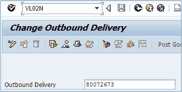
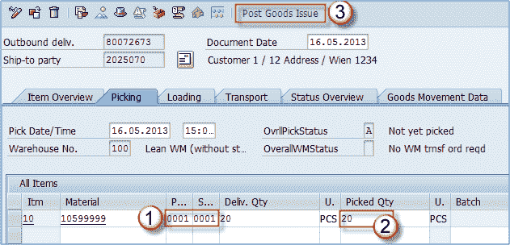
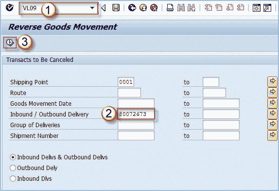
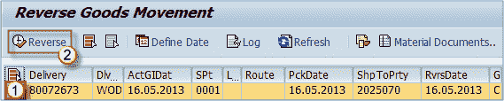
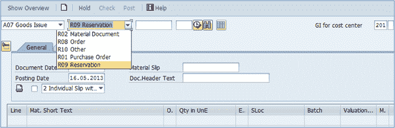

# 如何在 SAP MM VL02N，VL09 中过帐发货

> 原文： [https://www.guru99.com/how-to-issue-goods.html](https://www.guru99.com/how-to-issue-goods.html)

库存管理中的另一个重要过程是发货过帐。 预订本身就被认为是一个特定的过程，但是预订实质上使用了发货逻辑。 当我们创建要保留的物料单时，我们已经将货物从仓库发货到成本中心，生产订单等。

现在，我们可以讨论其他商品的发行过程。 最重要的是外向交货。 该过程如下：

1.  我们有来自销售部门的物料 10599999 的内向交货。
2.  将货物装上卡车后，我们应该进行发货过帐以进行交货。
3.  我们将收到为物料 10599999 创建的交货编号 **80072673** ，我们需要通过过帐发货来处理库存管理中的交货。

它是由 MM 用户在物流中主要使用的销售交易 VL02N 完成的。 使用此事务的部门可能会有所不同，具体取决于公司的组织结构。

**步骤 1）**

1.  打开 **VL02N** 事务。
2.  输入您需要处理的交货编号。点击**进入**。

**步骤 2）**

1.  输入工厂和存储位置。
2.  输入领料数量。 如果已拣选并装载了全部数量，请输入 20 PCS，但是如果由于某种原因装载的数量是 12 PCS（例如卡车已满），则将在 Deliv 中输入 12。 数量字段和拣配数量字段中。
3.  过帐发货。

大功告成

如果由于某些原因您需要 ***来退货/取消外向交货*** 的发货，则可以使用事务 **VL09** 。

**Step 1)**

1.  执行事务 **VL09** 。
2.  输入适当的交货编号。
3.  按下执行按钮。如您所见，您也可以将此功能用于收货。

**Step 2)**

1.  选择要处理的交货行。

单击反向按钮。

确认是否询问。 如果您收到以下消息，即已成功冲销了发货，则操作完成。

如果不是这样，则在处理中存在问题，必须由超级用户或顾问来识别。

**需要过帐发货的其他类型的过程**

您可以查看 **MIGO** 事务，以参考更多用于过帐发货的选项。

选择 **A07-发货**，然后在下一个下拉菜单中找到几个选项。 为了给您一些“功课”，您可以自己探索这些选项，这里只是它们的简短介绍。

*   **R02-物料凭证**（物料凭证的发货后）
*   **R08-订单**（生产订单的发货后）
*   **R10-其他**（无参考文件）
*   **R01-采购订单**（采购订单的 PGI）
*   **R09-保留**（用于保留的 PGI –我已经通过使用 **MB1C** 交易演示了此过程）

