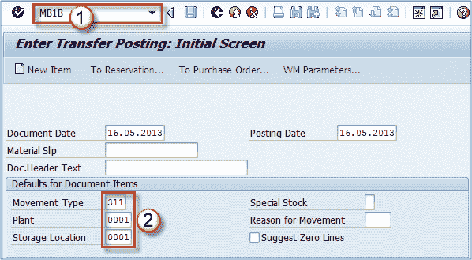
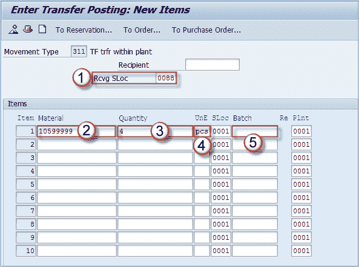

# SAP MB1B 中的货物转移过帐

> 原文： [https://www.guru99.com/transfer-posting-of-goods.html](https://www.guru99.com/transfer-posting-of-goods.html)

可以通过使用 MIGO 事务处理或 **MB1B** 将数量从一个存储位置转移到另一存储位置。

我将使用 MB1B 演示转移过帐过程，就像您已经看到 MIGO 一样。

**步骤 1）**

1.  执行事务 **MB1B** 。
2.  输入移动类型（311），来源工厂和存储位置。 点击 **ENTER** 。

**步骤 2）**

1.  输入接收存储位置，
2.  物料编号
3.  数量，
4.  测量单位。

保存文档，转移过账将完成。

物料凭证编号已分配。

如果您需要取消此过帐，则可以使用 **MBST** 或 **MIGO** 事务。