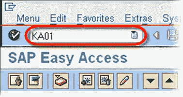
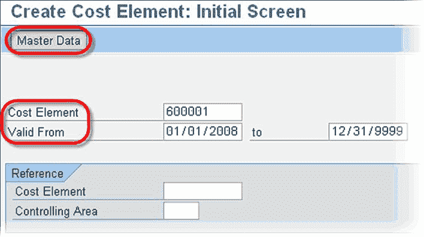
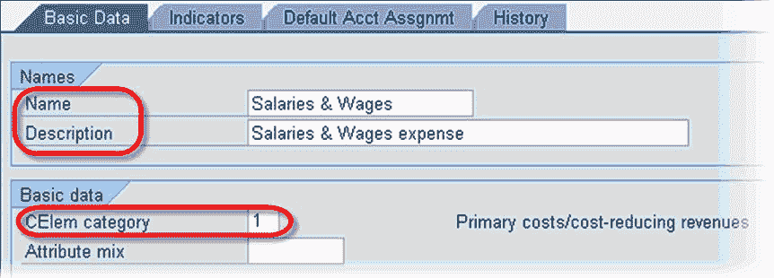

# 如何创建新的成本要素

> 原文： [https://www.guru99.com/how-to-create-a-new-cost-element.html](https://www.guru99.com/how-to-create-a-new-cost-element.html)

要创建新成本要素，在 SAP 事务代码框中，输入事务 **KA01**

在创建成本要素屏幕中

*   输入新的成本要素编号。
*   输入新成本要素的生效日期。

***可选-*** 在**参考**部分中：

*   如果详细信息与新的成本要素相似，则可以在**成本要素**字段中输入参考成本要素。
*   在**控制范围**字段中，您可以输入参考成本要素的控制范围。

单击主数据按钮

在下一个 SAP 屏幕中

*   输入名称&描述
*   输入相关的 CElem 类别
*   单击保存。

成本要素已创建

> 注意：在创建成本要素之前，必须在 SAP 系统中创建一个具有相同编号的总账科目。

其他值得注意的交易

*   **更改**现有成本要素-交易 **KA02**
*   **显示**一个成本要素-交易 **KA03**