# SAP Profit Center 教程：创建，分组，过帐&计划

> 原文： [https://www.guru99.com/all-about-profit-center.html](https://www.guru99.com/all-about-profit-center.html)

**Why A Profit Center is Required?**

利润中心的主要目标是代表一个独立的组织子单位，该子单位在市场上实际上是独立运作的，对其自身的成本和收入承担责任，并且可以扩展为投资中心或可以被视为公司内的公司。 利润中心方法体现了内部和外部会计之间越来越多的重新建立，并充当两个[会计](/accounting.html)概念之间的联系。

利润中心会计有助于回答以下问题：

1.  收入是多少？
2.  生产的商品成本是多少？
3.  保证金是多少？
4.  管理和销售费用是多少？
5.  营业利润是多少？

在利润中心级别可以进行 ROI，EVA 和现金流分析。

## 创建利润中心

**步骤 1）**在 SAP 命令字段中输入事务代码 KE51

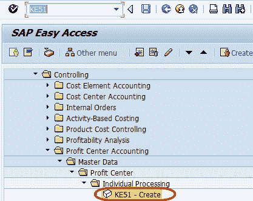

**步骤 2）**在下一个屏幕中，输入要在其中创建利润中心的控制区域

**步骤 3）**在下一个屏幕中，为利润中心输入唯一的 ID

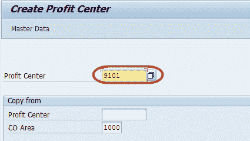

**步骤 4）**在下一个屏幕中，输入以下内容

1.  输入利润中心的名称
2.  输入利润中心的简短描述
3.  输入负责利润中心的人
4.  输入利润中心所属的利润中心组。

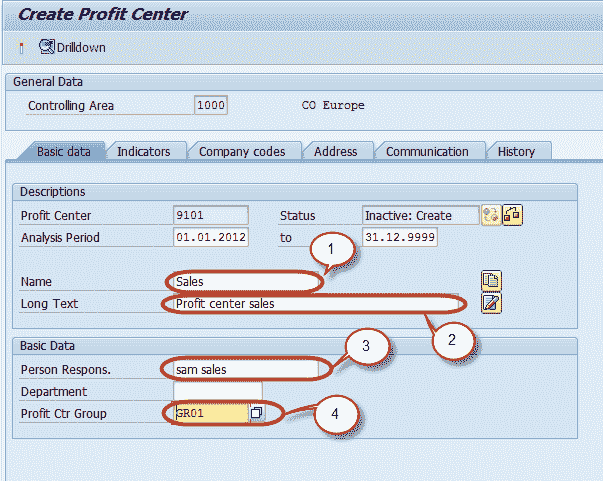

**步骤 5）**按下“保存”按钮，以从 SAP Standard Toolbar 保存利润中心

利润以非活动模式保存

。 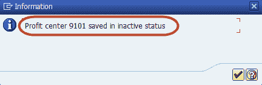

**步骤 6）**按下“激活”按钮以从应用程序工具栏中激活利润中心

**步骤 7）**在状态栏上查看利润中心的创建状态。

## 利润中心小组

**步骤 1）**在 SAP 命令字段中输入事务代码 KCH1

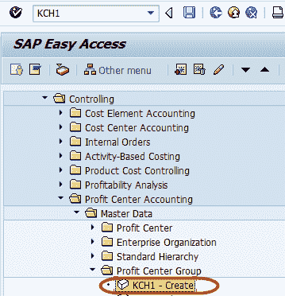

**步骤 2）**在下一个屏幕中，输入要在其中创建利润中心组的控制区域

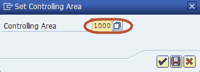

**步骤 3）**在下一个屏幕中，为要创建的利润中心组输入唯一的 ID。

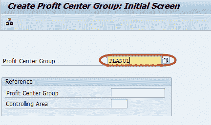

**步骤 4）**在下一个屏幕中，为利润中心组输入简短描述

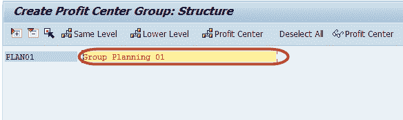

**步骤 5）**在 SAP Standard Toolbar 中按“保存”按钮，创建利润中心组

**步骤 6）**检查状态栏以创建利润中心组

## 利润中心过帐

**通过财务凭证（FI 接口）过帐到利润中心**

**步骤 1）**在 SAP 命令字段中输入事务代码 FB50

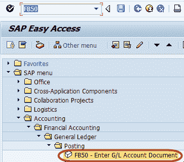

**步骤 2）**在下一个屏幕中，输入以下标题数据

1.  输入文件日期
2.  输入公司代码

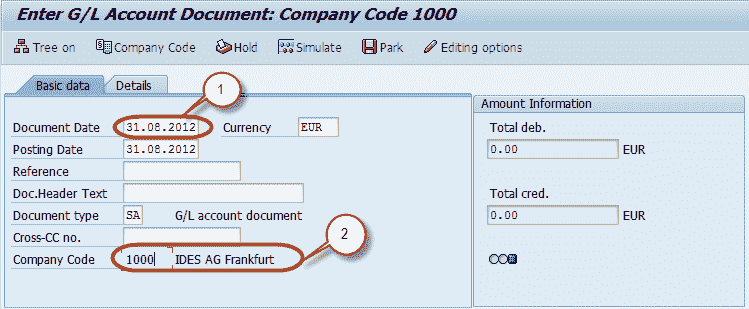

**步骤 3）**输入以下订单项数据

1.  输入借项总账科目
2.  选择借方
3.  输入借方金额
4.  输入信贷总账科目
5.  选择信用
6.  输入信用额

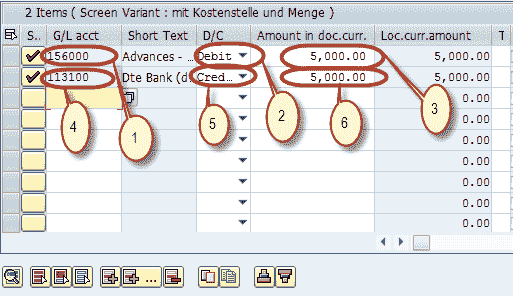

**步骤 4）**输入订单项后，

1.  选择借项行
2.  按选择详细信息按钮

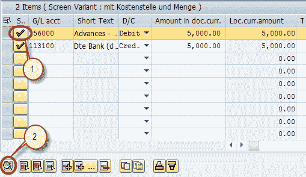

**步骤 5）**在下一个明细行项目屏幕中，输入利润中心

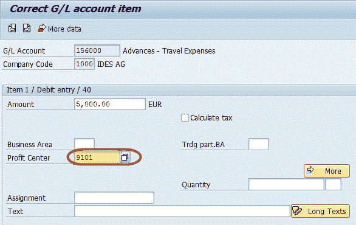

**步骤 6）**在 SAP 标准工具栏中按“保存”按钮以过帐文档

**步骤 7）**检查状态栏的凭证编号以确认过帐

## 利润中心计划

计划过程不是一次性的活动，而是一个反复的过程，通常分几个步骤执行。利润中心计划是整个公司计划不可或缺的一部分。 在利润中心会计中，业务计划的整体性尤其明显，因为此处使用的计划数据主要在其他应用程序（例如成本中心会计）中创建，并且可以在利润中心会计中进行补充或更改。 利润中心计划是短期业务计划的一部分，因此涵盖一个会计年度。 在利润中心计划过程中，将各个计划区域合并为一个集成计划网络。 我们可以使用各种计划版本来描述各种计划。利润中心计划为我们提供了以下计划方法：

1.  将现有计划或实际数据复制到计划
2.  按期间或通过其他应用程序的事务同时发布计划数据
3.  手动计划利润中心
4.  利润中心之间的数据分配和评估
5.  各种计划报告，用于比较不同计划版本

## SAP Profit Center 代码

| 码 | 描述 |
| 教授 | 利润中心会计企业价格控制 |
| KE5Z | 利润中心：实际行项目 Enterprice 控制 |
| 9KE0 | 创建利润中心凭证输入价格控制 |
| 3KEI | 派生默认利润中心企业价格控制 |
| KE51 | 创建利润中心 Enterprice 控制 |
| KE52 | 更改利润中心 Enterprice 控制 |
| KE53 | 显示利润中心 Enterprice 控制 |
| 2KES | 利润中心：平衡余额。 企业价格控制 |
| 碳酸钾 3 | 显示利润中心层次结构 Enterprice 控制 |
| 2KEE | 利润中心：总计记录企业价格控制 |
| S_AC0_52000888 | 应付款：利润中心 FI |
| KCH2 | 更改利润中心层次结构 Enterprice 控制 |
| KCH1 | 创建利润中心组企业价格控制 |
| KE54 | 删除利润中心 Enterprice 控制 |