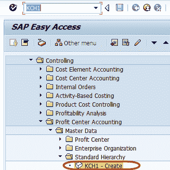
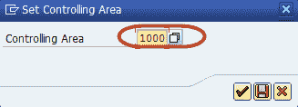
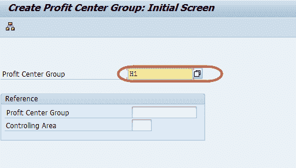
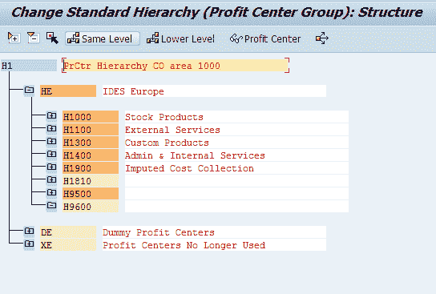
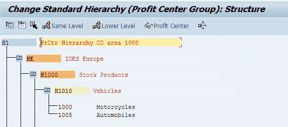
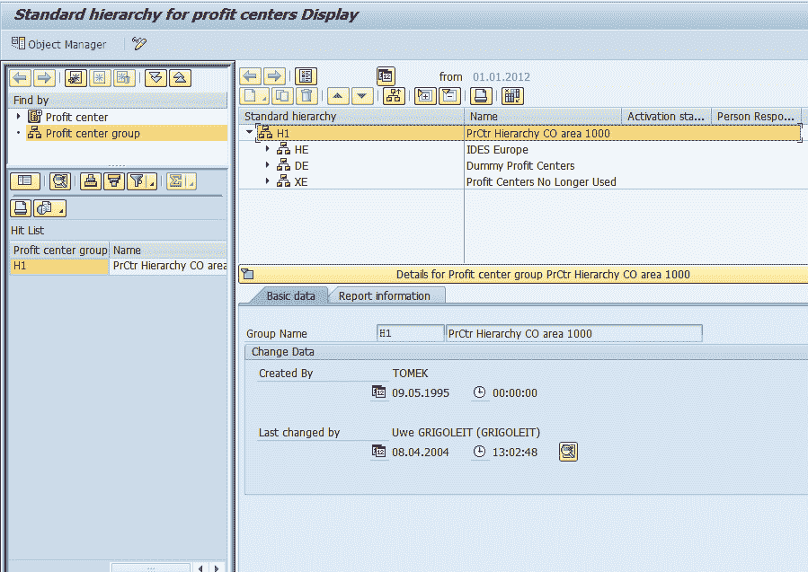

# 在 SAP 中使用标准层次结构创建利润中心

> 原文： [https://www.guru99.com/creation-of-profit-center-standard-hierarchy.html](https://www.guru99.com/creation-of-profit-center-standard-hierarchy.html)

标准层次结构是一种树形结构，用于对属于一个控制区域的所有利润中心进行分组。 创建利润中心时，必须将其分配给标准层次结构的组（节点）。 这样可确保将一个控制区域的所有利润中心集中在一个节点中。这有助于进行对账。 我们可以从应用程序菜单或在定制中维护标准层次结构。 定制还提供了一项功能，使您可以通过复制成本中心组来创建利润中心组。 如果我们的成本中心结构与利润中心结构相似，则可以使用此功能复制成本中心标准层次结构以创建我们的利润中心标准层次结构。

**步骤 1）**在 SAP 命令字段中输入事务代码 KCH1

**步骤 2）**在下一个屏幕中，输入要为其创建利润中心标准层次结构的控制区域

**步骤 3）**在下一个屏幕中，为要创建的控制区域输入标准层次结构的主节点利润中心组。

**步骤 4）**在下一个屏幕中，输入标准层次结构的子节点或子利润中心组

同样，将利润中心分配给利润中心组

。 

**步骤 5）**保存结构，并检查状态栏以保存更改

**步骤 6）**典型的标准层次结构显示

