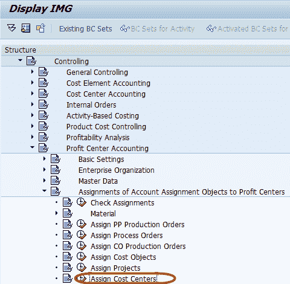
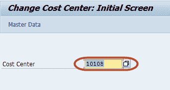
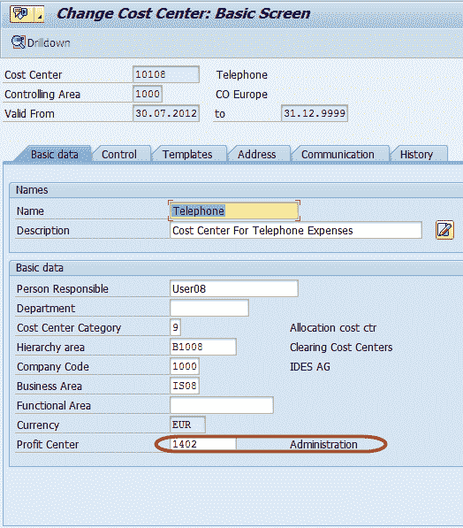

# 如何在 SAP 中将成本中心分配到利润中心

> 原文： [https://www.guru99.com/assignment-of-cost-centers-to-profit-center.html](https://www.guru99.com/assignment-of-cost-centers-to-profit-center.html)

在本教程中，我们将学习 SAP 中的成本中心到利润中心

**步骤 1）**在 SAP 命令字段中输入事务代码 SPRO

**步骤 2）**在下一个屏幕中，选择'SAP Reference IMG

'  

**步骤 3）**在下一个屏幕中，“显示 IMG”遵循菜单路径控制->利润中心[会计](/accounting.html)->帐户分配对象到利润中心的分配->分配成本中心

**步骤 4）**在下一个屏幕中，输入要分配给利润中心的成本中心

**步骤 5）**在下一个屏幕中，输入分配了成本中心的利润中心

**步骤 6）**按 SAP Standard 工具栏上的“保存”按钮，以保存更改。

