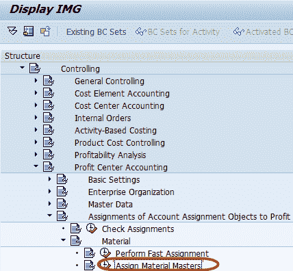
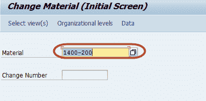
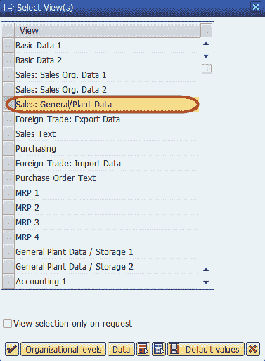
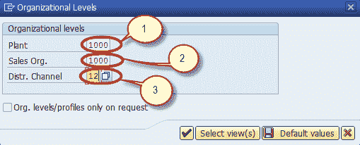
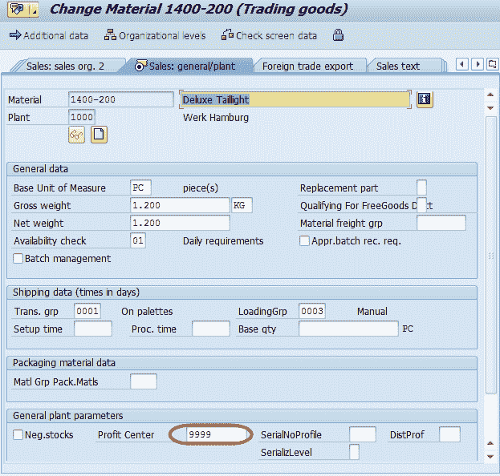

# 如何将物料分配给 SAP 中的利润中心

> 原文： [https://www.guru99.com/assignment-of-materials-to-profit-center.html](https://www.guru99.com/assignment-of-materials-to-profit-center.html)

在本教程中，我们将学习将物料分配给 SAP 的利润中心

**步骤 1）**在 SAP 命令字段中输入事务代码 SPRO

**步骤 2）**在下一个屏幕中，选择“ SAP Reference IMG”按钮

 

**步骤 3）**在下一个屏幕中，“ DISPLAY IMG”遵循菜单路径控制->利润中心[会计](/accounting.html)->帐户分配对象对利润中心的分配->物料->分配物料主数据

**步骤 4）**在下一个屏幕中，输入要为其分配利润中心的物料 ID

**步骤 5）**在下一个对话框中，选择物料主数据的“销售常规/工厂”视图

**步骤 6）**在下一个对话框中，输入以下内容

1.  输入物料的工厂
2.  输入销售组织
3.  进入分销渠道

**步骤 7）**在下一个屏幕中，在主屏幕中输入利润中心

**步骤 8）**在 SAP Standard Toolbar 中按“保存”按钮以完成分配

