# 如何在 SAP 中执行工资核算

> 原文： [https://www.guru99.com/how-to-execute-payroll.html](https://www.guru99.com/how-to-execute-payroll.html)

在本教程中，我们将学习 SAP 中的执行[工资单](/sap-payroll.html)

如何在 SAP 中执行工资核算

如何在后台执行工资核算

## 如何在 SAP 中执行工资核算

在继续执行工资核算之前，请确保在 SAP 系统中将控制记录设置为已发布状态

**步骤 1）**在 SAP 命令提示符下，输入事务 PC00_M **XX** _CALC，其中 **XX** =您要为其执行工资核算的国家/地区的 Molga。

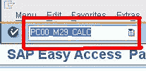

**步骤 2）**在下一个 SAP 屏幕中，

*   输入薪资范围
*   选择当前期间
*   您还可以选择其他期间，并运行当前期间以外的期间的薪资。

**步骤 3）**选择正确的架构

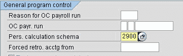

**步骤 4）**在“日志”下，选中**显示日志**复选框。

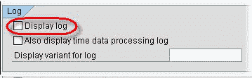

**步骤 5）**在“薪酬”语句参数下

*   对于少量雇员，请勾选“显示变式显示的对帐单”字段，然后选择适当的变式
*   对于大量员工，请勾选“无薪酬声明”，因为 ABAP 转储的可能性很大

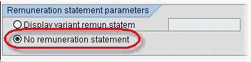

**步骤 6）**单击“执行”。在**显示日志**中检查工资核算结果。 它提供了运行的员工总数，出错的员工和成功的员工的摘要。

如果在上一个选择屏幕中选择了**薪酬表**，则可以通过单击**表格**按钮来查看。

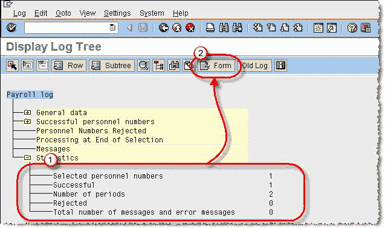

**步骤 7）**薪酬声明

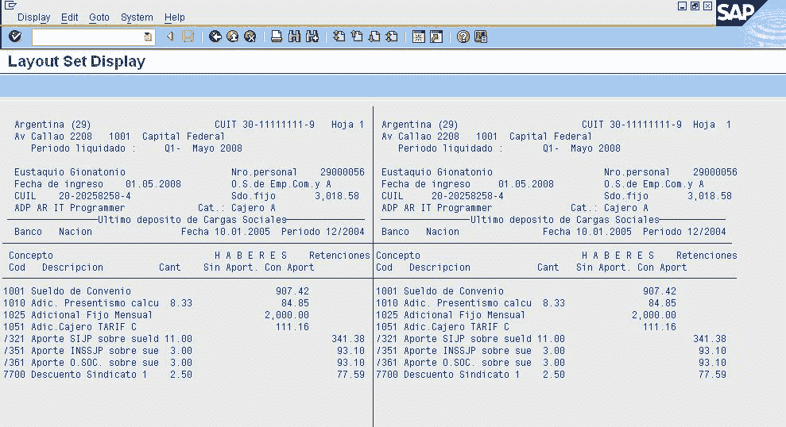

您还可以使用事务 **PC00_MXX_CALC_SIMU** （XX = Molga）在模拟（测试模式）中运行工资单。 测试模式模拟实际的工资核算运行，但不更新工资核算表。 在执行实际（实时）工资核算之前，这有助于确定和纠正错误

## 如何在后台执行工资核算

当为大型员工范围运行薪资时，建议在后台进行处理。

**步骤 1）**在 SAP 命令提示符中，输入事务 PC00_MXX_CALC，其中 XX =您要为其运行工资单的国家/地区的 Molga。

**步骤 2）**输入薪资区域和薪资架构

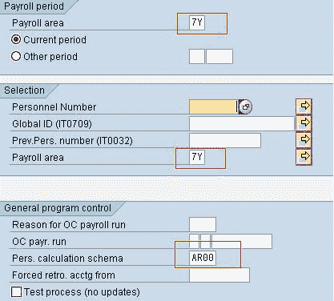

**步骤 3）**在 SAP 菜单栏中，单击

1.  程序
2.  在后台执行

**步骤 4）**在 SAP-“输出设备”对话框中

1.  输入设备作为 LOCL（本地）
2.  点击复选标记

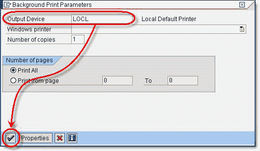

**步骤 5）**显示说明格式设置为 X_65_132 的信息消息。 单击复选标记以继续。

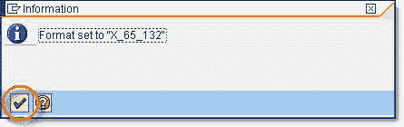

**步骤 6）**单击立即，然后单击保存按钮，以便立即计划作业。 或者，您也可以指定运行作业的日期和时间。

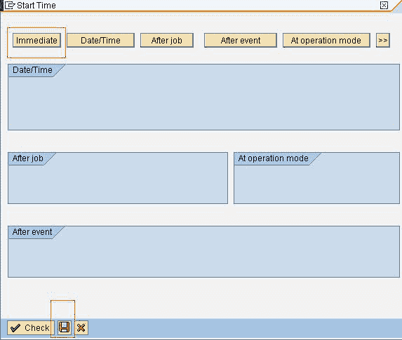

**步骤 7）**转到事务 SM37 检查您的作业。

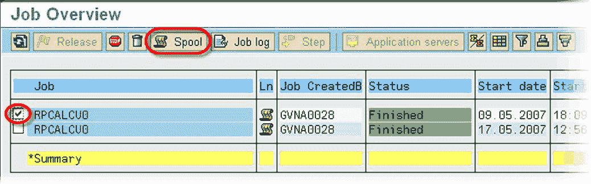