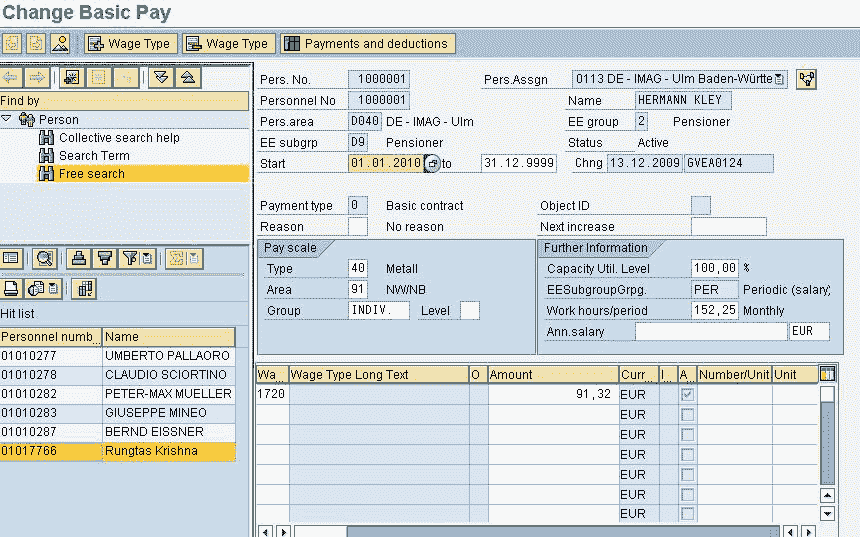
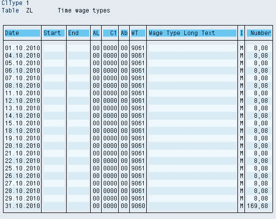
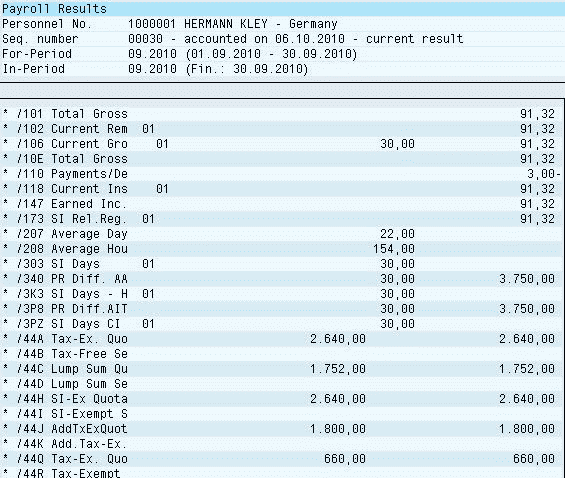

# SAP Wage Types 教程：主要，辅助，对话，时间

> 原文： [https://www.guru99.com/types-of-wage-types-in-sap.html](https://www.guru99.com/types-of-wage-types-in-sap.html)

付款数据（津贴或扣除额）使用工资类型存储。

SAP 中的 **2 个主要工资类别**

*   主要/主要工资类型
*   次要/技术工资类型

主要工资类型又分为

2.  对话工资类型
3.  时间工资类型

**对话框工资类型：-**这些工资类型可以在线输入，同时在 SAP 系统中维护主数据。 对于前 基本工资（IT0008），附加付款（IT0015），经常性付款/扣除额（IT0014）。

**时间工资类型：-**时间评估完成后，系统将创建时间工资类型。 它们不能在线维护，而是系统生成的。

例如：带薪假 75％

**次要工资类型**

次要工资类型是系统生成的，不能在线维护。 它们是在[工资](/sap-payroll.html)运行期间创建的。 次要工资类型还用作容器来累积其他几种工资类型或临时存储工资类型信息。 次要工资类型的技术名称以“ /”开头

例如：/ 559 银行转帐

