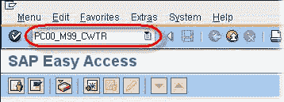
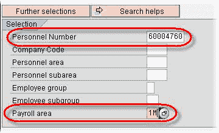
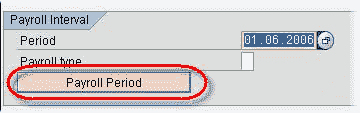
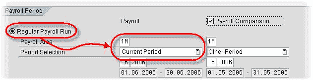
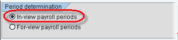
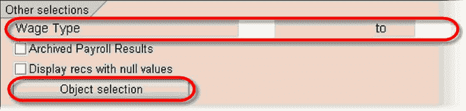
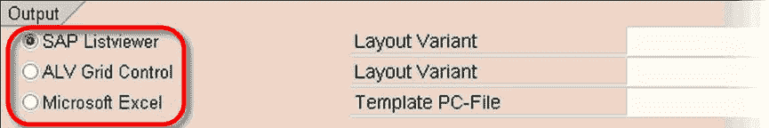
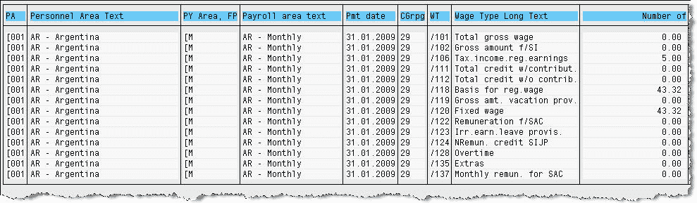

# SAP 工资类型报表器：PC00_MXX_CWTR

> 原文： [https://www.guru99.com/what-is-wage-type-reporter.html](https://www.guru99.com/what-is-wage-type-reporter.html)

工资类型报告器是一种综合灵活的 SAP 报告工具，可报告 RT（结果表）中保存的工资类型。 可以运行它来生成为某个日期范围支付的值或在特定时期内支付的值。 它还可以用于在[薪资](/sap-payroll.html)期间之间进行比较，还可以用于其他薪资结果。 可以按年初至今运行。 它是主要的标准 SAP 薪资报告，应始终运行并用作薪资验证。

**步骤 1）**在 SAP 命令提示符下，输入事务 **PC00_M99_CWTR**

**** 

**步骤 2）**在下一个 SAP 屏幕的**部分下选择**

*   如果要评估特定员工，请输入**人员编号**。
*   输入**薪资区域**。
*   输入定义您希望评估的员工组的任何其他选择标准

**步骤 3）**单击**工资核算期**。

*   选择**常规工资核算运行**单选按钮。
*   输入**工资核算区域**和**工资核算期间**。
*   如果要比较不同工资核算期间的工资核算结果，请选中**工资核对**复选框。 然后，输入适当的工资核算区域和工资核算期间以用作比较。

**步骤 4）**在**期间确定**下，选择**视图内工资核算期**单选按钮。

*   在**其他选项**下，您可以输入要显示在报告中的特定**工资类型**。
*   使用**对象选择**功能选择要在列表中显示为列的对象。

*   在**输出**部分中，勾选相应的**输出类型**。
*   如果适用，在输出类型旁边，选择预定义的**布局。**
*   **步骤 5）**单击执行

**** 

**步骤 6）**检查工资类型报告的结果。

