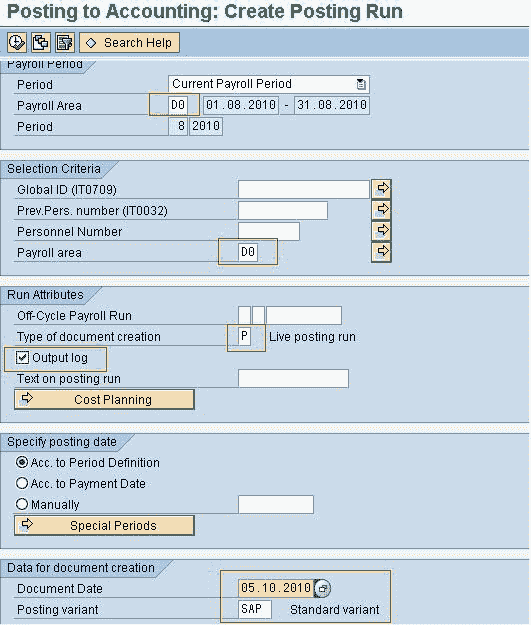
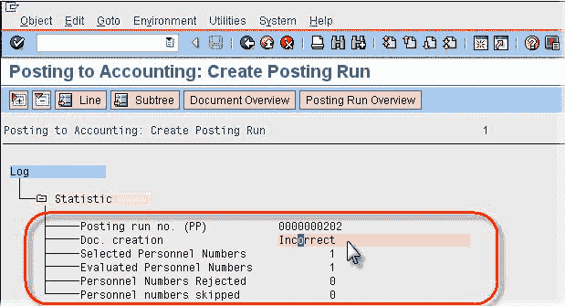
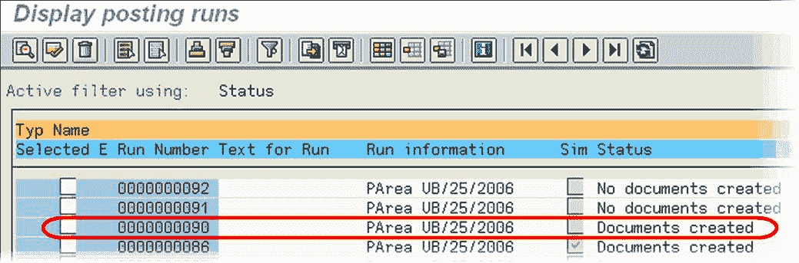

# SAP 中的总分类帐（G / L）过帐：PCP0 & PC00_M99_CIPE

> 原文： [https://www.guru99.com/posting-to-general-ledger.html](https://www.guru99.com/posting-to-general-ledger.html)

总帐过帐是将[薪资](/sap-payroll.html)结果过帐到包括成本中心在内的相应总帐科目的过程。将薪金结果过帐到[会计](/accounting.html)是成功运行薪资后的后续活动之一。 它通常在每个薪资发放周期以及每次非周期薪资发放之后进行一次。 总帐过帐执行以下操作

*   将薪水结果中的过帐相关信息分组在一起。
*   创建摘要文档。
*   将相关过帐到适当的总帐科目和成本中心

***如何评估发布？***

每个员工的薪资结果包含与会计相关的不同工资类型：

*   诸如标准薪水，奖金和加班费之类的工资类型代表公司的**费用**，并过账到相应的**费用帐户**。
*   工资类型，例如银行转账，就业税，员工对社会保险的供款等，是用人单位应付给员工，税务局等的款项，并作为**贷项**记入相应的**应付款 或财务帐户**。
*   此外，还有工资类型，例如雇主的健康保险费，这是企业的费用，同时是应向社会保险机构支付的费用。 因此，此类工资类型过帐到**两个帐户**-一次记为**费用**借记，然后记作**应付账款**记入贷方。
*   还存在其他类型的工资类型，例如应计，准备金等。这些类型的工资类型通常过帐到两个帐户，一次记为**支出**，记入**支出** ]。

过帐到总帐是一个两步过程：-

**步骤 1）创建过帐运行**

**交易**： PC00_M99_CIPE

**概述**：

*   此步骤基于工资核算结果创建过帐运行，并带有“区别编号”，“运行类型 PP”和随附的过帐凭证。
*   过帐运行可确保员工的薪资结果仅过帐一次
*   已标记员工的已处理工资结果
*   如果过帐运行成功，则其状态为“文档已创建”。
*   如果过账运行不成功，则其状态为“不正确的凭证”。 相关错误消息将出现在输出日志中。

可以在 3 种模式下执行过帐运行：

*   没有文件**（T）**的测试运行
*   使用模拟文档**（S）**进行的模拟运行
*   高效运行**（P）**

**测试（T）**

在测试运行中，系统仅检查费用和应付账款余额是否为零（应为零）。

**模拟（S）**

在模拟和生产运行中，系统都会检查所有 HR 和 RT 表以及主数据中的过帐信息，以确定它们是否存在以及它们是否一致。

**生产运行（P）**

当选择执行运行进行生产运行时，系统执行以下步骤：

*   选择员工及其薪资结果进行评估
*   创建过帐运行
*   创建过帐凭证

**程序输入画面**

输入薪资范围，选择标准，文档创建类型，检查输出日志，输入文档日期并选择过帐变式。 单击执行。

**输出日志**

*   日志显示所有人员编号的投递运行是否成功。
*   您将以“红色”（表示错误或不平衡）或“绿色”（表示没有错误）获得所有选定雇员的列表。
*   在输出日志中，如果运行成功，则输入“ Doc。 创建”将表示没有错误。 如果不成功，请在“文档 创建”将指示“不正确”。
*   写下过帐运行编号。
*   如果选择**文档概述**按钮或双击**文档。 创建**行，您可以访问文档概览屏幕

**步骤 2）编辑过帐运行**

**事务**：PCP0
**概述**：

*   此步骤概述了过帐运行期间创建的所有文档。
*   或者，您还可以通过选择**文档概述**按钮或双击**文档创建**行，从**创建过帐运行**日志中访问文档概述。
*   您可以深入查看这些文档，以找出由于投递运行失败（即，状态为“不正确”）而发生错误的原因。

**发布运行状态**

*   最初，过帐运行状态应为**创建的文档**。
*   如果状态为**，则未创建任何文档**，并且您需要文档，请返回到上一个**创建过帐运行**步骤，然后重试。
*   如果文档不正确，请查看错误消息并解决。
*   解决错误后，状态为**已创建文档**，选择“发布文档”按钮，状态将更改为**。所有文档已发布**
*   然后点击“发布文档”按钮，状态将更改为**已发布文档**

