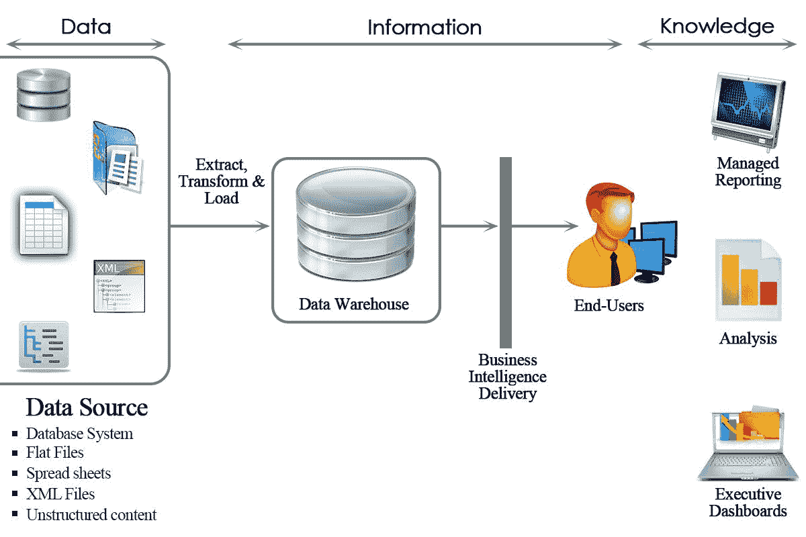
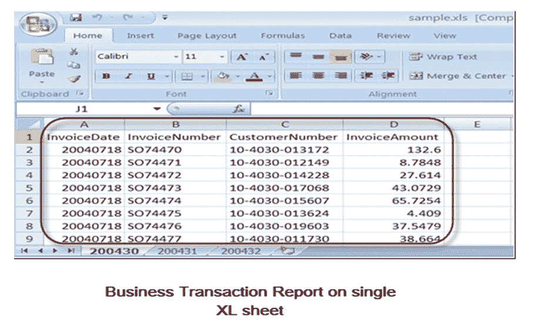

# 简介 SAP BI

> 原文： [https://www.guru99.com/introduction-sap-bi.html](https://www.guru99.com/introduction-sap-bi.html)

商业智能（BI）是用于赋予组织原始数据含义的应用程序。 原始数据将通过业务逻辑进行清理，存储和应用，以帮助企业用户做出更好的业务决策。 这些数据可以以报告的形式呈现，也可以以表格，图表等形式显示，这是高效且易于分析和制定业务决策的方式。

在所有业务活动中，公司都会创建有关客户，供应商和内部活动的数据。 根据这些数据，人力资源，财务，会计，市场营销等各个部门的员工都将制定工作计划。

商业智能涵盖了各种各样的工具集，其中数据仓库整合和加载来自不同源系统的数据，而诸如查询设计器，Web 应用程序设计器和分析器之类的报告工具主要用于创建显示合并数据的报告 由数据仓库用于分析目的。

商业智能是一种 SAP 产品，主要致力于为客户/组织提供用户友好且非常有用的表示数据形式，该数据可有助于分析目的和制定业务决策。

总之，商业智能工具将原始数据转换为用于决策和业务预测的报告。

## 为什么我们需要数据仓库& BI？

组织具有不同种类的数据，例如财务，人力资源，客户，供应商数据等，这些数据可以存储在不同种类的存储单元中，例如 DBMS，Excel 工作表，SAP R / 3 系统等...甚至公司内部 数据通常分布在许多不同的系统中，并且格式没有特别好。

数据仓库可以帮助组织数据。 它汇集了异构数据源，这些数据源在细节上大多不同。 使用 BI 工具可以导出有意义的报告

## 是什么使 SAP BI 成为更有效的 BI 工具？

*   通过 BI 可以单点访问所有信息。 可以在单个位置（即 BI）访问来自各种来源的数据。
*   从各种来源收集的数据以报告的形式呈现，这对于高层次的数据分析是有效的。
*   SAP BI 提供了易于使用的 GUI 和更好的格式
*   使 SAP BI 胜于其他软件的一些关键功能是能够分析 Web 和 MS 办公环境中的**多维**数据源，灵活的仪表板，移动性以及灵活的可扩展 BI 平台。
*   SAP BI 以出色的**查询性能**而著称，同时几乎不需要管理
*   **最终用户的移动 BI**
*   **与其他平台的轻松集成**

**SAP BI /数据仓库与。 OLTP 系统：**

**OLTP（在线交易处理）：**

这些系统具有详细的日常交易数据，并且不断变化。 例如，R / 3 或任何其他数据库。

**OLAP（在线分析处理）：**

这些系统具有用于分析目的的数据。 该系统的输入来自 OLTP 系统。 来自 OLTP 系统的数据用于准备分析数据。

商业智能是 OLAP 系统。

|  | **OLTP 系统** **（操作环境）** | **DWH / OLAP 系统（信息环境）** |
| 目标 | 通过业务流程自动化提高效率 | 产生知识

（竞争优势） |
| 优先事项 | 高可用性，更高数据量 | 简单易用，灵活访问数据 |
| 资料检视 | 详细 | 经常汇总 |
| 数据时代 | 当前 | 历史的 |
| 数据库操作 | 添加，修改，删除，更新和阅读 | 读 |
| 典型数据结构 | 关系型（平面表，高度归一化 | 多维结构 |
| 集成来自各种模块/应用程序的数据 | 最小的 | 全面 |
| 数据集 | 6-18 个月 | 27 年 |
| 封存 | 是 | Yes |