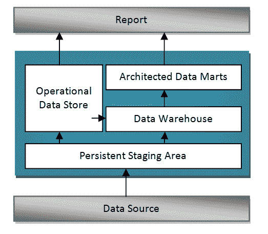
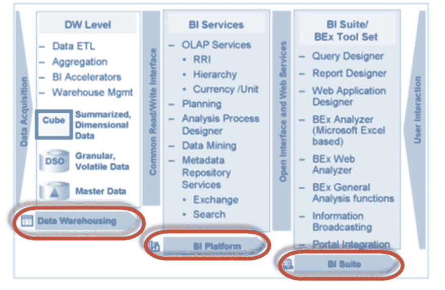
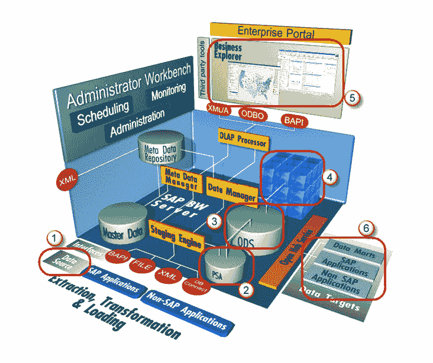

# SAP BI 体系结构概述

> 原文： [https://www.guru99.com/overview-of-sap-bi-architecture.html](https://www.guru99.com/overview-of-sap-bi-architecture.html)

在我们进一步了解 SAP BI 体系结构之前，让我们了解一下

## **BI 数据仓库的概念层**

**永久暂存区**

从源系统提取的数据首先进入持久暂存区。 该层的数据是原始数据，其格式不变。 数据仅在下一层进行合并和清除。

暂存区是一个临时表，用于保存数据并连接到工作区或事实表。 在没有暂存区域的情况下，数据负载将必须直接从 OLTP 系统传递到 OLAP 系统，这会影响 OLTP 系统的性能。

**数据仓库层（DWH 层）**

来自持久性暂存区的数据被加载到 DataWareHouse 层中。 它具有企业信息存储库。 该层中的数据存储时间较长，即整个历史记录数据（例如最近 5 年的数据）存储在此层中。不汇总与报告相关的数据;存储在该层中的数据的粒度为 在订单项（详细）级别。

**操作数据存储层**

数据经常从源系统连续不断地加载到操作数据存储层。 因此，该层中的数据包含全天对数据所做的所有更改。 稍后可以在特定时间（例如一天结束）将来自操作数据存储的数据加载到数据仓库层，以更新数据仓库层中的日期。 当数据仓库和数据集市层中的数据丢失时，如果发生任何紧急情况，也可以使用此操作数据存储层。 在这种情况下，可以将数据从运营数据存储层加载到数据仓库层和数据集市层。 ODS 不是基于星形模式模型，而是采用平面文件格式。

**架构化的数据集市层**

架构化数据集市层也称为 Infocube。 它旨在长时间存储汇总和汇总的数据。 来自数据仓库层的数据被加载到架构化数据集市层中。 它用于分析和报告中。 数据与创建显示这些数据的报告有关。 具有业务逻辑的数据操作在此层完成。 它由一个中央事实表（关键数字）组成，该表被几个维表包围，用于支持 BW 查询

### SAP BI 系统的关键组件

商业智能是 SAP NetWeaver 的核心组件。 下图显示了 BI 系统的关键组件。

*   ***数据仓库*** –这主要是从源系统提取，转换和加载数据。
*   ***BI 平台*** – BI 平台层包含 BI 服务，以支持复杂的分析任务和功能。 它包含分析引擎，该引擎处理通过 BEx 分析导航请求的数据。 它的界面允许作为 BI Integrated Planning 的一部分输入和处理数据。 它还具有特殊的分析工具，例如 Analysis Process Designer（APD）和 Data Mining，它们为贵公司的分析人员提供了合并，挖掘，预处理，存储和分析数据的工具。
*   ***BI Suite*** –这些工具有助于创建用于分析目的的报告。它包含 Business Explorer（BEx），它提供了灵活的报告和分析工具。

业务浏览器中的以下区域可用于数据分析：

1.  BEx Analyzer（具有类似于数据透视表功能的基于 Microsoft Excel 的分析工具）
2.  BEx Web Analyzer（具有类似于数据透视表功能的基于 Web 的分析工具）
3.  BEx Web 应用程序设计器（提供客户定义和 SAP BI 内容）
4.  BEx 报表设计器（高度格式化的 Web 输出）

### **SAP BI / BW 体系结构：**

BI 具有三层架构：

**数据库服务器：**物理存储数据的位置（ODS，PSA，Infocube 和元数据存储库）。

**应用程序服务器：**应用程序服务器基于 OLAP 处理器。 它用于检索存储在数据库服务器中的数据。

**Presentation Server：**管理报告和数据访问。

1.  数据是从源系统中提取的。
2.  数据在持久存储区（PSA）中暂存。 这保存了像源数据一样的数据。
3.  数据被清理，加载并存储在数据存储对象中。
4.  在 Infocube 中可以从多个维度查看数据。
5.  OLAP 处理器可将数据提供给业务浏览器，以根据业务的 Analysis 要求显示数据。
6.  Open Hub 服务可以将数据提供给 SAP / Non-SAP Data Marts（InfoSpoke）。

