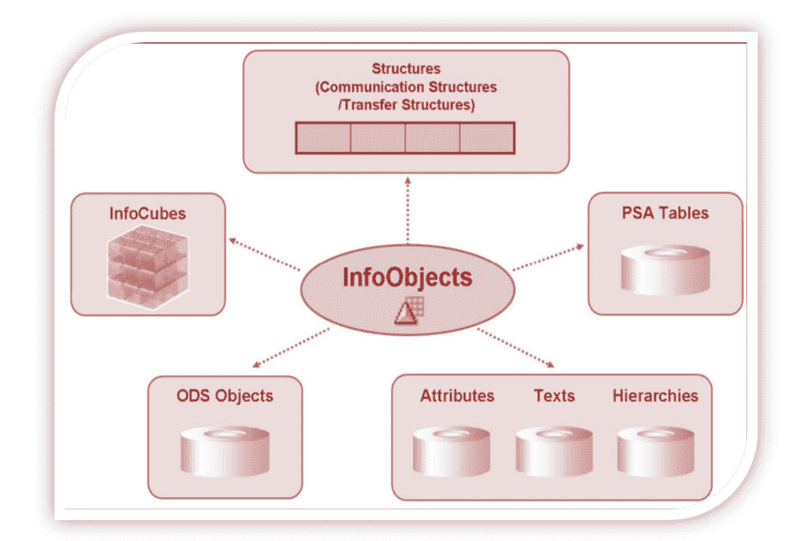
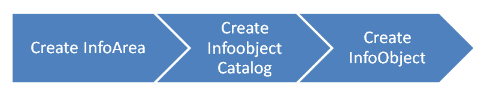

# SAP Infoobject，Infoarea，Infoobject 目录教程

> 原文： [https://www.guru99.com/all-about-infoobject-infoarea-infoobject-catalog.html](https://www.guru99.com/all-about-infoobject-infoarea-infoobject-catalog.html)

## 什么是 InfoObjects？

信息对象从源中获取信息，然后将信息调整并安排到标准或自定义报告中。 信息对象是 BI 中最小的可用信息模块/字段。 **在诸如 InfoCube，DSO，MultiProviders，Queries 等的信息提供者中需要这些信息提供者。这些信息提供者由信息对象组成。**

信息对象提供有关业务的所有信息。 例如，公司“ XYZ”有兴趣了解在“日期 x”运送到“工厂 x”的“产品 x”数量。 通过为特定功能（例如“ 0MATERIAL”，“ 0DATE”和“ 0LOCATION”）定义信息对象，可以检索所有信息。

InfoObject 可以分为以下类型：

*   特征（例如客户）
*   关键数据（例如收入）
*   单位（例如，货币，金额单位）
*   时间特征（例如，会计年度）
*   技术特征（例如，请求编号）

**特征：**

特征是用于分析关键指标的业务参考对象。

特征 InfoObjects 的示例：

*   成本中心（0COSTCENTER）
*   材料（0 材料）

**关键字：**

关键指标提供了要评估的值。 它们是查询中报告的数字信息。

关键指标 InfoObjects 的示例：

*   数量（0QUANTITY）
*   金额（0AMOUNT）

**单位：**

单位与[关键指标值](#1)配对。 它们为关键指标值分配了一个度量单位。 例如 10 Kg，其中 10 是 KeyFigure，Kg 是单位

单位特征的其他示例：

*   货币单位（0CURRENCY）（持有交易的货币类型，例如$，EUR，USD ...）

*   值单位（0UNIT）（或）度量单位（保持度量单位，例如加仑，英寸，厘米，PC）

**时间特征：**

时间特性为数据提供时间参考。

时间特征示例：

*   日历日（0CALDAY）
*   历年（0CALYEAR）
*   会计年度（0FISCYEAR）

### 技术特点：

技术特征是具有自己的管理目的的 SAP 标准对象。

技术特征示例：

*   Info Object 0REQUID-将数据加载到各种数据目标时，SAP 分配存储在此 Info 对象中的唯一编号
*   信息对象 0CHNGID –完成汇总更改运行后，将分配一个唯一编号并将其存储在此信息对象中。

**在创建信息对象之前，需要创建信息区域和信息对象目录。**

### 什么是 InfoArea？

*   在业务仓库中，信息区域是树结构的分支和节点。
*   用于组织信息立方体和信息对象。
*   每个信息对象都分配给一个信息区域。
*   信息区域可以看作是用于将相关文件保存在一起的文件夹。

### 什么是 Infoobject 目录？

*   每个信息对象都需要在信息对象目录中创建。
*   它有助于组织工作，与报告功能无关。
*   示例：有很多 SAP Financials 的 InfoObjects 可以汇总到一个 InfoObject Catalog 中。 这使得管理和维护变得容易。
*   信息对象可以分配给多个目录

有两种类型的信息对象目录。

1.  特征信息对象目录
2.  关键指标信息对象目录

**这是创建 Infoobject** 的 RoadMAP

