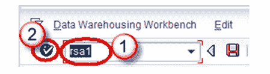
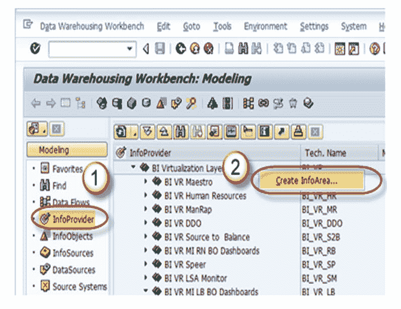
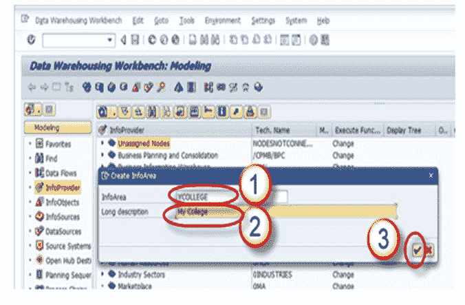
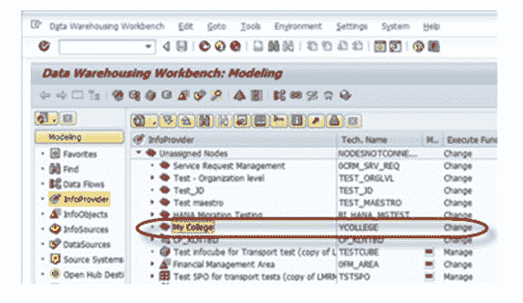

# 如何在 SAP BI / BW 中创建信息区域

> 原文： [https://www.guru99.com/how-to-create-an-infoarea.html](https://www.guru99.com/how-to-create-an-infoarea.html)

**步骤 1）**

1.  转到事务代码 RSA1 转到“数据仓库工作台”。
2.  单击确定按钮。

**步骤 2）**

1.  导航到建模-> InfoProvider
2.  右键单击工作台并创建一个 InfoArea

**步骤 3）**

1.  输入技术名称
2.  输入描述
3.  按下输入按钮

**步骤 4）**

创建的信息区域如下所示。

