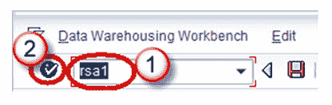
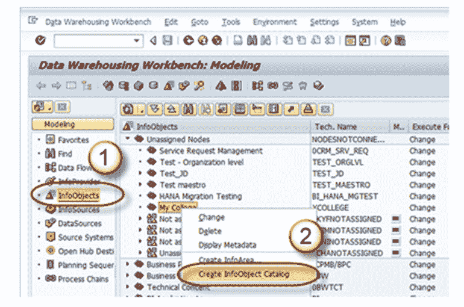
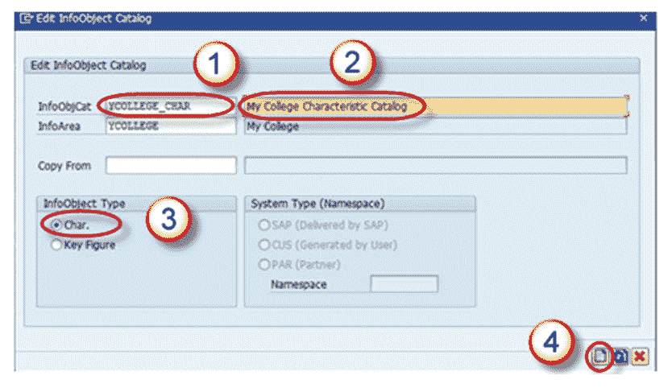
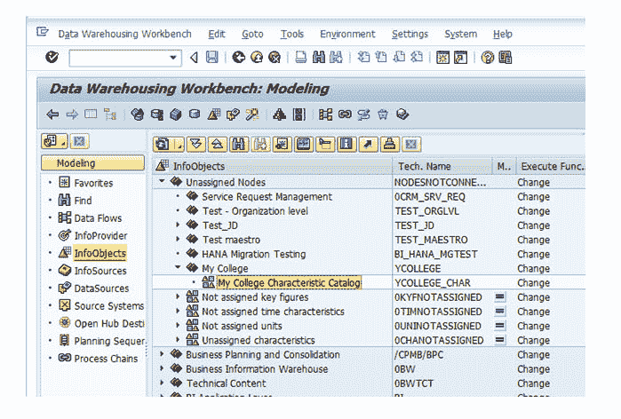

# 如何在 SAP BI / BW 中创建 InfoObject 目录

> 原文： [https://www.guru99.com/how-to-create-an-infoobject-catalog.html](https://www.guru99.com/how-to-create-an-infoobject-catalog.html)

**步骤 1）**

1.  转到事务代码 RSA1 转到“数据仓库工作台”。
2.  单击确定按钮。

**步骤 2）**

1.  导航到建模->信息对象
2.  右键单击“信息区域”，然后选择选项“创建 InfoObject 目录”，如下所示

**步骤 3）**

1.  输入 InfoObject 目录的技术名称。
2.  输入 InfoObject 目录的描述。
3.  单击“特征 InfoObject”选项按钮。 这是特征性的 InfoObject 目录。 单击 Keyfigure 选项按钮。 然后将创建一个 Keyfigure InfoObject 目录。
4.  单击创建按钮。

保存并激活 InfoObject 目录。 创建的 InfoObject 目录显示如下。

