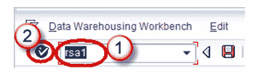
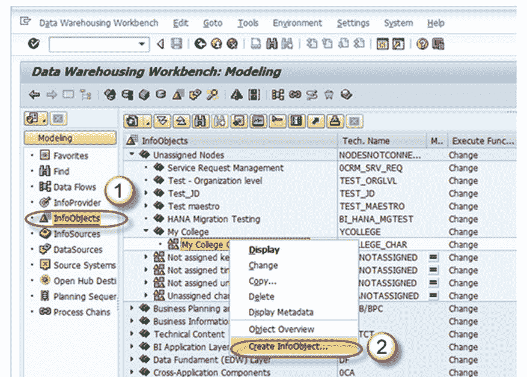
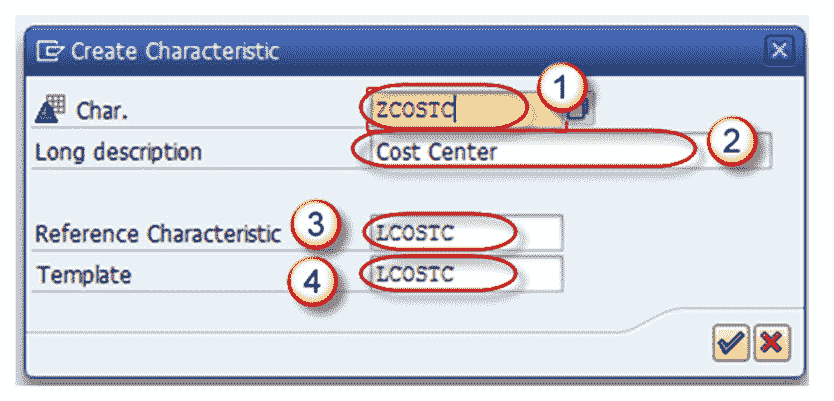
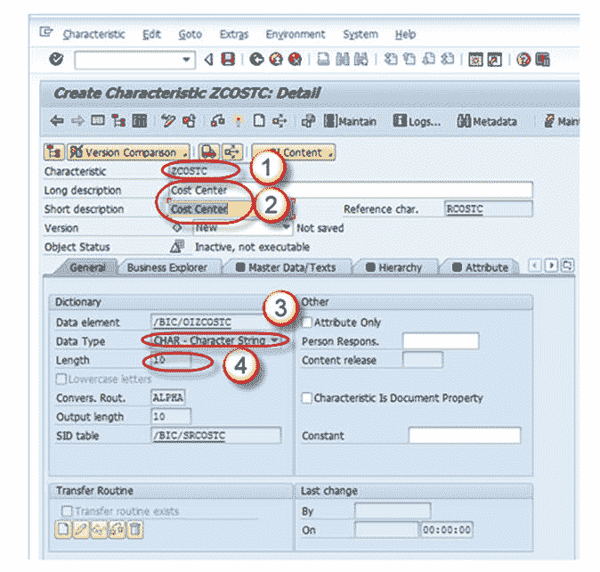
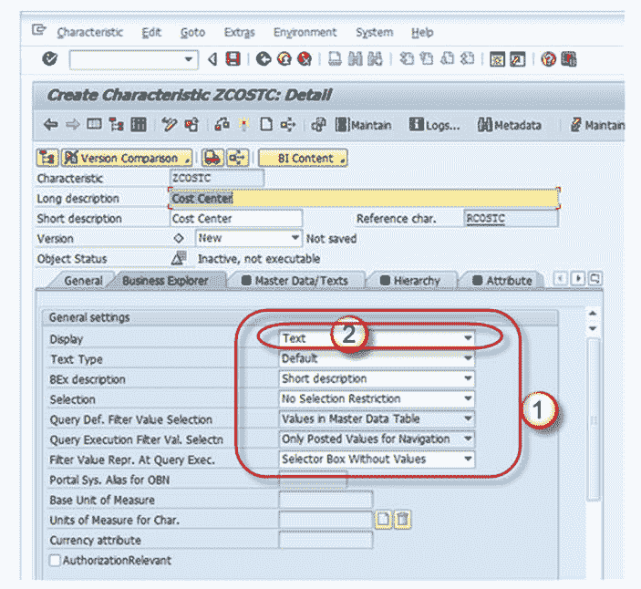
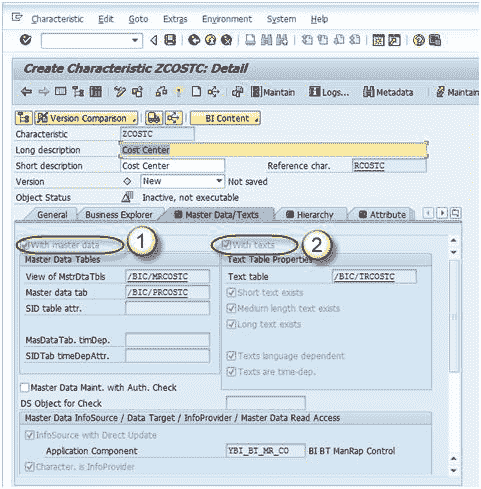
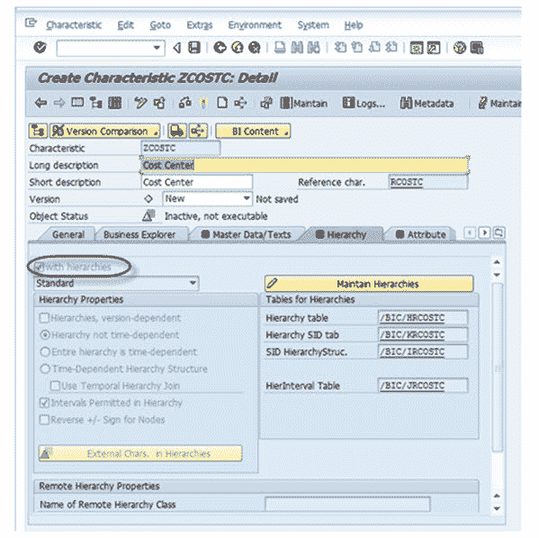
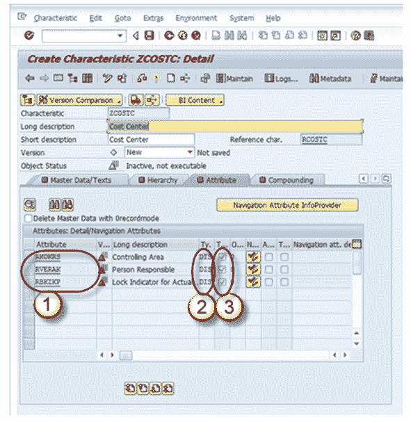
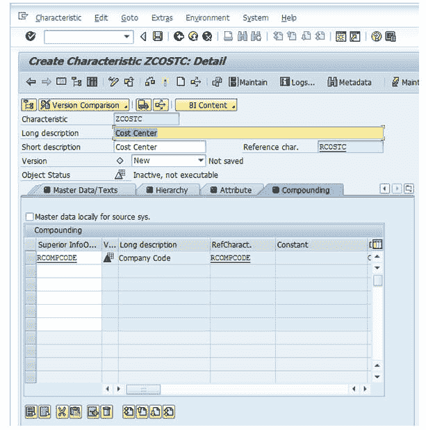

# 如何在 SAP BI / BW 中创建具有特征的 InfoObject

> 原文： [https://www.guru99.com/how-to-create-an-infoobject-with-characteristics.html](https://www.guru99.com/how-to-create-an-infoobject-with-characteristics.html)

**步骤 1）**

1.  转到事务代码 RSA1 转到“数据仓库工作台”。
2.  单击确定按钮。

**步骤 2）**

1.  导航到建模->信息对象
2.  右键单击特征 InfoObject 目录，然后选择选项“创建 InfoObject”，如下所示。

**步骤 3）**

1.  给出特征的技术名称
2.  给出有意义的描述
3.  如果要创建的新特性具有与其他已经存在的特性相同的技术特性，则提及参考特性。（LCOSTC）
4.  如果要创建的新特性具有已经存在的特性的某些技术特性，则指定模板。 （LCOSTC）
5.  点击输入按钮。

完成上述步骤后，将带您进入 Infoobject 的“编辑屏幕”。 Infoobject 的“编辑屏幕”具有下面列出的 6 个选项卡页面。

1.  一般
2.  业务浏览器
3.  主数据/文本
4.  层次结构
5.  属性
6.  复利

让我们分别查看每个标签页。

### **标签页：常规**

在此标签页中，输入以下内容

1.  InfoObject 的技术名称
2.  输入详细说明
3.  输入数据类型
4.  输入长度。

此选项卡和其他选项卡中的所有其他设置都是可选的。

### **选项卡页：业务浏览器**

1.  业务浏览器选项卡页面中的每个设置都是在业务浏览器中设置默认值。
2.  此页面上的显示：“文本”设置决定特征的值是作为文字描述显示还是作为 Business Explorer 中的键显示。

### **选项卡页：主数据/文本**

1.  必须为带有主数据的 Infoobject 选中“带有主数据复选框”和/或“带有文本”复选框。 通过选择这些复选框中的任何一个，特征被设计为承载主数据，并且具有自己的主数据表。
2.  如果特征需要自己的文本，则需要至少选择一个文本。 文本可以是短文本，中文本或长文本，分别具有 20、40 或 60 个字符。

在下面显示的屏幕快照中，特征具有主数据表（选中了主数据复选框），但没有文本表（未选中带有文本）。

### **标签页：层次结构**

层次结构指示由几个节点和叶子组成的父子关系。

在“层次结构”选项卡页上，确定特征是否可以具有层次结构，如果可以，则确定允许这些层次结构具有哪些属性。

如果选中**“具有”层次结构**复选框，则可以为此特性创建层次结构。 在下面的屏幕快照中，未选中该复选框，因此没有为此信息对象创建层次结构。

可以手动创建层次结构，也可以从 SAP 系统或其他非 SAP 源系统中加载层次结构。 层次结构可用于向下钻取或提取有关业务项目的特定信息。

示例：可以使用层次结构的实时场景如下：

假设在银行的情况下，可以以层次结构的形式维护主银行与银行下各个分支机构之间的关系。 在这里，您可以从任何分支机构提取有关其帐户，贷款，还款到期日等客户详细信息。

### **标签页：属性**

属性不过是主数据的字段或属性，有不同类型的属性，如显示属性，导航属性，执行属性，复合属性等。

1.  您确定特征是否可以具有属性或文本。 在*属性*选项卡页面上，将属性分配给特性。 *可以在“属性”选项卡页面中添加几个特征作为主数据特征的属性。*
2.  *通过单击“导航属性开/关”按钮，可以将属性标记为导航属性或显示属性。*

*   如果将属性定义为**显示属性**，则在与特性结合使用时，只能将这些属性用作报表中的附加信息。
*   如果将属性定义为**导航属性**，则可以使用它们在报表中进行导航。 执行查询时，系统不会区分 InfoProvider 的导航属性和特征。
*   在下面的示例中，公司代码是可导航的。

3.  如果每个属性值都需要有效期，则可以将显示和导航属性标记为与时间相关的**。**

### **标签页：复合**

在此选项卡页面上，确定是否将特征与其他 InfoObjects 混合。 您通常需要复合特征值以使特征值能够唯一地分配。 如果不进行复合，则无法定义某些 Info-object，为了映射数据模型，您有时必须复合 Info-Object。 如果将信息对象定义为属性，则不能将其包含为复合对象。

举例来说，成本中心 1000 代表控制区域 10 中的销售和分销，也代表控制区域 20 中的销售。在这种情况下，您将定义成本中心来控制区域特征复合。

现在保存并激活信息对象。