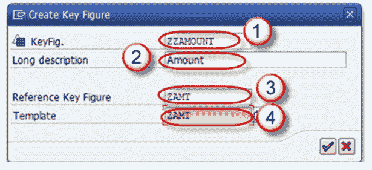
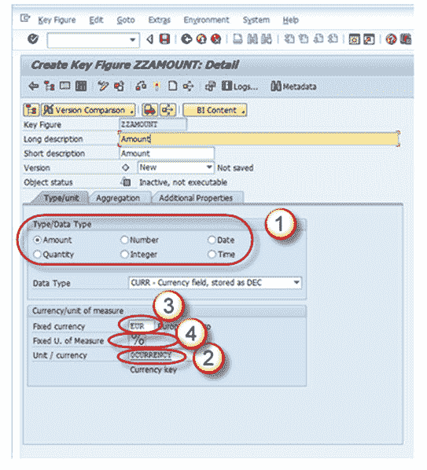
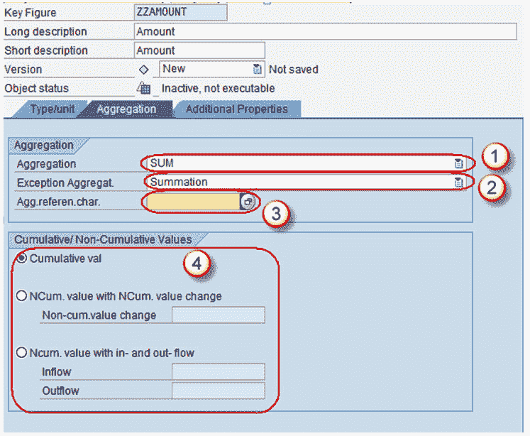
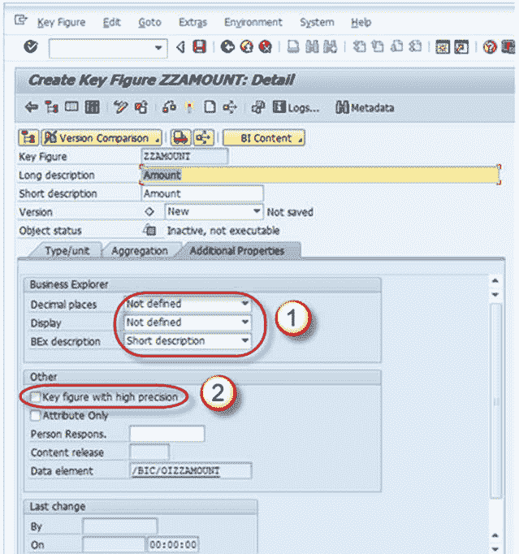

# 如何在 SAP BI / BW 中使用关键指标创建 InfoObjects

> 原文： [https://www.guru99.com/how-to-create-infoobjects-with-key-figures.html](https://www.guru99.com/how-to-create-infoobjects-with-key-figures.html)

转到 RSA1->建模-> Infoobjects

右键单击 Infoarea->单击“为关键指标创建 Infoobject 目录”。 激活 Keyfigure 信息对象目录。

现在单击 Infoobjects 目录->创建 Infoobject

1.  输入 Keyfigure 的技术名称。
2.  给出有意义的描述
3.  如果要创建的新 Keyfigure 具有与某些其他已经存在的 Keyfigure 相同的技术属性，则提及参考 Keyfigure。 在这种情况下，已经存在的 Keyfigure（此处提及技术名称）。
4.  如果要创建的新 Keyfigure 具有已经存在的 Keyfigure 的某些技术属性，则指定模板。 在这种情况下，已经存在的 Keyfigure（此处提到技术名称）。
5.  点击输入按钮。

完成上述步骤后，将带您进入键图 Infoobject 的 Edit 屏幕。 键图信息对象编辑屏幕具有下面列出的 3 个选项卡页面。

1.  类型/单位
2.  聚合
3.  其他特性

让我们分别查看每个标签页。

## 标签页：类型/单位

1.  在此标签页上，确定关键指标类型（金额，数量等），数据类型和货币/数量单位。
2.  如果选择关键指标类型的数量或数量，则必须为该关键指标分配货币或数量单位。
3.  对于关键指标类型“金额”，您可以选择固定货币（例如 USD）或可变货币（例如 0CURRENCY）。
4.  对于关键指标类型“数量”，可以在固定数量单位（例如 KG）或可变数量单位（例如 0UNIT）之间进行选择。

## 标签页：汇总

聚合是 Infocube 中数据的物化汇总视图。 换句话说，它将信息多维数据集数据的子集合并并存储到数据库中。 在具有适当聚合的信息多维数据集上执行查询时，查询将直接从数据库中读取汇总数据。 它也称为信息多维数据集的婴儿多维数据集。 如果信息多维数据集包含大量数据，建议使用聚合。

当数据存储在 BI 和 BEx 报表中的表中时，在此选项卡页上针对关键指标的行为设置聚合规则。

1.  **汇总**

在“聚合”字段中，指定确定关键指标聚合方式的函数（SUM / MAX / MIN）。

2.  **异常汇总**

在“异常聚集”字段中，指定功能（最后一个值，第一个值，最大值或最小值），该函数使用 Business Explorer 中用于异常聚集的参考特征来确定关键指标的聚集方式。

3.  **异常汇总的参考特征**

在“异常汇总的引用特征”字段中，选择要通过异常汇总对关键指标进行汇总的参考特征。 通常，这是时间特征。

4.  **累积/非累积值**

非累积值是一个或多个对象级别的非聚合关键指标，始终与时间相关地显示。

## 标签页：其他属性

1.  该选项卡页面主要用于更改 Business Explorer（BEx）中关键指标显示类型（小数位数，显示比例等）的默认设置。
2.  它还允许您设置具有最大精度的关键指标，该指标在内部处理涉及该关键指标的计算时要保留更多小数位，从而减少了舍入误差，但以降低速度为代价。

最后保存并激活关键指标。