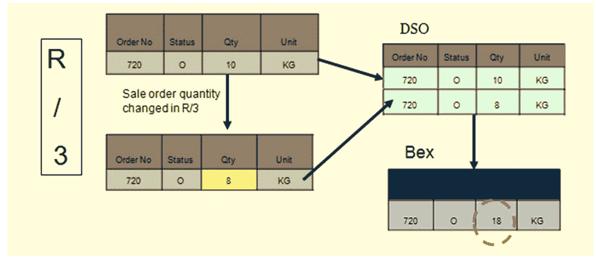

# SAP BW 中的 DSO 是什么？ 为什么要使用它？

> 原文： [https://www.guru99.com/what-is-dso-why-use-it.html](https://www.guru99.com/what-is-dso-why-use-it.html)

### 什么是 DSO？

DSO 是二维存储单元，主要以最小的粒度存储合并和清理的交易数据或主数据。 DSO 代表数据存储对象。

*   它是二维透明表。
*   数据以详细级别存储。
*   使用 DSO，还可以覆盖数据字段。
*   可以从 DSO 获得详细的级别报告。

## 为什么要使用 DSO？

让我们以一个销售订单数据为例，该数据必须从 SAP R / 3 系统（OLTP：不断变化的在线交易处理数据）中提取到 BI 中。 在 R / 3 系统中创建的销售订单可以在创建记录后的任何时间进行编辑。 最初，在 R / 3 中创建销售订单记录时，这些记录将提取到 BI 中。 一旦在 R / 3 中更改了记录，就需要在 BI 中进行更改。

*   从 SAP R / 3 系统中提取数据并将其加载到数据存储对象中。
*   最初，记录存储在 DSO 的“新状态”中。 记录存储在新表中。
*   激活 DSO 数据后，数据将存储在活动表中。新表不再保存该数据。
*   在 R / 3 中更改记录时，为了使这些更改反映在 BI 中，这些更改将提取到 DSO 中。
*   现在，数据将存储在新表中，直到激活 DSO 内容。 数据必须进一步加载到 Info 多维数据集中，从该多维数据集中传递报表。
*   DSO 具有覆盖和附加功能。如果所有特征都相同，则根据所选功能汇总/覆盖关键指标。
*   多维数据集本质上是加性的。 如果所有特征都相同，则将汇总关键数据。

### DSO 的类型

DSO 可以分为以下几种类型：

1.  标准 DSO
2.  直接更新 DSO
3.  写优化的 DSO