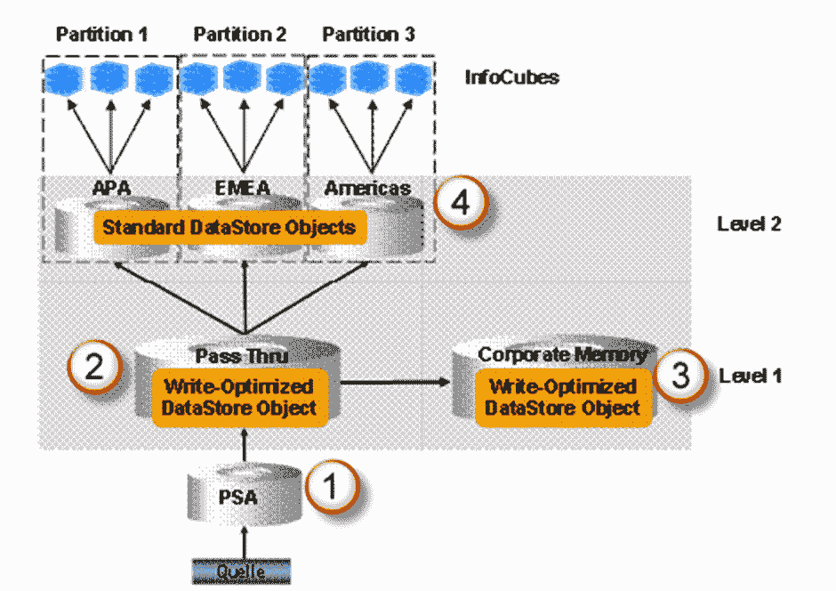
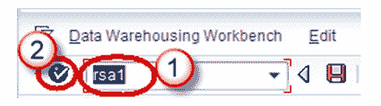
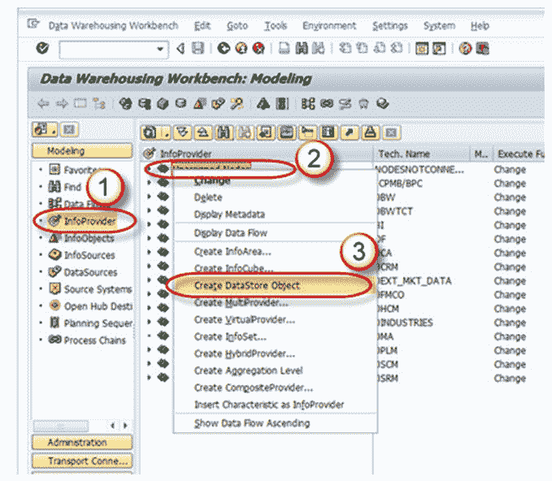
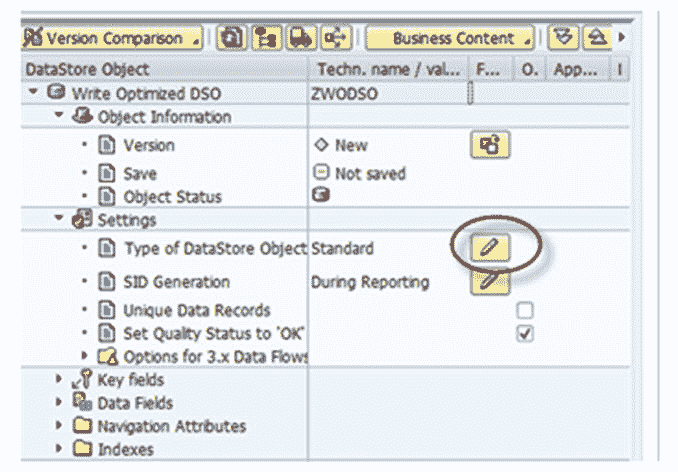
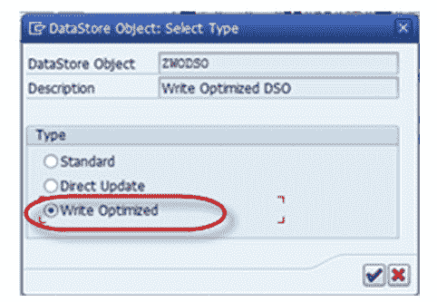
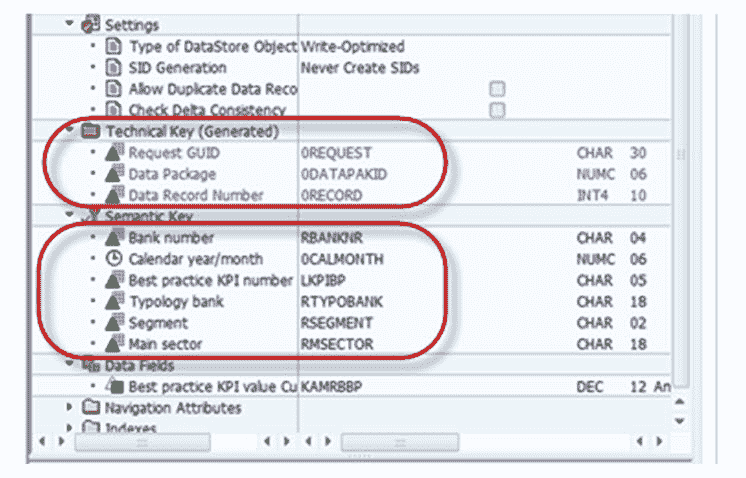
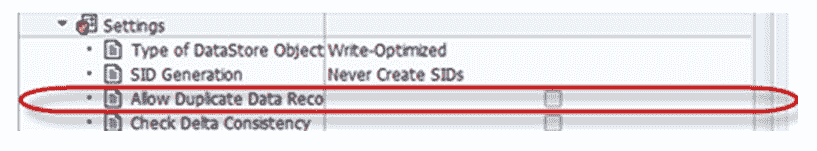
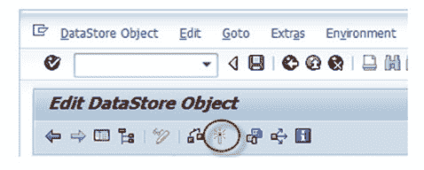

# 什么是 SAP 中的写入优化 DSO？ 如何创建一个？

> 原文： [https://www.guru99.com/what-is-write-optimized-dso-how-to-create-one.html](https://www.guru99.com/what-is-write-optimized-dso-how-to-create-one.html)

### 什么是写优化 DSO？

当需要数据存储对象来存储最低粒度的记录（例如地址）并且不需要覆盖功能时，将使用写优化 DSO。 它仅由活动数据表组成，因此无需激活数据即可增加数据处理量。 数据存储对象可立即用于进一步处理； 它用作大量数据的临时存储区域。

写入优化的 DSO 最初被设计为源系统数据的初始阶段，可以将数据从该阶段转移到标准 DSO 或信息多维数据集。

1.  PSA 接收到源系统未更改的数据
2.  在文档级别**和**上发布数据后，将数据加载到标准 DSO 中将被删除
3.  数据通过写优化 DSO 传递到企业内存写优化 DSO
4.  数据根据业务需求从写优化的“直通”分发到标准 DSO

**写入优化的 DSO 属性：**

*   它用于源系统数据的初始暂存。
*   存储的数据的粒度最低。
*   数据加载可以更快，因为它没有单独的激活步骤。
*   每个记录都有一个技术密钥，因此不可能汇总记录。 每次都会插入新记录。

**创建写优化 DSO：**

**步骤 1）**

1.  转到交易代码 RSA1
2.  单击确定按钮。

**步骤 2）**

1.  导航到“建模”选项卡->信息提供者。
2.  右键单击信息区域。
3.  从上下文菜单中单击“创建数据存储对象”。

**步骤 3）**

1.  输入技术名称。
2.  输入说明。
3.  点击“创建”按钮。

**步骤 4）**

单击“数据存储对象的类型”的编辑按钮。

**步骤 5）**

选择“写优化”类型。

技术键包括请求 ID，数据包，记录号。 此下不能包含其他对象。

语义键类似于键字段，但是，此处不考虑覆盖功能的唯一性。 而是将它们与设置*“不检查数据的唯一性”结合使用。*

语义键的目的是识别传入记录或重复记录中的错误。

重复的记录将按照以下顺序写入错误堆栈。 通过在 DTP 中定义语义组，可以处理或重新加载错误堆栈中的这些记录。

如果没有重复记录或错误记录的可能性，则无需定义语义组。

如果我们未选中“允许重复数据记录”复选框，则将检查来自源的数据是否重复，即，如果 DSO 中已经存在相同的记录（语义键），则当前加载将终止。

如果选中此复选框，则重复记录将作为新记录加载。 在这种情况下，语义键不相关。

**步骤 6）**

激活 DSO。

