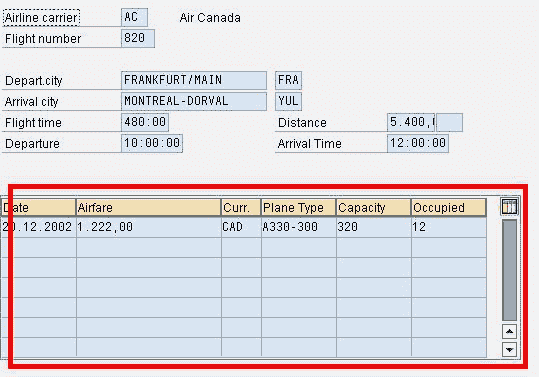

# SAP ABAP 表控件示例

> 原文： [https://www.guru99.com/abap-table-controls.html](https://www.guru99.com/abap-table-controls.html)

表格控件和步骤循环是屏幕表格显示的对象，您可以将其添加到“屏幕绘画器”中的屏幕。

从编程的角度来看，表控件和步骤循环几乎完全相同。 表控件只是经过改进的步进循环，可以显示与桌面应用程序中的表相关联的外观的数据。

使用表格控件，用户可以：

*   垂直和水平滚动表格
*   调整列的宽度
*   在字段中滚动（当字段内容比字段宽时）
*   选择表格行或列
*   重新排序列的顺序
*   保存当前的显示设置以备将来使用

表格控件还提供了特殊的格式设置功能（有些是自动的，有些是可选的），使表格更易于查看和使用。 表控件提供-

*   用户调整窗口大小时自动调整表的大小（垂直和水平）
*   行之间和列之间的分隔线（垂直和水平）
*   所有列的列标题字段

步进循环的一个功能是它们的表行可以跨越屏幕上的多行。 另一方面，表格控件的一行必须始终包含在一行中（尽管可以滚动）。

***通常，表控件提供的许多功能都是由系统的 SAPgui 前端在本地处理的，因此您无需自己对其进行编程。 唯一值得注意的例外是垂直滚动*** 。

示例（交易 TZ60）

 

***语法***

要处理 ABAP 程序中的表控件，必须使用以下语句在程序的声明部分为每个表控件声明一个控件：

```
CONTROLS <ctrl> TYPE TABLEVIEW USING SCREEN <scr>
```

其中 *< ctrl >* 是 ABAP 程序在屏幕上的表控件的名称。 该控件允许 ABAP 程序读取表控件的属性并影响该控件。此处 *< scr >* 是加载表初始值的屏幕号。

可以通过以下方式设置表控件的光标位置：

在 PBO 上，可以将光标设置在表控件特定行的特定字段上。

```
SET CURSOR FIELD <f> LINE <lin> [OFFSET <off>]
```

使用可选的附加项 *OFFSET* ，您可以按照设置光标位置中的说明在字段中输入光标的偏移量。

在 PAI 上，您可以读取当前光标位置。

```
GET CURSOR FIELD <f> LINE <lin> ...
```

除了在“找到光标位置”下给出的信息之外，字段 *< lin >* 包含有关光标当前位于表控件的哪一行的信息。 您也可以使用

```
GET CURSOR LINE <lin>.
```

确定表控件的行。 *SY-SUBRC* 允许您检查光标是否放置在表格控件的一行中。

用于获取内部表的相应行：

```
GET CURSOR line <lin>.

ind = <table_control>-top_line + <lin> - 1.

Read table <itab> index ind.
```

系统变量*步骤 1* -在 loop ... endloop 中包含当前表行索引。 *Loopc* -包含表格中可见的行数

***创建表格控件***

1.添加表格 屏幕上的控件元素

2.为表控件命名。 在 ABAP 程序中声明具有相同结构的结构（CONTROLS < tcl >类型 TABLEVIEW 使用屏幕< scrn >）

3.要创建字段，请转到 Dict./Program 字段。 功能。

*   输入您想要其字段的结构的名称。 （如果您希望它从程序字典中选择它，请单击相关的 puhbutton）。
*   在字段列表中，选择所需的字段，然后选择确定。
*   在表格控制区域中单击

如果需要选择列，请选中属性中的相应复选框并为其命名。 在 ABAP 程序中创建该字段。

在 PBO 中，您应该有以下声明

```
LOOP at <itab> USING CONTROL <cntrl_name>.

ENDLOOP.
```

在 PAI 中，您应该拥有。

```
LOOP at <itab>.

ENDLOOP.
```

在屏幕和内部表之间进行数据传输是在循环内。当填充内部表时，请使用 DESCRIBE TABLE < itab > LINES < cntrl_name >-行来存储总数。 FIELD 语句可用于控制何时进行数据传输

。要更改单个单元格的属性，请临时更改 PBO 中的 SCREEN 表。 您可以更改 CONTROLS 语句创建的结构的属性

```
<cntrl>-fixed_cols etc are the attributes of the control

<cntrl>-cols-index etc are the attributes of the columns.

<cntrl>-cols-screen-invisible etc are the screen attributes of each column.
```