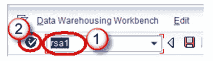
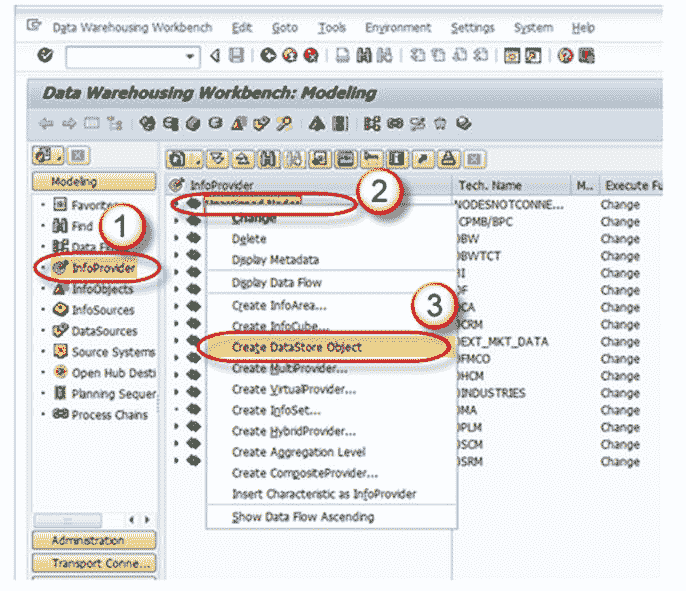
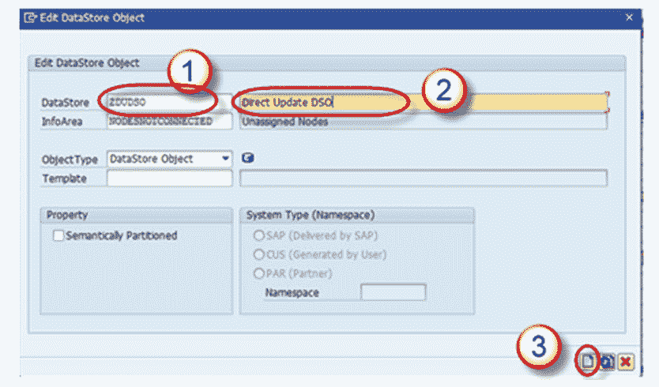
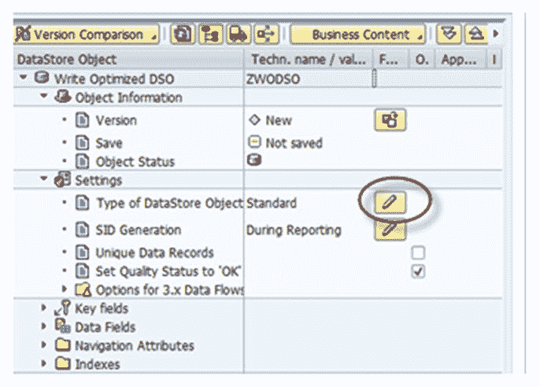
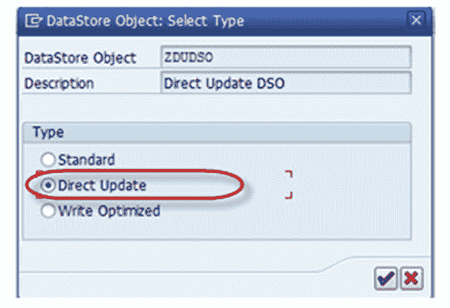
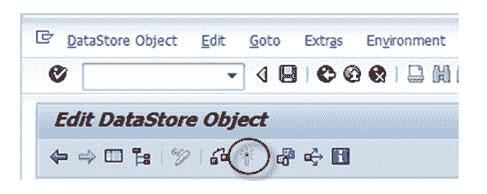

# 什么是 SAP 中的直接更新 DSO？ 如何创建一个？

> 原文： [https://www.guru99.com/what-is-direct-update-dso-how-to-create-one.html](https://www.guru99.com/what-is-direct-update-dso-how-to-create-one.html)

标准 DSO 在数据处理方式方面与直接更新 DSO 不同。

在标准 DSO 中，数据存储在不同版本的 Active，Delta，Modified 中

而直接更新 DSO 包含单个版本的数据。 数据以与写入 DSO 相同的形式精确存储，该形式由 Active Data Table 组成，供应用程序直接更新。 它通过 fill 或 delete API 从外部系统检索其数据。

## **存在以下 API：**

*   RSDRI_ODSO_INSERT：此 API 用于插入系统中不存在的新数据。
*   RSDRI_ODSO_INSERT_RFC：与该 API“ RSDRI_ODSO_INSERT”类似，不同之处在于可以远程调用此 API。
*   RSDRI_ODSO_MODIFY：此 API 用于修改现有记录。 如果有新记录，则插入该记录。
*   RSDRI_ODSO_MODIFY_RFC：这类似于 API“ RSDRI_ODSO_MODIFY”，但可以远程调用此 API。
*   RSDRI_ODSO_UPDATE：此 API 用于修改现有记录。
*   RSDRI_ODSO_UPDATE_RFC：这类似于 API“ RSDRI_ODSO_UPDATE”，但可以远程调用此 API。
*   RSDRI_ODSO_DELETE_RFC：此 API 用于删除记录。

## **直接更新 DSO-属性**

*   用于直接更新的 DSO 包含单个版本中的数据。 因此，数据的存储格式与应用程序写入数据的格式完全相同
*   具有相同键的记录不会汇总
*   无法生成 SID
*   可以将其中的数据更新到其他信息提供者。
*   用于直接更新的 DSO 可作为 BEx 查询设计器中的信息提供者使用，并可用于分析目的。
*   它是可以在特殊应用程序上下文中使用的附加功能。
*   快速加载数据而无需使用 BI 系统中的提取和加载过程。
*   可用作分析过程的数据目标。

## **直接更新 DSO-功能**

*   可以将直接更新 DSO 数据更新到其他信息提供程序中。
*   可以用作 Bex Query Designer 的信息提供者，也可以用于分析过程。

**优势：**

*   它以易于访问数据的方式进行结构化。
*   数据在加载后立即可供分析和报告。

**缺点**

*   BI 系统不支持加载过程（数据源不提供数据）。
*   因此，DSO 不会显示在管理部门或监视器中。
*   由于未生成更改日志，因此我们无法对信息提供者执行增量更新。

## 创建直接更新 DSO：

**步骤 1）**

1.  转到交易代码 RSA1
2.  单击确定按钮。

**步骤 2）**

1.  导航到“建模”选项卡->信息提供者。
2.  右键单击信息区域。
3.  从上下文菜单中单击“创建数据存储对象”。

**步骤 3）**

1.  输入技术名称。
2.  输入说明。
3.  点击“创建”按钮。

**步骤 4）**

单击“数据存储对象的类型”的编辑按钮。

**步骤 5）**

选择类型“直接更新”。

**步骤 6）**

激活 DSO。

