# 什么是 SAP BI / BW 中的 Infocube？ 如何创建一个？

> 原文： [https://www.guru99.com/what-is-an-infocube-how-to-create-one.html](https://www.guru99.com/what-is-an-infocube-how-to-create-one.html)

### 什么是 Infocube？

Infocube 是数据存储区，我们在其中维护从物理上从源系统提取的数据。 InfoCube 既可以充当数据目标又可以充当 InfoProvider。 从报告的角度来看，Infocube 可以描述为一个独立的数据集。

例如，可以用任意轴查看维度为 MONTH – PRODUCT-CUSTOMER-REGION 的 Sales Amount Infocube，例如按区域或客户的总销售额。 信息多维数据集的维度是实体或层次结构。

[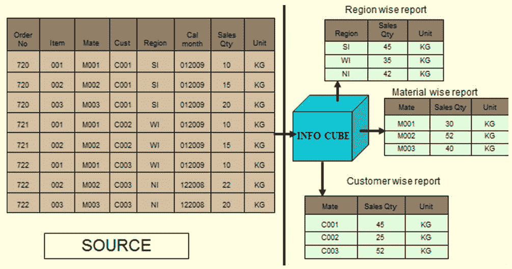](/images/sap/SAP_BI/sap_bi_13_1.jpg)

BIW（商业智能仓库）提供了定义 16 个维度的功能，其中 3 个是预定义的。

[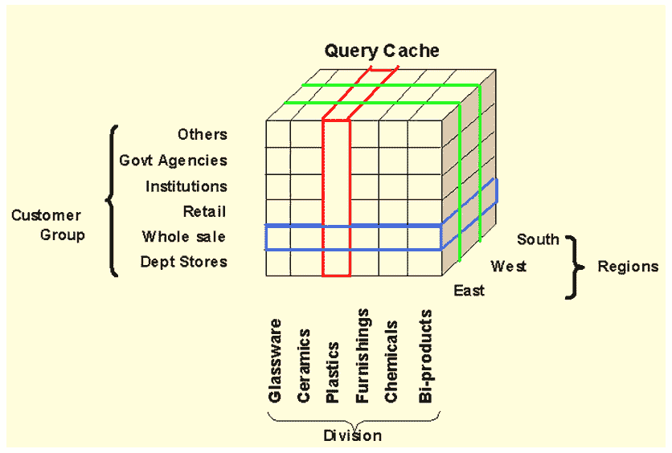](/images/sap/SAP_BI/sap_bi_13_2.jpg)

上面的立方体演示了一个简单的三维立方体。 每个维度可以包含 248 个特征进行分析。 上方立方体中的一个正方形代表相应客户/区域/部门组合的相对价值。

**InfoCube 结构：**

*   Infocube 遵循扩展星形架构。
*   它的中心是事实表，周围是 16 个维度表，主数据位于多维数据集的外部。
*   信息多维数据集是 BI 中的中央多维数据模型。
*   它是一个自封闭的数据集，包含一个或多个相关的业务流程。 报告用户可以定义或执行针对信息多维数据集的查询。
*   它用于长时间存储汇总/汇总数据。 信息多维数据集恰好由一个事实表和维表组成。
*   SAP 提供的 Infocubes 通常以数字 0 开头。您自己的 Infocube 应以字母 A 到 Z 开头，并且长度应为 3 到 9 个字符。

**InfoCube 的类型**

根据维护和分发数据的方式，Infocube 分为三种类型。

*   **标准信息多维数据集：**用于物理上维护多维数据集中的数据。 只读是可能的。
*   **Virtual Infocube：**它并不物理上维护多维数据集中的数据。在执行查询期间，它将数据从相应的源系统中引入。
*   **实时信息多维数据集：**将数据物理存储在多维数据集中。可以进行读取和写入。 它在计划数据中被大量使用。

### 如何创建标准 Infocube

**步骤 1）**

创建 InfoCube

1.  转到交易代码 RSA1
2.  单击确定按钮。

[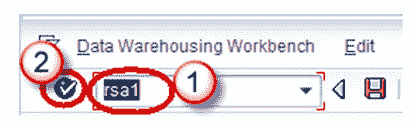](/images/sap/SAP_BI/sap_bi_13_3.jpg)

**步骤 2）**

1.  导航到“建模”选项卡-> InfoProvider。
2.  右键单击 InfoArea。
3.  从上下文菜单中单击“创建 InfoCube”。

[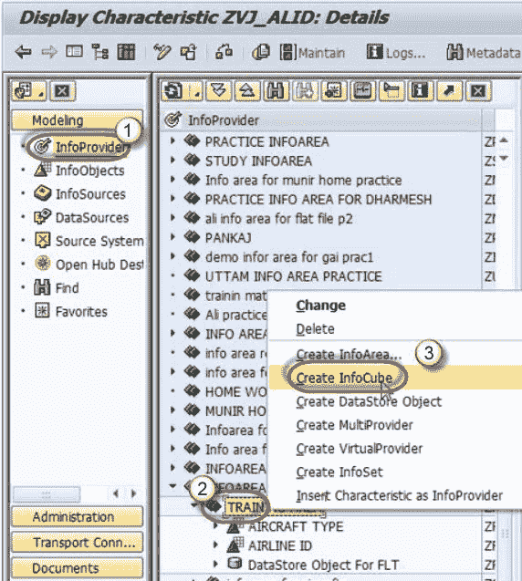](/images/sap/SAP_BI/sap_bi_13_4.jpg)

[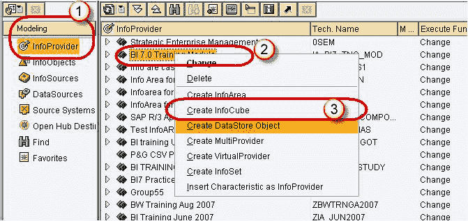](/images/sap/SAP_BI/sap_bi_13_5.jpg)

**步骤 3）**

1.  输入技术名称。
2.  输入说明。
3.  选择选项按钮“ Standard InfoCube”。

点击创建按钮

[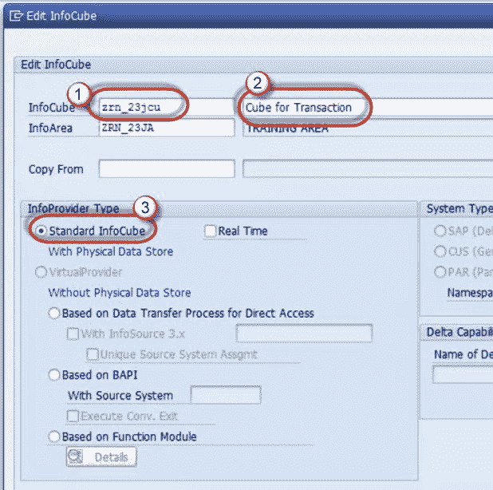](/images/sap/SAP_BI/sap_bi_13_6.jpg)

**步骤 4）**

右键单击维度 1->属性。

[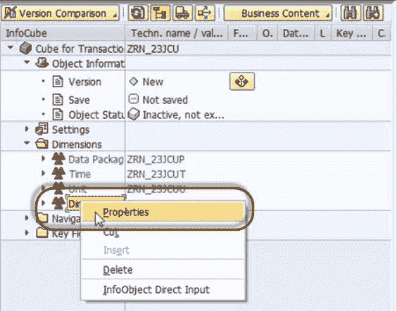](/images/sap/SAP_BI/sap_bi_13_7.jpg)

**步骤 5）**

根据信息对象信息重命名维度。

[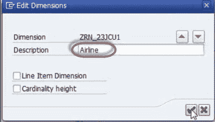](/images/sap/SAP_BI/sap_bi_13_8.jpg)

**步骤 6）**

右键单击维度-> InfoObject 直接输入，以将 InfoObjects 插入维度。

[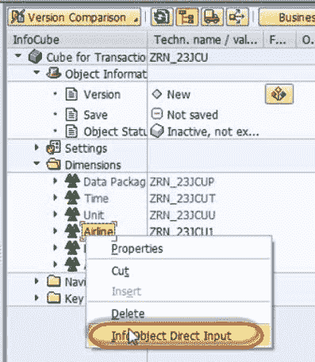](/images/sap/SAP_BI/sap_bi_13_9.jpg)

**步骤 7）**

选择特征。

[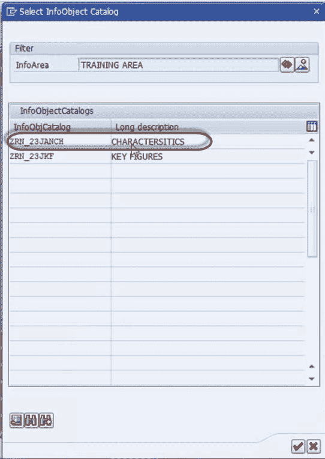](/images/sap/SAP_BI/sap_bi_13_10.jpg)

**步骤 8）**在特征中选择航空公司 ID

[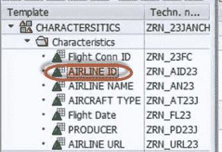](/images/sap/SAP_BI/sap_bi_13_11.jpg)

将其拖放到“维度”中

[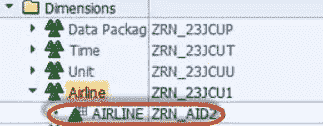](/images/sap/SAP_BI/sap_bi_13_12.jpg)

**步骤 9）**

同样，创建新尺寸并按照步骤 4-8 添加 InfoObject。

[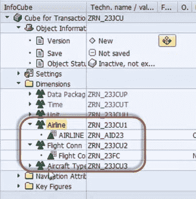](/images/sap/SAP_BI/sap_bi_13_13.jpg)

**步骤 10）**

在 Infocube 中添加关键的 figInfoInfoObjects

[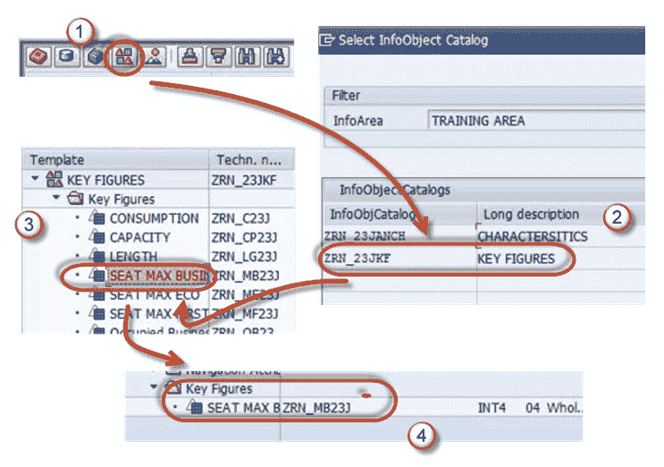](/images/sap/SAP_BI/sap_bi_13_14.jpg)

**步骤 11）**

按照上面的步骤添加更多关键指标

[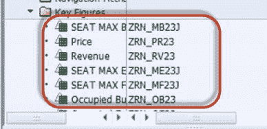](/images/sap/SAP_BI/sap_bi_13_15.jpg)

**步骤 12）**

激活 Infocube。

[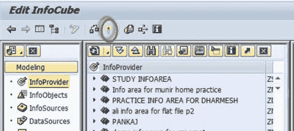](/images/sap/SAP_BI/sap_bi_13_16.jpg)

### Infocube 附加点：

尺寸表的技术名称由系统使用模式/ BIC /“ D <您的 Infocube >＃”指定，其中第一个是 a1，第二个是 2，依此类推*。*

如果它是汁液传递的多维数据集，则它将以/ BI0 / D 开头

特性信息对象可以自由添加到客户创建的尺寸中。

尺寸表应最佳使用。

在向维度添加特征信息对象的同时确保最佳基数。 *一家百货商店有 10,000 个客户和 1000 种不同的物料。 基数为 **m：n** ，这意味着每个客户都可以购买许多材料。 这种基数不应该在同一维表中维护。*

*规则：避免在尺寸内使用 m：n。*

中的

*   导航到“建模”选项卡-> InfoProvider。
*   右键单击 InfoArea。
*   从上下文菜单中单击“创建 InfoCube”。
*   输入技术名称。
*   输入说明。
*   选择选项按钮“ Standard InfoCube”。

**不要**

*   如果用户满足以下条件，则可以使用标准 Infocube：
*   希望方便进行多维分析。
*   想要存储具有大量数据的摘要/汇总信息。
*   如果维度表中仅放置一个对象，请使用订单项维度。
*   保持较高的记录粒度。
*   M 组：同一维内的 N 个基数。
*   更加注意通过导航属性带来角色信息。
*   在维表中维护高基数信息。