# 如何从 SAP BI / BW 中的平面文件加载主数据

> 原文： [https://www.guru99.com/how-to-load-master-data-from-flat-file.html](https://www.guru99.com/how-to-load-master-data-from-flat-file.html)

**我们将在方案的帮助下了解负载-**

将主数据加载到具有属性 ZMAT_NM（材料名称）的 InfoObject ZMAT（材料编号）。下面是从平面文件将数据加载到主数据 Infoobject 的详细步骤。

[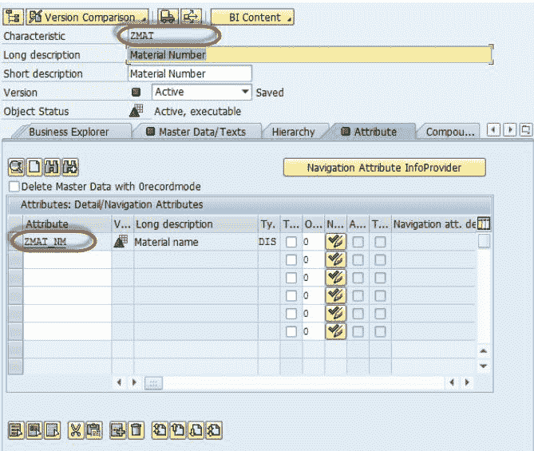](/images/sap/SAP_BI/sap_bi_14_1.jpg)

**步骤 1）为平面文件**创建源系统。

1.  转到交易代码 RSA1
2.  单击确定按钮。

在下一个屏幕中，

1.  导航到“建模”选项卡->源系统。
2.  右键单击名为 FILE 的文件夹，然后从上下文菜单中选择“创建”。

In the next screen,

1.  输入逻辑系统名称。
2.  输入说明。
3.  单击继续按钮。

**步骤 2）创建应用程序组件。**

1.  导航到“建模”选项卡->数据源。
2.  选择源系统。

[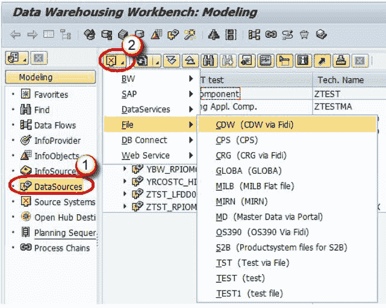](/images/sap/SAP_BI/sap_bi_14_5.jpg)

3.  右键单击->创建应用程序组件。

[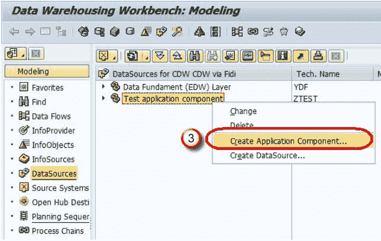](/images/sap/SAP_BI/sap_bi_14_6.jpg)

4.  输入技术名称。
5.  输入说明。
6.  单击继续。

[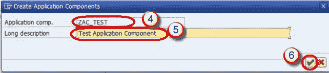](/images/sap/SAP_BI/sap_bi_14_7.jpg)

7.  导航到“建模”选项卡->数据源。
8.  右键单击->创建数据源

[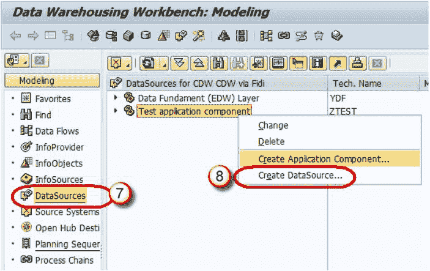](/images/sap/SAP_BI/sap_bi_14_8.jpg)

9.  输入技术名称。
10.  选择数据类型数据源。
11.  单击继续。

[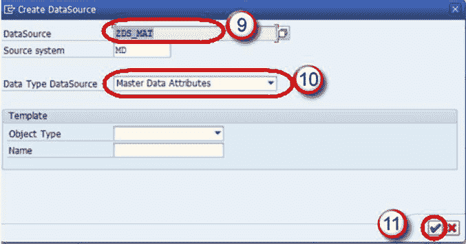](/images/sap/SAP_BI/sap_bi_14_9.jpg)

12.  输入如下所示的字段。 此结构应与将事务数据加载到的 DSO 相同。

[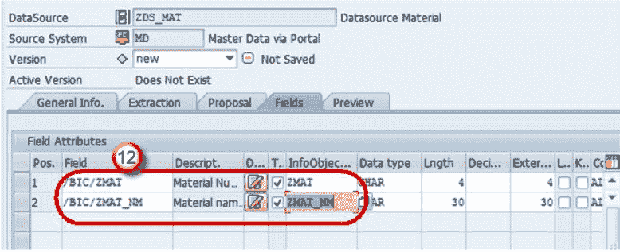](/images/sap/SAP_BI/sap_bi_14_10.jpg)

13.  在“提取”选项卡中，将适配器选择为“从本地工作站加载文本类型文件”。
14.  选择要在其中放置平面文件的文件路径，然后激活数据源。

[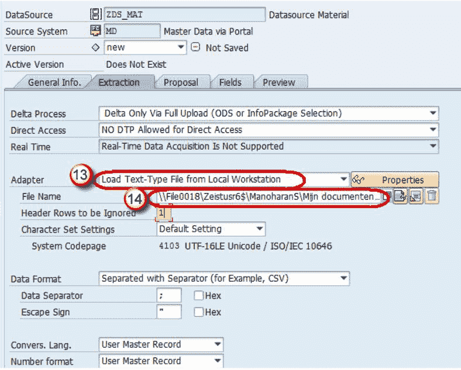](/images/sap/SAP_BI/sap_bi_14_11.jpg)

单击保存。

**步骤 3）在数据源（源）和 InfoObject 属性（目标）之间创建转换。**

右键单击数据源->创建转换

In the next screen,

1.  输入目标对象类型。
2.  输入目标对象名称。
3.  输入子类型
4.  单击继续。

[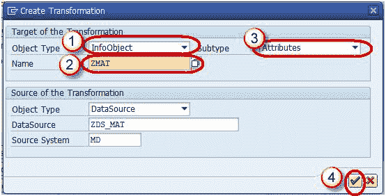](/images/sap/SAP_BI/sap_bi_14_13.jpg)

将通过自动将“源”字段映射到“目标”字段来创建转换。

右键单击 DTP 文件夹，然后从上下文菜单中选择选项“创建数据传输过程”。

[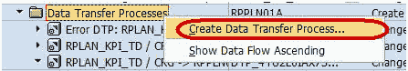](/images/sap/SAP_BI/sap_bi_14_14.jpg)

下面的屏幕显示创建的 DTP。

[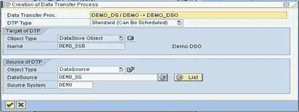](/images/sap/SAP_BI/sap_bi_14_15.jpg)

**步骤 4）创建信息包并将数据加载计划到数据源（PSA）。**

1.  在命令提示符下输入 RSA1
2.  按下 Enter
3.  导航到“建模”选项卡->数据源。
4.  右键单击数据源->创建 InfoPackage。

5.  输入信息包说明
6.  单击保存。

[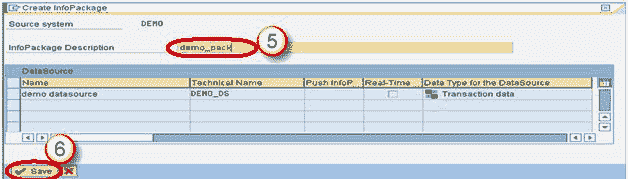](/images/sap/SAP_BI/sap_bi_14_17.jpg)

7.  单击计划选项卡。
8.  单击开始按钮以开始从平面文件到数据源的加载。

**步骤 5）将数据加载到 DSO。**

1.  单击 DTP 中的“执行”选项卡。
2.  单击执行按钮以开始将数据从数据源（PSA）加载到 DSO。

