# 如何从 SAP BI / BW 中的平面文件加载事务数据

> 原文： [https://www.guru99.com/how-to-load-transaction-data-from-flat-file.html](https://www.guru99.com/how-to-load-transaction-data-from-flat-file.html)

我们将在场景的帮助下学习如何从平面文件加载事务数据。

场景：将数据加载到名为“ DEMO_DSO”的 DSO。 DSO 具有以下字段。

**关键字段：**

ZCUST-客户

ZMAT –材料

**数据字段：**

ZPRICE –物料价格

ZQTY-数量

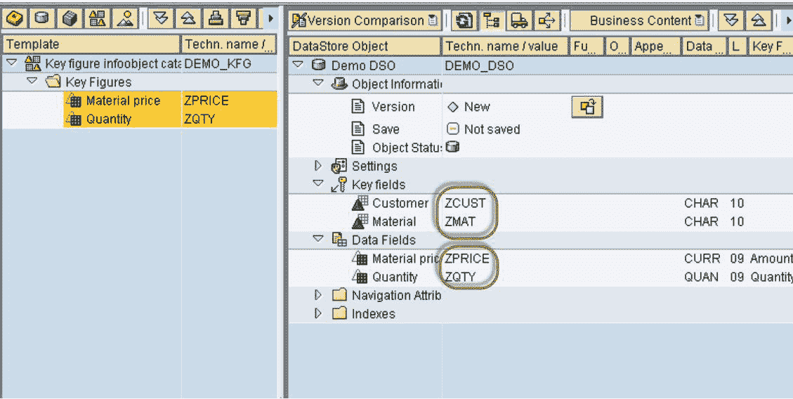

让我们看一下从平面文件将数据加载到 DSO 的步骤

**步骤 1）创建平面文件的源系统。**

1.  转到交易代码 RSA1
2.  单击确定按钮。

在下一个屏幕中，

1.  导航到“建模”选项卡->源系统。
2.  右键单击名为 FILE 的文件夹，然后从上下文菜单中选择“创建”。

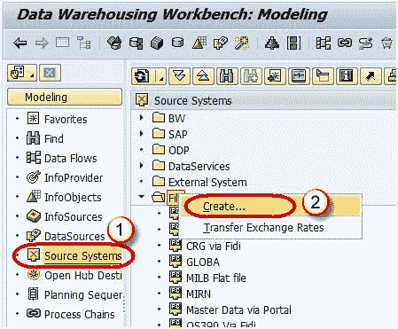

In the next screen,

1.  输入逻辑系统名称。
2.  输入描述。单击继续按钮。

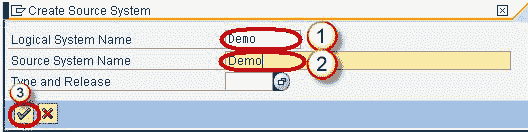

**步骤 2）创建应用程序组件。**

1.  转到交易代码 RSA1
2.  单击确定按钮。

3.  导航到“建模”选项卡->数据源。
4.  选择源系统。

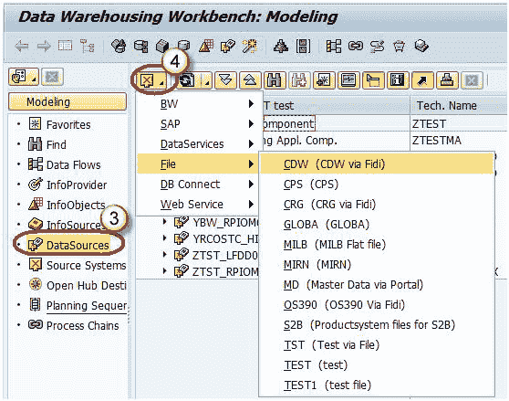

5.  右键单击->创建应用程序组件。

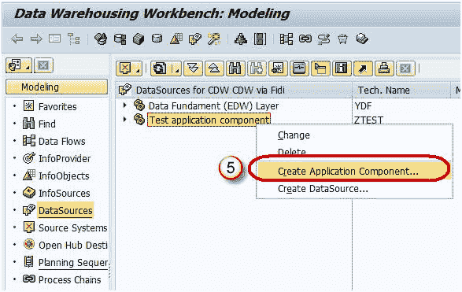

6.  输入技术名称。
7.  输入说明。
8.  单击继续。

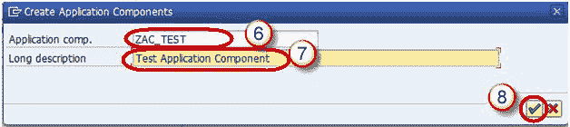

**步骤 3）创建数据源。**

1.  转到交易代码 RSA1
2.  单击确定按钮。

3.  导航到“建模”选项卡->数据源。
4.  右键单击->创建数据源。

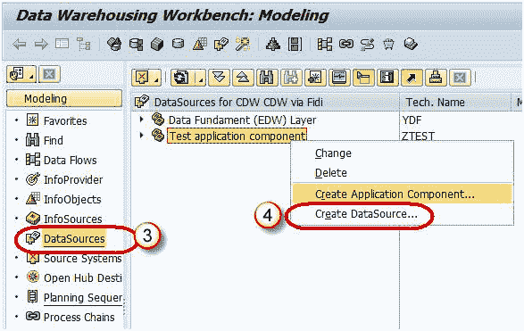

5.  输入技术名称。
6.  选择数据类型数据源。
7.  单击继续。

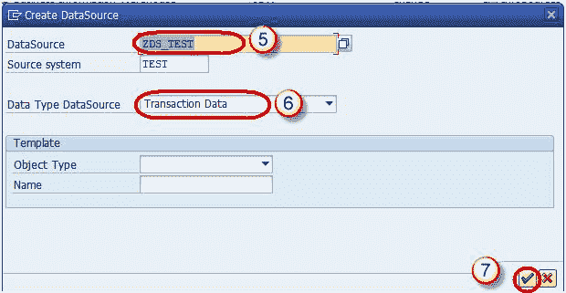

8.  输入如下所示的字段。 此结构应与将事务数据加载到的 DSO 相同。

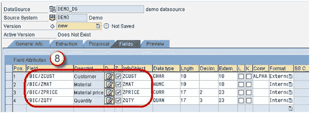

9.  在“提取”选项卡中，将适配器选择为“从本地工作站加载文本类型文件”。
10.  选择要在其中放置平面文件的文件路径，然后激活数据源。

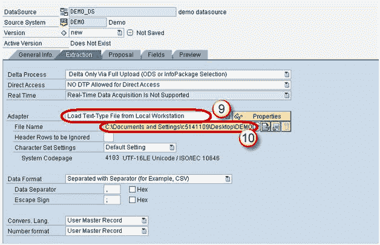

**步骤 4）在数据源（源）和 DSO（目标）之间创建转换。**

1.  转到事务代码 RSA1。
2.  单击确定按钮。

3.  导航到“建模”选项卡-> InfoProvider。
4.  创建转换。

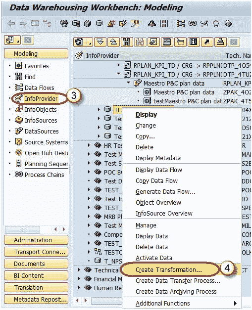

5.  输入目标对象类型。
6.  输入目标对象名称。
7.  输入源对象类型。
8.  输入源对象名称。
9.  输入源系统。
10.  单击继续。

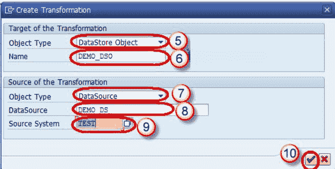

下面的屏幕显示了将 Source 字段自动映射到 Target 字段所创建的转换。

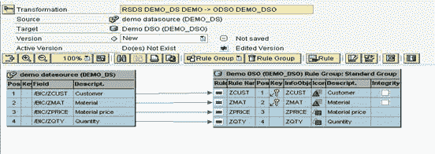

**步骤 5）创建数据传输过程。**

右键单击 DTP 文件夹，然后从上下文菜单中选择选项“创建数据传输过程”。

下面的屏幕显示创建的 DTP。

**步骤 6）创建信息包并将数据加载计划到数据源（PSA）。**

1.  转到事务代码 RSA1。
2.  单击确定按钮。

3.  导航到“建模”选项卡->数据源。
4.  右键单击数据源->创建 InfoPackage。

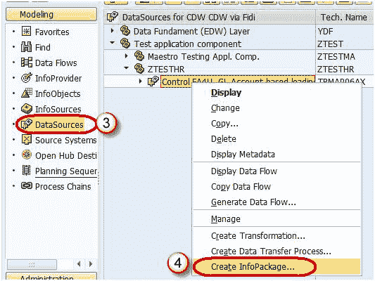

5.  输入信息包描述。
6.  单击保存。

7.  单击计划选项卡。
8.  单击开始按钮以开始从平面文件到数据源的加载。

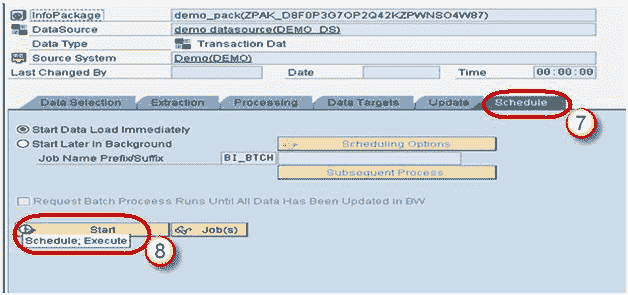

**步骤 7）将数据加载到 DSO。**

1.  单击 DTP 中的“执行”选项卡。
2.  单击执行按钮以开始将数据从数据源（PSA）加载到 DSO。

