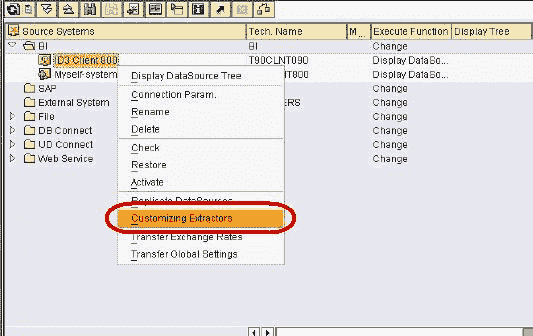
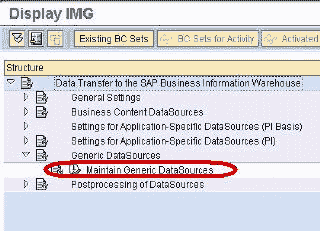
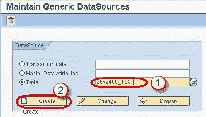
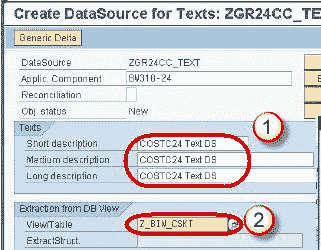
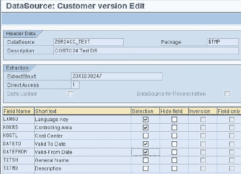
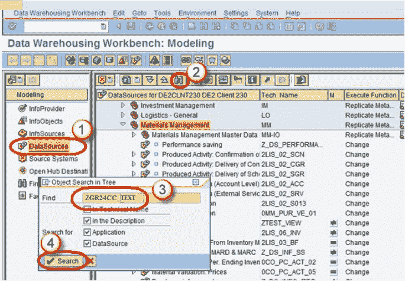
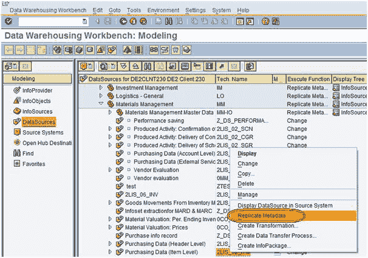
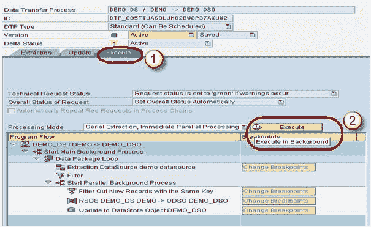

# 如何从 SAP BI / BW 中的 ECC 加载主数据

> 原文： [https://www.guru99.com/how-to-load-master-data-from-ecc.html](https://www.guru99.com/how-to-load-master-data-from-ecc.html)

**步骤 1）为文本 InfoObject** 创建通用数据源

右键单击 BI Source System->自定义提取器。

在下一个屏幕中，单击维护通用数据源。

在下一个屏幕中

1.  键入文本的技术名称。
2.  单击创建按钮。

In next screen,

1.  输入简短描述，中等描述和详细描述。
2.  输入视图/表名称。

按下输入按钮。 显示以下屏幕。

现在，

1.  转到交易代码 RSA1
2.  单击确定按钮。

In next screen,

1.  转到“数据源”选项卡
2.  点击查找
3.  键入数据源技术名称。
4.  单击搜索按钮。

接下来，从数据源 **ZGR24CC_TEXT** 中，右键单击“复制元数据”，如下所示。 激活数据源。

**步骤 2）在数据源（源）和 InfoObject 文本（目标）之间创建转换。**

1.  转到交易代码 RSA1
2.  单击确定按钮。

在下一个屏幕中，右键单击数据源->创建转换

In next screen,

1.  输入目标对象类型。
2.  输入目标对象名称。
3.  输入子类型。 选择文本。
4.  单击继续。

将通过自动将“源”字段映射到“目标”字段来创建转换。

**步骤 3）创建信息包并将数据加载计划到数据源（PSA）。**

1.  转到交易代码 RSA1
2.  单击确定按钮。

3.  导航到“建模”选项卡->数据源。
4.  右键单击数据源->创建 InfoPackage。

5.  输入信息包说明
6.  单击保存。

7.  单击计划选项卡。
8.  单击开始按钮以开始从平面文件到数据源的加载。

**步骤 4）创建数据传输过程。**

右键单击 DTP 文件夹，然后从上下文菜单中选择选项“创建数据传输过程”。

下面显示了创建的 DTP。

**步骤 5）将数据加载到 InfoObject 文本。**

1.  单击 DTP 中的“执行”选项卡。
2.  单击执行按钮以开始从数据源（PSA）到 InfoObject 文本的数据加载。

