# 如何从 ECC 加载事务数据：SAP RSA5

> 原文： [https://www.guru99.com/how-to-load-transaction-data-from-ecc.html](https://www.guru99.com/how-to-load-transaction-data-from-ecc.html)

以下是将数据从 ECC 提取到 BW 系统中的步骤。 在我们的示例中，我们将采用物流（采购应用程序模块）。

**步骤 1）**

登录 ERP 系统

1.  输入 T 代码 RSA5。
2.  单击继续按钮。

[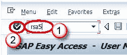](/images/sap/SAP_BI/sap_bi_17_1.jpg)

**步骤 2）**

单击文件夹 SAP R / 3，如下图所示。

[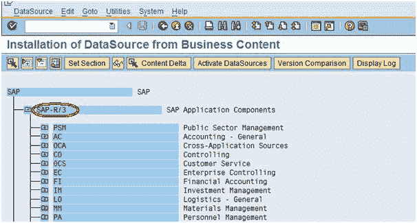](/images/sap/SAP_BI/sap_bi_17_2.jpg)

**步骤 3）**

转到文件夹 MM（材料管理）— MM-IO，如下面 Box 中的屏幕快照所示。

[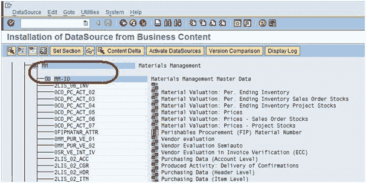](/images/sap/SAP_BI/sap_bi_17_3.jpg)

**步骤 4）**

选择数据源 2LIS_02_ITM，该数据源在项目级别购买数据。

[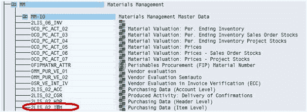](/images/sap/SAP_BI/sap_bi_17_4.jpg)

**步骤 5）**

选择数据源 2LIS_02_ITM 并转到“数据源”选项卡，然后单击“更改数据源”，如屏幕截图所示。

[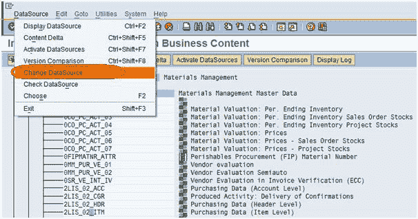](/images/sap/SAP_BI/sap_bi_17_5.jpg)

**注意：**当我们需要添加其他字段以压入 BW 时，使用此步骤。 同样，对于不希望在 BW 中填充的字段，我们可以执行相同的步骤（步骤 1-5）。

选择“更改数据源”选项卡后，您可以看到与该数据源关联的所有字段，如下所示。

[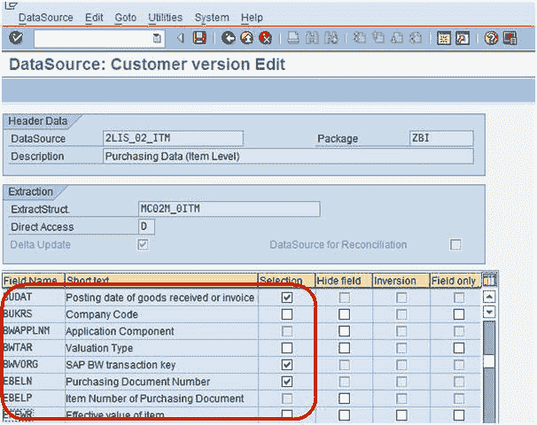](/images/sap/SAP_BI/sap_bi_17_6.jpg)

**步骤 6）**

现在，根据上面的屏幕截图，未在选择字段中选中“字段 EFFWR –有效值”项，这意味着该字段在 BW 中不可用。 要在 BW 中填充 Field EFFWR，我们将必须在选择字段中选中标记，如下所示。

[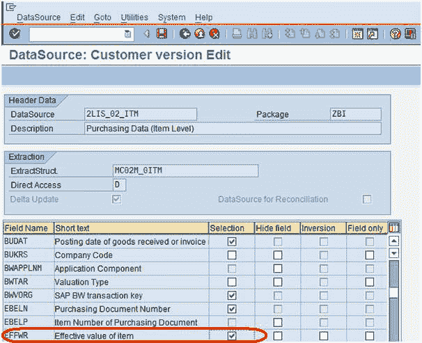](/images/sap/SAP_BI/sap_bi_17_7.jpg)

**步骤 7）**

选中字段 EFFWR 后，选择保存数据源，如下所示。

[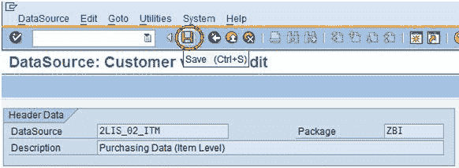](/images/sap/SAP_BI/sap_bi_17_8.jpg)

**步骤 8）**

如下所示激活数据源。

[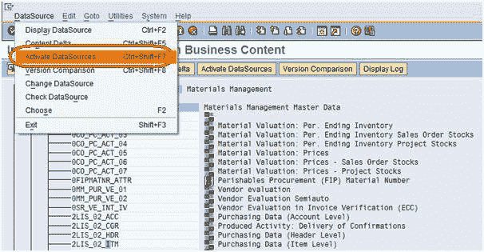](/images/sap/SAP_BI/sap_bi_17_9.jpg)

现在，我们准备将字段 EFFWR 选择为 BW 后，将更改后的数据源 2LIS_02_ITM 推送。

**步骤 9）**

1.  登录到 BW 系统，转到“数据源”选项卡
2.  单击查找进行搜索。
3.  键入数据源技术名称。
4.  单击搜索按钮。

[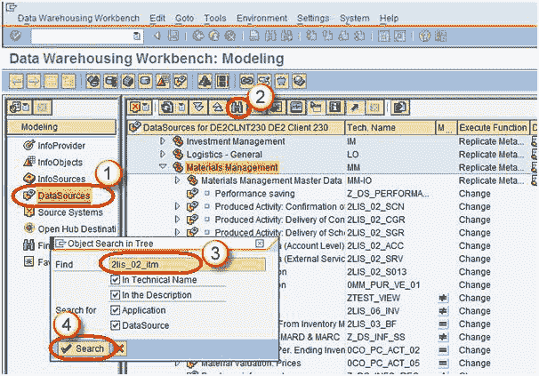](/images/sap/SAP_BI/sap_bi_17_10.jpg)

**步骤 10）**

在数据源 2LIS_02_ITM 中，右键单击“复制元数据”，如下所示。

成功复制数据源后，归档的 EFFWR 将在 BW 中可用

[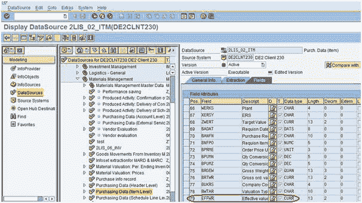](/images/sap/SAP_BI/sap_bi_17_12.jpg)

**步骤 11）**

将数据从 ECC 加载到 BW 中，以使用某些数据填充已归档的 EFFWR。

1.  转到交易代码 RSA1
2.  单击确定按钮。

[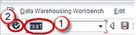](/images/sap/SAP_BI/sap_bi_17_13.jpg)

3.  导航到“建模”选项卡->数据源。
4.  右键单击数据源->创建信息包。

[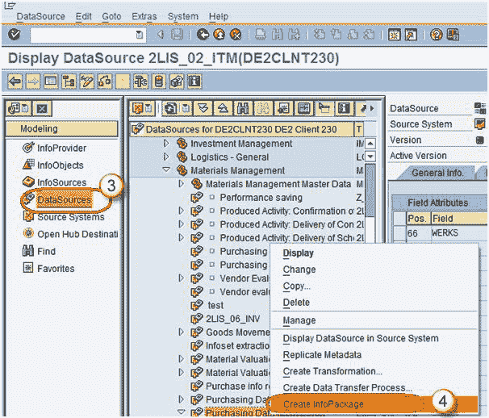](/images/sap/SAP_BI/sap_bi_17_14.jpg)

该信息包用于以中等级别的 PSA 级别将数据从 ECC 加载到 BW 系统中。

5.  输入信息包描述。
6.  单击保存。

[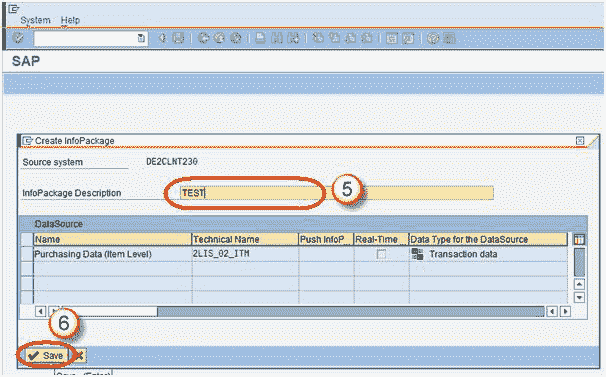](/images/sap/SAP_BI/sap_bi_17_15.jpg)

7.  为了触发从 ECC 到 BW 的数据加载，请转到信息包，单击“计划”选项卡。
8.  单击开始按钮以开始从平面文件到数据源的加载。

[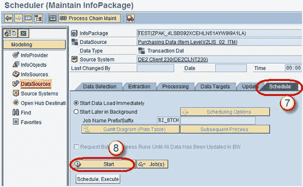](/images/sap/SAP_BI/sap_bi_17_16.jpg)