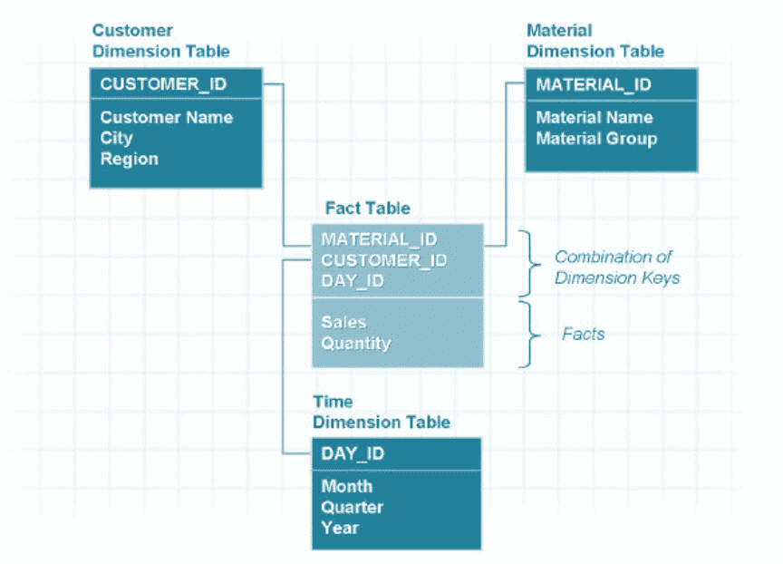
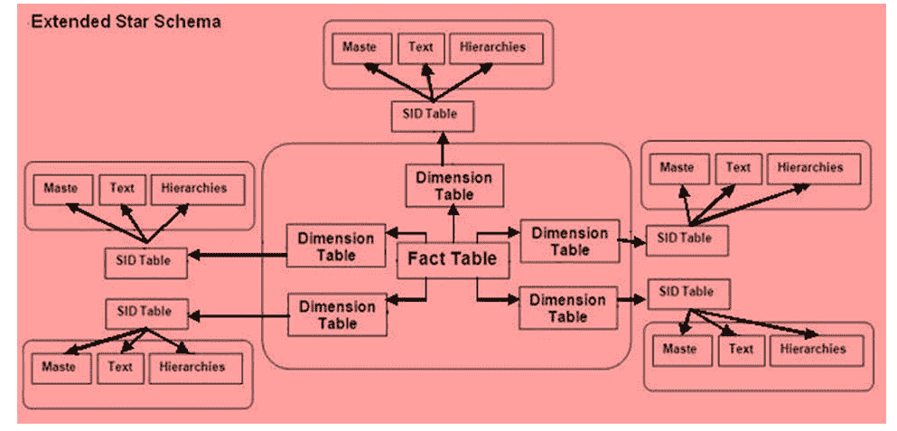
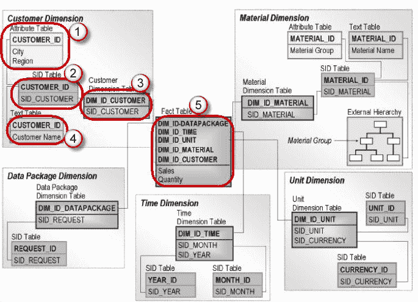
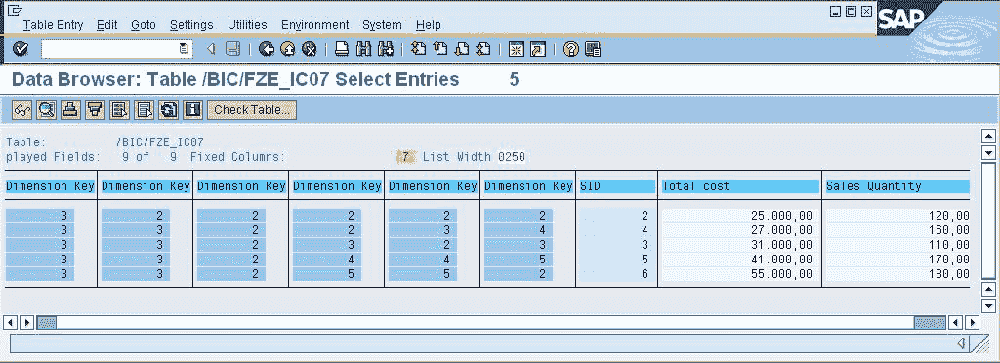
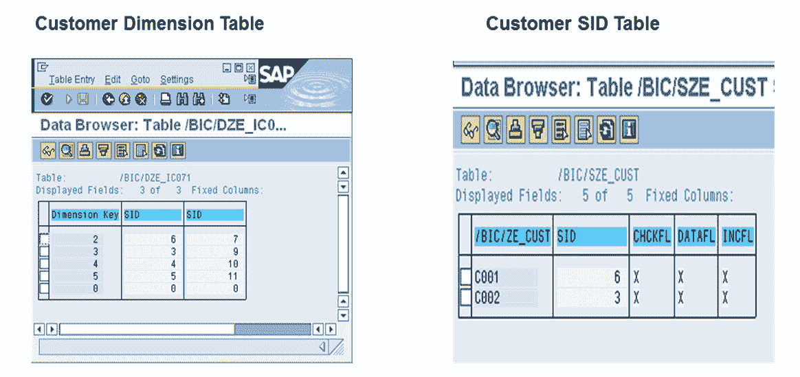
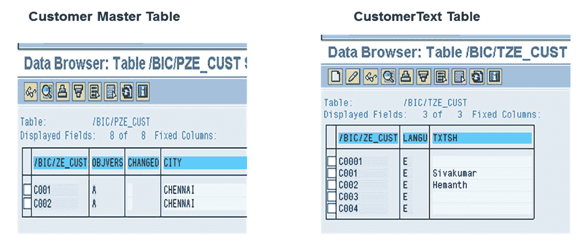
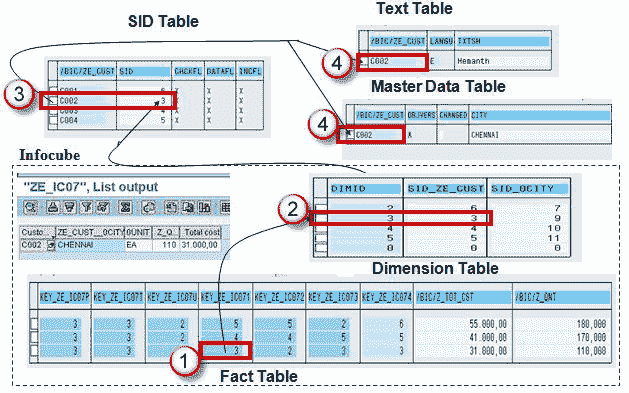

# 有关 SAP BI / BW 中星型架构&扩展星型架构的全部信息

> 原文： [https://www.guru99.com/all-about-classical-extended-star-schema.html](https://www.guru99.com/all-about-classical-extended-star-schema.html)

## 什么是架构？

在数据库管理系统（DBMS）中，该模式表示关系数据库。 它定义了表，每个表中的字段以及字段和表之间的关系。 换句话说，模式是数据库对象的集合，包括表，视图，索引和同义词。 模式通常存储在数据字典中。

## 什么是古典星图？

经典的星型模式是多维数据模型。它基于中央**事实表**，该表由星形的多个维表包围（因此得名）。

一个 InfoCube 由几个 Info-Objects（特征和关键指标）组成，并根据星形模式进行结构化。 这意味着有一个很大的事实表，其中包含 InfoCube 的关键指标，还有很多维表围绕着它的结构，看起来像星形。

星型模式的好处是可以缩减范围，轻松理解数据并提高性能。

## 什么是扩展星形架构？

在扩展星形模式中，``事实表''和``主数据表''通过 SID（代理 ID）表连接。 在扩展星形模式中，事实表和维度表将在多维数据集中。 它的分析能力为 16 * 248（SID 表）。 与 Star Schema 模型相反，事实表很小而维度表很大。 在扩展星型模式模型下，维度表不包含主数据

以下是扩展星形架构的不同组件。

1.  属性表保存主数据的属性。
2.  SID 表为每个主数据记录创建唯一的 SID（代理 ID）。
3.  维度表为 SID 的每个唯一组合创建 DimId（DIM 表中最多可以容纳 248 个 SID（字符））。
4.  文本表包含主数据的描述。
5.  事实表包含 DIM ID 和关键数字的唯一组合（事实表中最多可容纳 233​​个关键数字（可衡量的数量））。

以下是 Infocube 事实表的外观示例。

以下是 Dimension 和 SID 表。

下面显示的是 Info 对象的主数据和文本表。

### Infocube：示例扩展星型：

以下是 Infocube 的示例，其中显示了扩展星形架构。

**解释 Infocube 的扩展星形架构的步骤：**

1.  InfoCube 的事实表的值为 3。
2.  事实表的值（即“ 3”）映射到维度表中。
3.  维度 ID“ 3”具有映射到 SID 表中​​的 SID。
4.  SID 值与“文本和主数据”表映射。

