# SAP BI 流程链：创建，检查，激活，分配，监视

> 原文： [https://www.guru99.com/all-about-process-chains-in-sap-bi-bw.html](https://www.guru99.com/all-about-process-chains-in-sap-bi-bw.html)

### 什么是流程链？

*   流程链是在后台等待事件的一系列流程。
*   这些进程中的一些触发单独的事件，该事件可以依次启动其他进程。
*   它提供了各种连接器，这些连接器允许进程的替代和并行执行。
*   例如，一家零售店收到一个客户订单，这将触发一系列事件，例如检查库存中的物料，从仓库订购产品以生产产品等等。
*   流程链提供图形调度&监视功能，以帮助自动化，可视化&监视任务/流程。
*   流程链已集成到基于门户的 BI 管理主控室中。
*   可以将流程链视为流程图，这些流程图计划在后台&中等待由另一个进程触发的事件。

[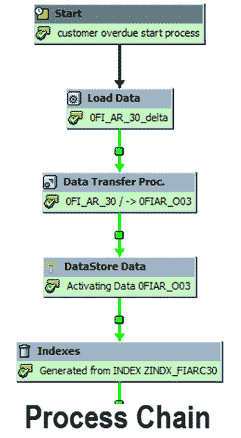](/images/sap/SAP_BI/sap_bi_19_1.jpg)

流程链涉及三个主要步骤

1.  启动流程：描述流程何时开始（立即，计划的作业，元流程，API）
2.  连接器：这是一个链接过程，可以选择开始下一个过程的选项
3.  Variant：我们应该在其上执行该过程的对象称为 Variant。 它是一组传递给流程的参数，例如 InfoPackage 或 Info-Objects 的名称

在本教程中，您将学习–

[创建流程链的步骤。](#1)

[检查过程链一致性的步骤。](#2)

[激活过程链的步骤。](#3)

[将流程链分配给应用程序组件的步骤。](#4)

[激活流程链的步骤。](#5)

[如何监视过程链。](#6)

### 创建流程链的步骤

RSPC 是用于过程链维护的全部且唯一的事务。 在此屏幕中，现有流程链按“ ApplicationComponents”排序。

有两个可用的视图：

1.  查看视图
2.  计划视图。

默认模式为“计划视图”。

**步骤 1）**

创建流程链：

点击“创建”图标。

[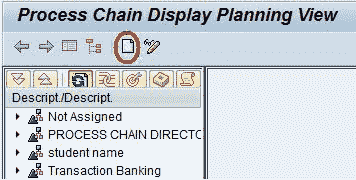](/images/sap/SAP_BI/sap_bi_19_2.jpg)

**步骤 2）**

1.  输入流程链的技术名称。
2.  为流程链输入有意义的描述。

[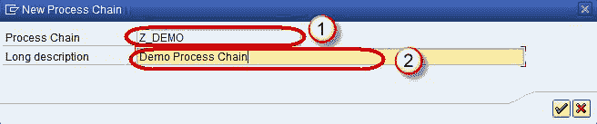](/images/sap/SAP_BI/sap_bi_19_3.jpg)

单击复选标记

**步骤 3）**

弹出一个新窗口。 单击“新建”图标以创建一个新的“开始过程”。

**步骤 4）**

1.  输入启动过程的技术名称。
2.  为“启动过程”输入有意义的描述，然后单击“输入”按钮。

[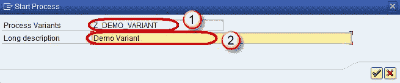](/images/sap/SAP_BI/sap_bi_19_5.jpg)

**步骤 5）**

后续屏幕用于为流程链分配基于时间或基于事件的触发器。

1.  单击选项“直接计划”以在特定时间计划流程链。
2.  单击按钮“更改选择”以输入用于计划执行流程的详细信息。

[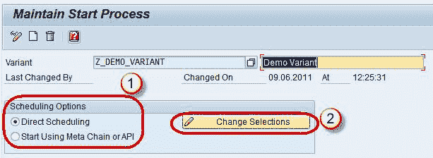](/images/sap/SAP_BI/sap_bi_19_6.jpg)

**步骤 6）**

计划流程链的步骤：

1.  单击“日期/时间”按钮。 指定预定的开始日期/时间，结束日期/时间。
2.  要设置频率，请单击复选框“ Periodic Job”。
3.  单击按钮“ PeriodValues”。
4.  在下一个屏幕中，选择所需的频率（每小时/每天/每周/每月/其他时段）。 单击“保存”图标和“后退”按钮以返回上一 RSPC 屏幕。

[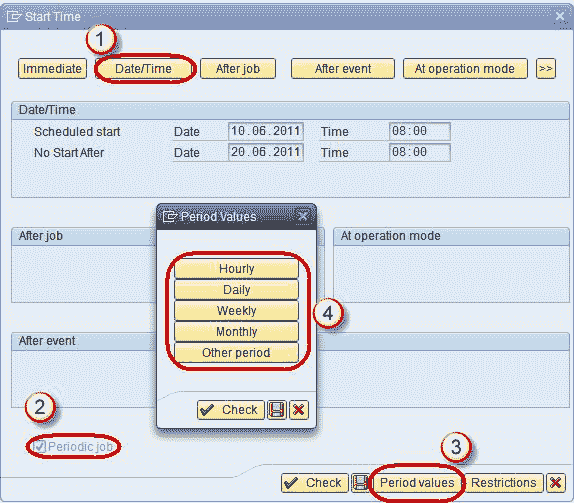](/images/sap/SAP_BI/sap_bi_19_7.jpg)

点击保存

**步骤 7）**

添加信息包：

单击“过程类型”图标以继续。

[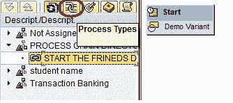](/images/sap/SAP_BI/sap_bi_19_8.jpg)

**步骤 8）**

如前所述，可以通过 InfoPackage 或 DTP 触发数据加载。

1.  如果要通过 InfoPackage 完成数据加载，请使用“ Execute InfoPackage”过程类型
2.  如果要通过 DTP 完成数据加载，请使用“数据传输过程”过程类型

**<u>[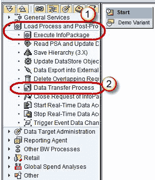 ](/images/sap/SAP_BI/sap_bi_19_9.jpg)</u>** 

**步骤 9）**

出现一个新的弹出窗口。 在这里，您可以选择所需的 InfoPackage。

**<u>[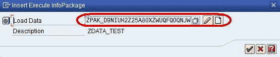 ](/images/sap/SAP_BI/sap_bi_19_10.jpg)</u>** 

**步骤 10）**

连接“开始版本”和“信息包”：

有两种方法可以执行此操作–右键单击第一步。 点击“连接”->“加载数据”

另一种方法是选择“开始变体”并按住鼠标左键。 然后将鼠标按钮移到目标步骤。 箭头应跟随您的移动。 停止按下鼠标按钮，创建新连接。 从启动过程到第二步，都有一条黑线。

[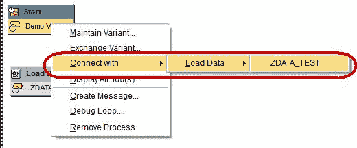](/images/sap/SAP_BI/sap_bi_19_11.jpg)

创建 Start 变量和 Infopackage 之间的连接后，Process 链如下所示。

[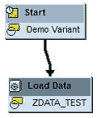](/images/sap/SAP_BI/sap_bi_19_20.jpg)

对于任何后续步骤，我们可以选择仅在前任步骤之后才执行后继步骤。

*   成功：通常用于常规处理
*   以错误结尾：通常用于发送失败消息
*   无论上一步成功或失败，都执行

### 检查过程链

1.  一致性的步骤选择菜单“转到”
2.  选择“检查视图”。

[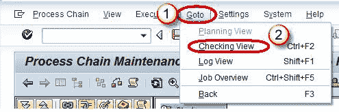](/images/sap/SAP_BI/sap_bi_19_13.jpg)

SAP 将验证所有步骤是否都已连接并且至少有一个先前版本。 未检测到逻辑错误。 如果收到警告或“链条确定”消息，则可以将其激活。 如果检查发现某些错误，我们必须先删除这些错误。

[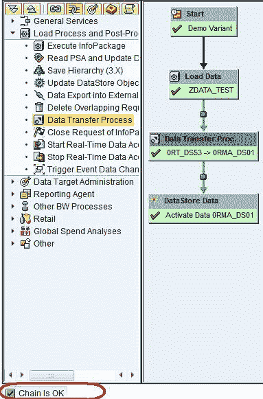](/images/sap/SAP_BI/sap_bi_19_14.jpg)

### 激活过程链的步骤

1.  单击菜单“过程链”
2.  ，选择“激活”。
3.  或选择“激活”按钮

**<u>[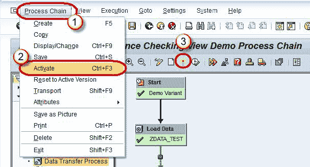 ](/images/sap/SAP_BI/sap_bi_19_15.jpg)</u>** 

### 将流程链分配给应用程序组件的步骤

默认情况下，在应用程序组件“未分配”下创建流程链。

1.  选择“ ApplicationComponent”按钮
2.  选择所需的组件，然后重新激活链。

[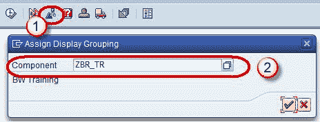](/images/sap/SAP_BI/sap_bi_19_16.jpg)

### 激活过程链

1.  的步骤单击菜单“执行”。
2.  选择“时间表”。

[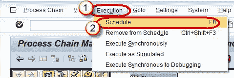](/images/sap/SAP_BI/sap_bi_19_17.jpg)

或者按下按钮“时间表”。

该链将被安排为后台作业，并且可以在 SM37 事务代码中查看。 您将找到一个名为“ BI_PROCESS_TRIGGER”的作业。 所有流程链都计划有相同的作业名称。

[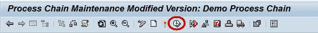](/images/sap/SAP_BI/sap_bi_19_18.jpg)

### 如何监视过程链

1.  有许多可用于监视过程链运行的工作环境：
2.  从 DatawarehouseWorkBench（RSA1）
3.  BI Monitor 中的“管理”选项卡中导航。 计算中心管理系统（CCMS）
4.  监视日常流程链（事务 RSPCM）
5.  流程链维护（事务 RSPC）中的流程链运行的日志视图

[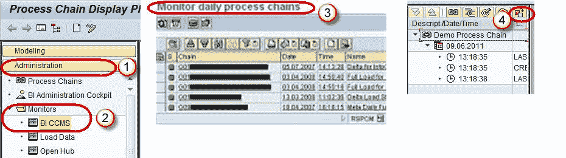 ](/images/sap/SAP_BI/sap_bi_19_19.jpg)