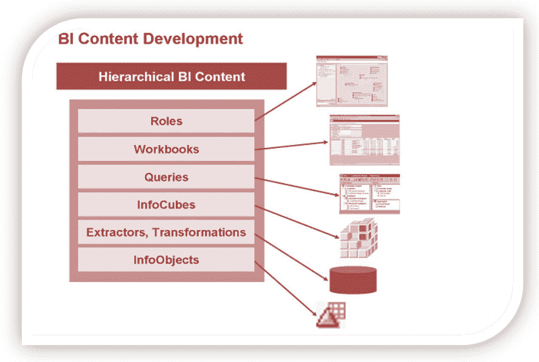
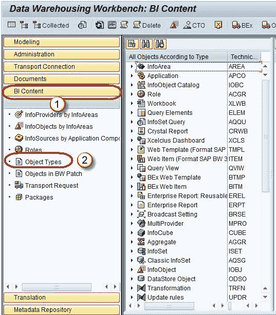
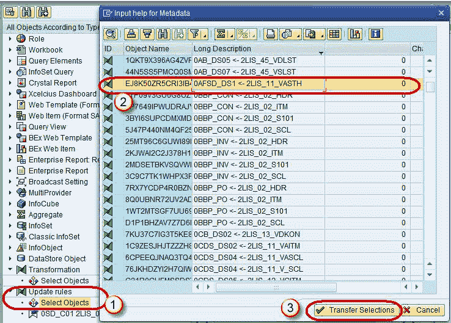
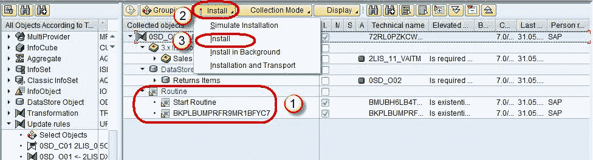

# SAP BI 内容：安装，激活

> 原文： [https://www.guru99.com/installing-bw-standard-content.html](https://www.guru99.com/installing-bw-standard-content.html)

## BI Content:

BI Content 为公司中选定的角色提供了他们执行任务所需的信息。 SAP NetWeaver Business Warehouse 在集体术语 BI 内容下提供了预配置的授权对象。 为了理解这一点，我们以销售经理为例，他希望获得销售，市场份额，产品质量，销售和服务成本等所有信息，以使他能够做出有效的决策。 BI 内容角色将把所有这些数据以工作簿和查询的形式汇集在一起​​，并准确地包含销售经理所需的信息。 没有显示来自人事部门的敏感&机密信息

**BI 内容的好处：**

下面提到的是使用 BI Content 的好处。

*   无需修改即可用于特定行业
*   进行修改，这意味着您可以自定义任何细节
*   作为客户定义的业务内容的模板或示例
*   立即访问解释信息。
*   准备就绪的报告，数据模型，提取器，转换
*   大大减少了实施时间和成本
*   操作流程与管理流程的一致性
*   容易扩展
*   自动改进信息模型
*   数据一致性和完整性
*   丰富的标准关键绩效指标集

## BI 内容对象：

业务内容包括：

*   SAP 提取器程序
*   数据源
*   工艺链
*   信息对象
*   信息来源
*   数据目标（信息多维数据集和 DSO 对象）
*   变数
*   查询
*   工作簿
*   转换和更新规则
*   网页模板
*   oles

## 激活 BI 内容：

查看和激活可通过 BI 内容使用的对象的步骤：

**步骤 1）**

1.  转到事务代码 RSA1。
2.  点击“确定”按钮。

**步骤 2）**

1.  浏览到选项卡“ BI 内容”。
2.  单击“对象类型”。

**步骤 3）**

您可以使用不同的视图浏览 BI 内容。 在所附的屏幕截图中，内容按“对象类型”分组。

1.  单击“选择对象”以获取所需的对象类型。 每种对象类型在组织中的作用都不同
2.  在随后的屏幕中，选择所需的对象。
3.  点击“传输选择”。

**步骤 4）**

所选对象及其所依赖的所有对象都按层次结构添加。

1.  选择/取消选择所需对象
2.  点击“安装”按钮
3.  从下拉菜单中单击安装。

