# SAP BEx：特征&关键指标设置（RKF，CKF &公式）

> 原文： [https://www.guru99.com/learn-about-key-characteristics-settings-cfk-rfk-formulas.html](https://www.guru99.com/learn-about-key-characteristics-settings-cfk-rfk-formulas.html)

在本教程中，您将学习

[特征设置–显示名称](#1)

[特征设置–显示属性](#2)

[关键指标设置–显示名称](#3)

[关键指标设置–显示属性](#4)

[关键指标–计算的关键指标](#5)

[关键指标–受限关键指标](#6)

### 特性设置–显示名称：

默认情况下，将特征添加到查询时，它将显示 SAP BW 中指定的描述。 可以使用以下自定义文本替换它。

1.  点击属性
2.  选择常规标签
3.  输入说明

### 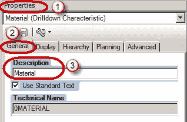 

### 特性设置–显示属性：

1.  选择所选特性的属性窗口的“显示”选项卡。
2.  “显示为”选项用于仅显示按键或仅显示文本，或同时显示两个按键 & 文本。
3.  如果特征填充了 2 个或更多的短/中/长文本，则“文本视图”用于显示相应的文本。
4.  可以按特征或其任何属性对数据进行升/降排序。
5.  “结果行”选项用于显示或隐藏基础特征的小计。

## 特征设置–显示记录：

显示选项用于定义用户在数据选择期间（在过滤器中）和执行报告后查看的数据。

1.  在所选特征的属性窗口中选择“高级”选项卡。
2.  结果值的访问类型。 选择这些值之一。

*   “过帐值”仅用于显示与某些交易相关联的记录
*   “主数据”显示所有主数据记录，无论是否存在交易。 如果与零抑制一起使用，则无效。

3.  过滤器值选择。 选择这些值之一。

*   导航的仅过帐值：系统仅显示当前导航状态的过帐值。
*   InfoProvider 中的仅值：系统仅显示 InfoProvider 中包含的值。
*   主数据表中的值：速度更快，但可能会导致零记录符合选择标准。

### 关键指标设置–显示名称：

默认情况下，将关键指标添加到查询时，它将显示 SAP BW 中指定的描述。 可以使用以下自定义文本替换它。

1.  点击属性
2.  选择常规标签
3.  输入说明

### 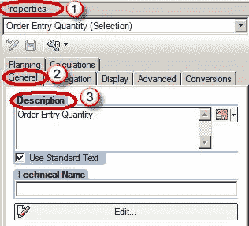 

### 关键指标设置–显示属性：

1.  选择所选关键指标的属性窗口的“显示”选项卡。
2.  隐藏：

*   选项“始终显示”和“始终隐藏”是不言自明的。
*   隐藏（可以显示）选项用于使关键指标隐藏在报表的默认输出中。 但是，用户以后可以使用过滤器显示此字段。

3.  小数位数可用于限制报表中显示的小数位数。
4.  比例因子用于以千/百/等显示数据。
5.  如果需要，可以反转关键数字的符号。 例如 从库存角度来看，销售数量是负向变动，从销售角度来看是正向变动，我们可以根据用户反转符号。

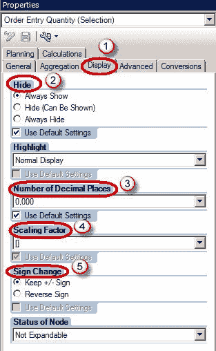

## 关键指标设置-货币或单位换算：

BW 不允许以不同单位累计金额，例如 1 卢比兑换 1 美元，或 1 公斤兑换 1 码。 如果数据以多种货币/单位存在，则必须使用“货币换算/单位转换”将所有记录转换为单一货币/单位。 转换可以是动态的（通过使用选择屏幕变量）或静态的（目标货币/单位在相邻屏幕中硬编码）。 在 SAP BW 中执行此操作的优点是，它将 SAP ERP 中可用的转换因子直接导入到 SAP BW 中。

1.  选择转化标签。
2.  对于货币换算，可以使用此选项。
3.  对于单位转换，可以使用此选项。

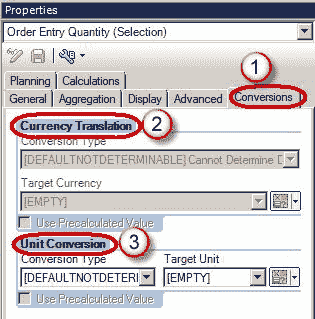

## 关键指标设置-汇总：

Query Designer 可以灵活地计算汇总，包括平均值，总和，最小值，

还可以对行级数据<u>执行类似的计算。</u>

1.  选择“计算”选项卡。
2.  从“计算结果为”下拉菜单下的“可用选项”中选择。

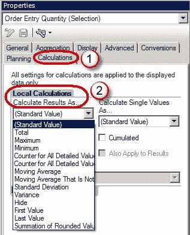

## **主要指标-本地公式**：

BW 允许对来自 InfoProvider 的数据使用公式，以向用户提供计算值。

例如 从收入中减去成本以计算利润

## 创建公式的步骤：

**步骤 1）**

1.  右键单击“关键人物”结构
2.  点击“新配方”

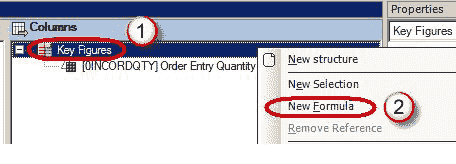

**步骤 2）**

单击属性框的编辑按钮以创建/编辑本地公式

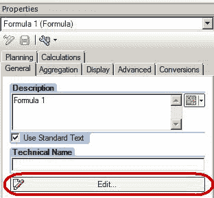

**步骤 3）**

BW 中使用的一些常见运算符包括：

*   加法，减法，乘法和除法
*   NODIM 用于显示关键指标而没有它们的相应单位
*   NOERR 用于显示零而不是错误消息（例如零而不是提到除以零的错误）
*   ％GT 用于显示关键指标的值占总值的百分比

1.  在“详细信息视图”框中，输入公式
2.  使用“运算符”框中的运算符。

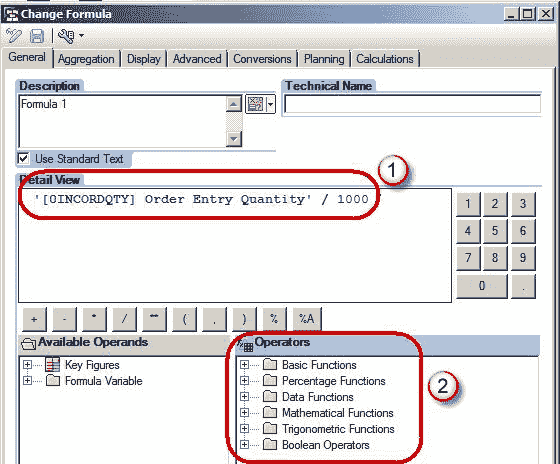

### 关键指标–计算的关键指标：

如果多个报告需要相同的计算，则可以将其映射到 InfoProvider，而不必在每个查询中单独创建。 这种关键指标称为“计算关键指标”或 CKF。

定义后，可以像其他任何关键指标一样将其拖动到查询中。 这种方法的最大优点是，它便于对通用的已计算 KPI 进行全局定义。

**创建计算关键值的步骤**：

1.  导航到“信息提供者”部分
2.  右键单击 Key Figures 文件夹。
3.  选择选项“新计算的关键指标”。

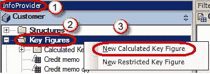

### 关键指标–受限关键指标：

受限关键指标（RKF）可用于仅将过滤器仅应用于报告中的特定 KPI，而不应用于整个报告（例如报表）。 将销售分成 YTD（年初至今）销售额，PYTD（上一年迄今）销售等列。

**Step 1)**

1.  导航到“信息提供者”部分
2.  右键单击 Key Figures 文件夹。
3.  选择选项“新的受限关键指标”。

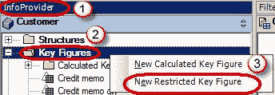

**Step 2)**

单击属性框的编辑按钮以创建/编辑 RKF

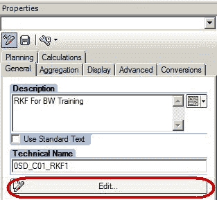

**Step 3)**

在随后的屏幕中，必须输入至少一个关键指标和一个特征，以创建有意义的 RKF。

1.  要限制的关键人物。
2.  该特性可能会受到选择屏幕变量的限制，以使其成为“动态” RKF。
3.  它也可能受到常数的限制，例如 year =2008。在下面的屏幕截图中，版本受常数“ 1”限制。

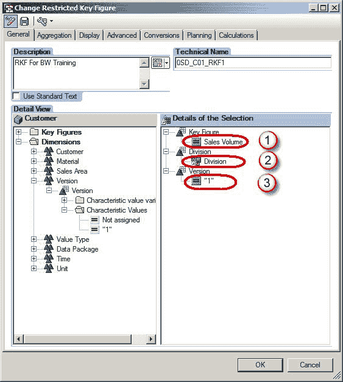

像 CKF 一样，RKF 对 InfoProvider 也是全局的，并且可以使用同一 InfoProvider 在多个查询中重用。