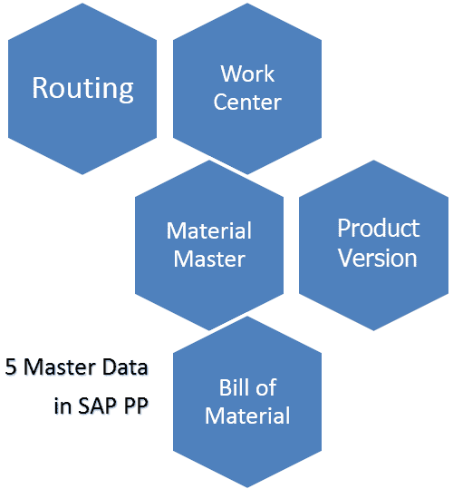
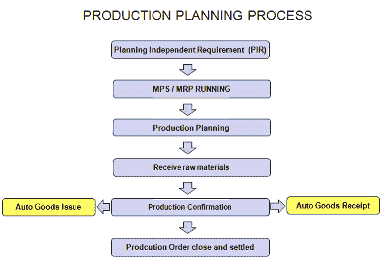

# SAP PP 简介（生产计划）

> 原文： [https://www.guru99.com/introduction-sap-pp.html](https://www.guru99.com/introduction-sap-pp.html)

**什么是生产计划？**

*   生产计划是使需求与制造能力保持一致以创建最终产品和组件材料的生产和采购计划的过程。
*   SAP PP 是 SAP 的重要模块。 它跟踪并记录制造流程，例如计划和实际成本。 另外，货物从原材料转换为半成品的过程也发生了变化。

*   它与其他 SAP 模块完全集成：SD，MM，QM，FICO & PM。

## SAP PP 中的组织结构

在任何实时生产计划模块中，制造工厂的位置和工厂内的存储都应在系统中可用。

工厂和仓储地点在生产计划中的重要性-

*   所有生产主数据在工厂级别创建。
*   在工厂级别也执行计划活动。
*   生产确认过程和相关的货物移动发生在工厂和存储地点级别。

## SAP PP 中的主数据

主数据通常对于任何公司都是静态的，并且很少根据要求进行更改。 生产计划模块中需要维护 **5 个主数据**。

1.  **物料主数据**

物料主数据包含有关公司采购，生产，存储和销售的所有物料的信息。 它是一个数字，唯一标识物料主记录，因此也标识物料。

具有相同基本属性的物料被分组在一起，并分配给诸如成品，原材料等物料类型。

它用于以下目的：

1.  购买材料
2.  对于货物移动过帐，例如库存管理中的发货或收货，以及实际库存过帐
3.  发票校验中的过帐发票
4.  在销售和分销中执行销售订单
5.  在生产计划和控制中进行物料需求计划，计划和生产确认过程。

2.  **物料清单（BOM）**

物料清单是零件的完整，正式结构化清单，以及生产产品或组件所需的数量。

BOM 用于物料需求计划和产品成本核算。

您还可以为单个产品创建多达 99 个替代 BOM。

对于具有变型的产品，您可以创建超级物料清单，其中包含用于制造不同类型的变型的所有可能类型的组件，然后根据销售订单中选择的特征选择适当的组件。

例如，“产品周期”可以包含所有类型的框架（具有不同的颜色和尺寸），并根据销售订单中选择的颜色和尺寸在生产订单中选择所需的框架。

3.  **工作中心**

工作中心是执行生产操作的一台机器或一组机器。 工作中心用于任务列表操作（路由）。

它包含以下数据

*   **安排**
*   **容量**
*   **成本核算**

4.  **路由**

路由不过是在工作中心执行的一系列操作。 它还指定用于执行操作的机器时间，人工时间等。

它也可用于调度作业，并用于产品的标准成本计算。

5.  **生产版本**

生产版本是用于生产的 BOM 表和工艺路线数据的组合。 它是 BOM &工艺路线之间的链接，并确定制造过程。

根据不同的制造过程，可以有多个生产版本来生产产品。

## 生产计划周期

生产计划和控制包括两个明显的计划和执行过程。

**规划**

生产计划通常是从预算的销售计划中完成的。 计划基于销售计划，以满足生产周期中的销售要求。 通过计划管理独立需求（PIR）的需求管理输入产品需求。 来自需求管理的数据成为物料需求计划（MRP）的输入。MRP 使用主数据（例如物料清单（BOM）和可用的当前工厂库存）检查在不同阶段用于生产的各种原材料的可用性。

如果出现材料短缺的情况，则会为外部采购的物料创建采购申请，并为内部生产的物料创建计划订单。

这些采购申请和计划订单分别启动了采购周期和生产执行周期。

由于 MRP 具有无限容量，因此必须进行容量均衡以避免任何容量瓶颈。

**执行**

这些计划订单将转换为生产订单，并使用主数据（如工艺路线）根据生产时间计划。

生产主管由生产主管在车间下达订单，还可以进行材料可用性检查以检查是否缺少任何组件。

生产是根据工艺路线中维护的活动进行的，其中针对工艺路线中的每个操作都提到了诸如工作中心之类的主数据。

生产完成后，将执行订单确认，并针对订单过账物料消耗&收货的货物移动。 因此，订单状态为已交货（DLV），物料被接收到所需的存储位置。

通常在进行订单结算之前的月底，需要将生产订单设置为技术上已完成的状态，以便由控制人员计算生产差异。

## 需求管理

需求管理的功能是估计成品和重要组件的需求数量和交货日期。 需求管理使用 PIR（计划独立需求）和客户需求。

必须为产品定义计划策略。 它代表计划和制造的生产方法。 我们可以通过两种方法来做到这一点。

**按库存制造**：无销售订单的商品生产，即独立于订单生产商品。

**按订单交货**：此策略适用于特定单个销售订单或行项目的物料生产。

## 物料需求计划（MRP）

MRP 确定任何短缺并创建适当的采购要素。 它进行净需求计算并生成内部生产物料的计划订单和原材料的采购申请。

它确实提前安排时间并按计划的订单计算生产日期。

它会爆炸 BOM，并在每个 BOM 级别生成采购建议。

## 容量计划&均衡

产能计划用于分析工作中心的产能超负荷并转移订单，以避免任何产能瓶颈。

容量需求是通过 Work Center 上的 MRP 生成的，并且由于 MRP 具有无限的容量，并且可以在不考虑任何容量限制的情况下计划工作中心上的所有内容。 需要平衡工作中心的容量。

可以通过计划表在每个工作中心调整产能，以创建约束生产计划。

## 生产订单

MRP 的输出将为“计划订单”，需要将其转换为生产订单以进一步执行流程。

与计划订单不同，生产订单是固定的收货要素，不受 MRP 运行的影响。

*   生产订单是一个文档，其中指定了需要生产的物料和数量。 它还包含要在工作中心执行的 BOM 表组件和工艺路线操作数据。
*   下达生产订单以执行，并且可以执行物料可用性检查，以确定是否缺少任何组件。

## 生产订单确认

在车间实际生产商品时，必须确认生产订单。

在确认期间，可以通过反冲洗机制自动消耗组件物料，并且可以通过工艺路线中的操作控制键自动执行物料收货。

但是，代替自动货物移动，可以与确认分开进行手动发货和收货。

由于零件库存不足而导致的任何失败的货物移动都可以手动进行重新处理。

机器，人工等活动成本也将在实际确认过程中在生产订单中更新。

在最终确认并最终收货后，订单将获得 CNF（已确认）和 DLV（已交付）状态。

如果确认发错了，那么我们可以取消确认，然后使用正确的数据再次发送。

## 生产订单关闭

生产订单完全交付后，或者我们不想进一步执行订单，则应该从技术上完成订单。

订单获得 TECO 状态后，将从库存/需求清单中删除，并且不再在物料需求计划运行中考虑。 所有相关的保留也将从系统中删除。

接下来，我们将研究 SAP PP 的每个阶段，并学习如何操作 SAP PP 模块。