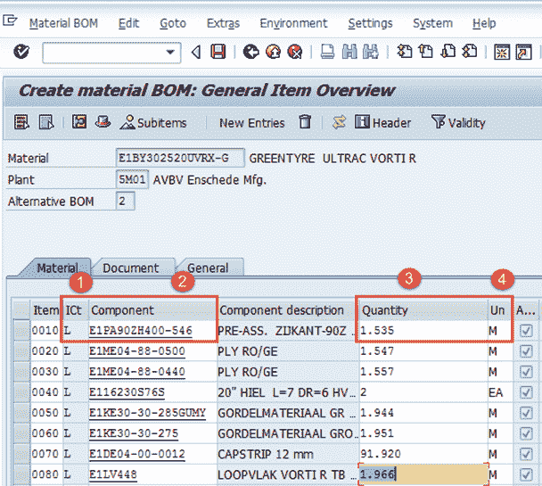
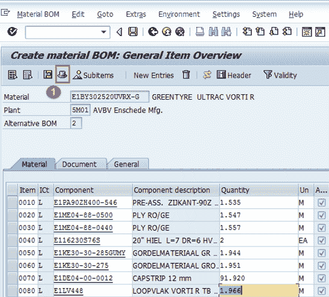
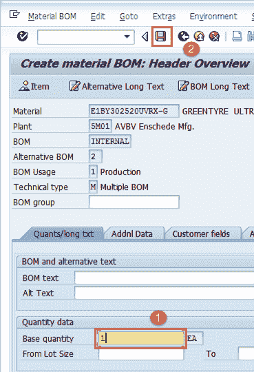
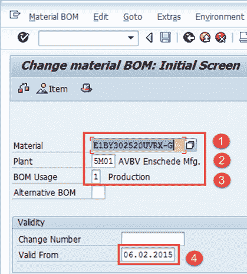
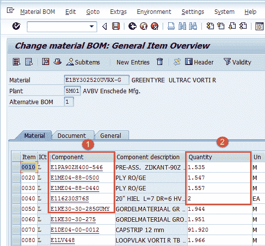
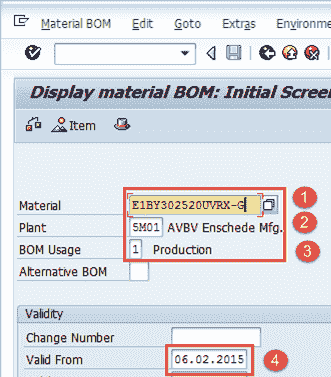
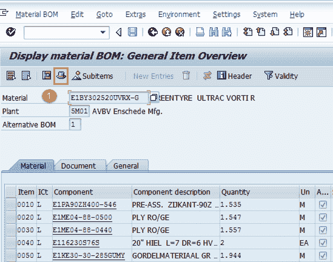

# SAP PP 中的物料清单（BoM）：创建，更改，显示

> 原文： [https://www.guru99.com/bill-material-bom-sap-pp.html](https://www.guru99.com/bill-material-bom-sap-pp.html)

**什么是物料清单（BOM）及其作用？**

物料清单是构成产品或装配体的组件的完整的正式结构化清单。 该列表包括每个组件的材料编号以及数量和计量单位。

*   BOM 可以是单层和多层。 例如，成品将包含半成品作为组件，而半成品又将包含原材料作为下一个级别。

*   根据批次大小，有效日期和不同的生产方法，产品可能会有不同的替代 BOM。

*   BOM 用于原材料的半成品生产计划和采购计划。

*   通过将成本从原始成本提高到半成品，再到最终成本，BOM 也可用于最终产品的标准成本计算。

*   可以为 PP 模块中的物料制作物料 BOM，而在工厂维护模块中使用设备物料清单。

在本教程中，您将学习，

*   [如何创建 BOM 表](#1)
*   [如何更改 BOM](#2)
*   [如何显示 BOM 表](#3)

## 如何创建 BOM

**步骤 1）**从 SAP 轻松访问屏幕打开事务 CS01

1.  输入需要为其创建 BOM 的父物料。

2.  输入工厂代码。

3.  输入物料清单用法= **“ 1”** ，用于创建生产物料清单

4.  输入从该日期开始的有效日期，这意味着 BOM 从该日期开始有效。

填写所有字段后，单击  或按 Enter 键进入下一个屏幕。

**步骤 2）**在下一个屏幕中

1.  输入项目类别为“ L”，用于库存项目，也可以默认使用。

2.  在组件字段中输入组件材料代码。

3.  输入组件数量，如下所示。

4.  单击  或从键盘按 Enter 键后，系统会自动带出某些信息，例如组件的描述和基本单位度量。

有用说明：

要进一步深入了解这些组件之一的 BOM，请双击 **A** 组件列中的  。 如果未选中该框，则该组件没有其他 BOM。

**步骤 3）**在此屏幕中，

1.  单击此图标  查看 BOM 表标题，然后系统将在下一步中显示 BOM 表标题屏幕：

**步骤 4）**在 BOM 表标题视图中，

1.  填充母料的基本数量。 如果这是 1 个 EA（每个），那么组件数量将描述生产 1 件物品需要多少。

2.  选中后单击  保存新 BOM，系统将在左下角显示消息  。

现在，在下一步中，我们将看到如何更改 BOM？

## 如何更改 BOM

如果用于制造最终产品的组件列表或组件数量有任何变化，我们将更改 BOM。

**步骤 1）**从 SAP 轻松访问屏幕打开事务 CS02。

1.  输入需要更改 BOM 的父物料。

2.  输入工厂代码。

3.  输入 BOM 用法= **“ 1”** ，用于更改生产 BOM。

4.  输入有效的起始日期，这意味着 BOM 从该日期开始有效。

**步骤 2）**填写所有字段后，单击  进入下一个屏幕。

1.  更改组件代码或数量。

2.  完成所有修改后，单击  保存 BOM。 系统将在左下角显示类似  的消息。

## 如何显示 BOM

**步骤 1）**从 SAP 轻松访问屏幕打开事务 CS03

1.  输入需要显示物料清单的父物料。

2.  输入工厂代码。

3.  输入 BOM 用法= **“ 1”** ，用于更改生产 BOM。

4.  输入有效的起始日期，这意味着 BOM 从该日期开始有效。

单击  进入下一个屏幕。

**步骤 2）**在此屏幕中，将显示成分清单和数量。

1.  单击  图标以查看 BOM 表头。

在下一步中，您将看到 BOM 表头。

**步骤 3）**在此步骤中，将显示 BOM 表头。

1.  显示产品的基本数量。

**故障排除**

*   可能存在成分材料不存在的情况。 为此，您需要在创建 BOM 表之前为组件物料创建物料主数据。
*   一些用户尝试为同一产品再次创建 BOM，系统给出有关“正在创建替代 BOM2”的警告消息，他们倾向于忽略该警告消息而继续前进，因此最终为该产品创建了类似的替代 BOM 2 相同的产品。 不必要的操作会创建重复数据。