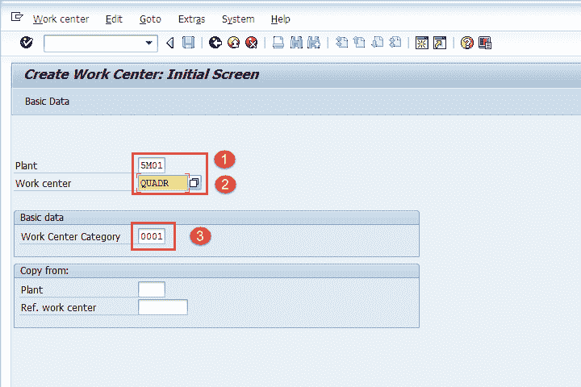
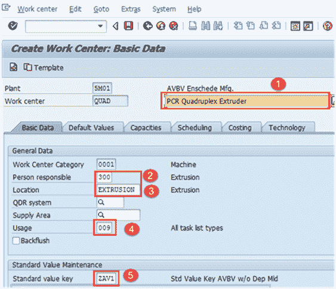
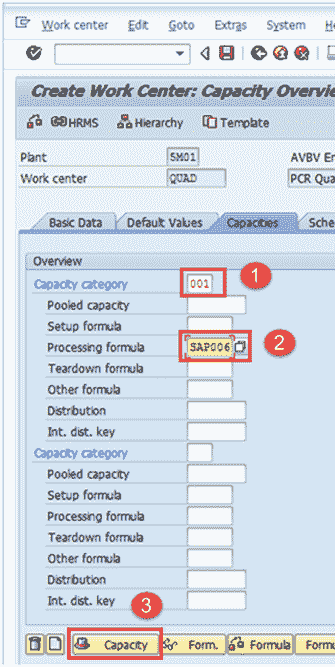
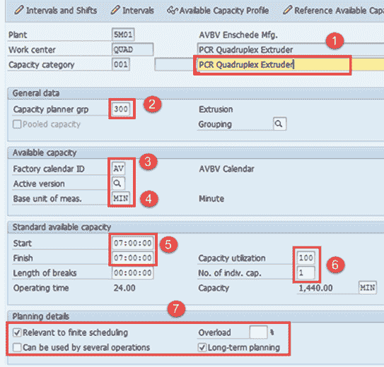
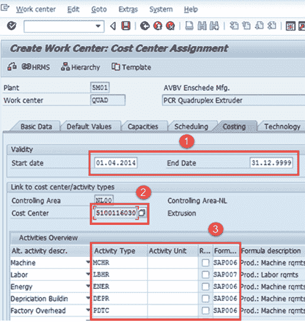
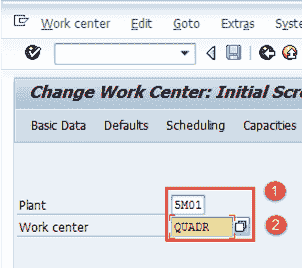
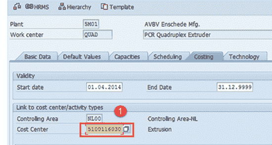
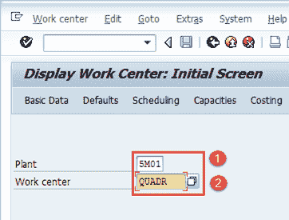

# SAP PP 中的工作中心：创建，更改，显示

> 原文： [https://www.guru99.com/work-center-sap-pp.html](https://www.guru99.com/work-center-sap-pp.html)

工作中心是执行生产活动的组织单位。

换句话说，工作中心是代表真实机器，生产线，装配工作中心等的主数据。制造活动或操作在工作中心进行。

*   工作中心用于任务列表（路由）操作，并复制到生产订单或流程订单中，以进行车间计划和执行。
*   工作中心数据用于

1.  **Scheduling**

    创建生产订单时，可以根据工艺路线中的工作时间和在工作中心中输入的公式来计算工序的持续时间。

2.  **Costing**

    可以根据在工作中心中输入的公式在生产订单中计算工序成本。 工作中心也链接到成本中心。

3.  **Capacity Planning**

    可用容量和用于计算容量要求的公式存储在工作中心中。

*   工作中心用于路由操作数据。
*   为制造工厂创建了工作中心，并通过代码进行标识。
*   也可以将一组相似的机器创建为单个工作中心。 例如，可以将 5 台类似的机器创建为 1 个工作中心，其容量为 5。

在本教程中，您将学习

*   [如何创建工作中心](#1)
*   [如何更改工作中心](#2)
*   [如何显示工作中心](#3)

## 如何创建工作中心

**步骤 1）**从 SAP 轻松访问未清事务 CR01

1.  输入需要在其中创建工作中心的制造工厂代码。

2.  输入工作中心代码。

3.  输入工作中心类别为“ 0001”，这意味着工作中心将被分类为机器。

填写所有字段后，单击  或按 Enter 键进入下一个屏幕。

**步骤 2）**在此屏幕中，将按如下所示输入工作中心基本数据。

1.  输入工作中心描述。

2.  输入该工作中心的人员负责代码。

3.  输入工作中心在工厂中的实际位置。

4.  输入用法为“ 009”，这表示 Work Center 对所有任务列表类型（例如生产工艺路线，维护任务列表等）均有效。

5.  输入标准值键，其中包含用于标准成本计算的不同活动类型。

**步骤 3）**在此屏幕的“容量选项卡”下。

1.  将容量类别输入为代表机器类别的“ 001”。

2.  输入处理公式为“ SAP006”-用于计算工作中心的可用容量。

SAP006 =（操作数量*机器时间）/基本数量

3.  填写容量类别和处理公式后，单击  按钮：

它将打开另一个屏幕。

**步骤 4）**在此屏幕的“容量”选项卡下，将输入容量数据。

1.  输入容量描述。

2.  输入有关“输入容量计划者组”的详细信息，该组负责机器的容量。

3.  输入工厂日历 ID，其中列出了您工厂的公共假日。 因此，在假日期间，该工作中心的容量为零。

4.  输入基本计量单位“ MIN”，这意味着将按时间（即最小）测量工作中心的可用容量。

5.  输入可用于工作中心的时间段（开始和结束时间）。

6.  考虑机器的故障和预防性维护，输入工作中心的产能利用率百分比％（在标准可用工作时间内消耗了多少时间）。 输入能力的数量，这意味着多个类似的工作中心。

7.  选中“与有限计划相关”和“长期计划”标记，这些标记指示是否存在容量限制，然后将该操作移至某个日期，在此日期可以不受容量限制地对其进行处理。

填写所有字段后，单击  返回工作中心容量总览。

然后从菜单上单击选项卡“计划”选项卡，系统将显示以下屏幕：

**步骤 5）**在“计划”标签中，

1.  将能力类别输入为代表机器类别的“ 001”，因此机器时间将是计算生产订单中计划时间的基础。
2.  输入处理公式为“ SAP002”，用于计算计划时间。

SAP002 =（运行数量*机器时间）/基本数量/编号 的分裂。

填写所有字段后，单击选项卡“ Costing”。

**步骤 6）[成本计算]标签中的**

1.  输入代表成本中心有效日期的开始和结束日期。
2.  输入成本中心，将其运营成本预定到该中心。
3.  输入所有活动类型以及公式，该公式将用于计算活动成本。

单击按钮  保存新的工作中心。 系统将在左下角显示消息  。

## 如何更改工作中心

如果财务团队更改了分配给工作中心的成本中心，我们需要更改工作中心。 如果 Work Center 的可用生产时间或其利用率％已更改，那么我们还需要在 Work Center 中进行更改。

**步骤 1）**在 SAP 轻松访问屏幕上，打开事务 CR02。

1.  输入工厂代码。
2.  输入需要更改的工作中心代码。

填写所有字段后，单击  进入工作中心的概览屏幕。 您也可以使用  按钮直接转到首选标签。

**步骤 2）**

1.  更改成本中心或进行任何类型的修改，例如更改任何选项卡中的可用时间或利用率％。

完成所有修改后，单击  保存工作中心。 系统将在左下角显示类似  的消息。

## 如何显示工作中心

**步骤 1** ）在 SAP 轻松访问屏幕中，打开事务 CR03

1.  输入工厂代码。
2.  输入需要显示的工作中心代码。

填写所有字段后，按键盘上的 Enter 键进入工作中心的概览屏幕。 您也可以使用  按钮直接转到首选标签。

**故障排除**

*   可能存在“成本中心”中不存在的情况。 为此，您需要创建成本中心并维护活动类型–成本中心关系。

*   如果转到“技术”选项卡，您将无法选择机器类型，如果要，请单击  离开选项卡。

*   需要配置人员，能力计划者组，才能继续创建工作中心。