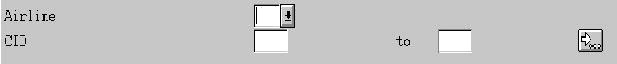

# 关于 ABAP 报告编程的全部信息

> 原文： [https://www.guru99.com/all-about-abap-report-programming.html](https://www.guru99.com/all-about-abap-report-programming.html)

SAP-ABAP 支持两种类型的程序-报告程序&对话程序。 需要显示大量数据时使用报告程序

在本教程中，您将学习：

*   [选择屏幕](#1)
*   [ABAP 报告程序](#2)中的事件
*   [格式化报告](#3)
*   [交互式报表编程](#4)
*   [逻辑数据库](#5)

**报告程序的目的/用途**

*   当在显示之前必须从多个表中选择数据并对其进行处理时使用它们
*   当报告需要特殊格式时使用
*   在必须将报告从 SAP 下载到 Excel 表格以进行分发时使用。
*   在必须将报告邮寄给特定人员时使用。

**关于报告程序**的重要注意事项

*   报告程序始终是可执行程序。 程序类型始终为 1。
*   每个报表程序都对应于特定的应用程序类型，即销售&分配，FI-CO 等。它也可以是交叉应用程序，即类型“ *”。
*   报表编程是事件驱动的编程。

*   报告程序的第一行始终是 Report ***< report-name >。***
*   要取消列表标题或程序名称，请使用附加的 ***没有标准页面标题*** 。
*   可以通过使用附加的 ***线路尺寸<尺寸>来设置特定报告的线路尺寸。***
*   可以通过使用 ***行数 n（n1）*** 来设置特定页面的行数。 N 是页面的行数，N1 是为页面页脚保留的行数。
*   要显示任何信息或错误消息，我们使用以下添加项将消息类添加到程序中： ***Message-id <消息类名称>。*** 消息类在 SE91 中维护。

Therefore an ideal report program should start with:

```
Report <report name> no standard page heading

line-size <size>

line-count <n(n1)>

message-id <message class>.
```

## 选择屏幕

``选择屏幕''是一个屏幕，其中一个用于指定要为其运行程序的输入值。

通常从

1.  参量
2.  选择选项

句法

```
Selection-screen begin of screen <screen #>
selection-screen begin of block <#>  with frame title <text>
.........
.........
selection-screen end of block <#>
selection-screen end of screen <screen #>
```

***参数***

参数有助于进行动态选择。 在一个程序执行周期中，它们只能容纳一个值。

语法

将参数定义为数据类型

```
Parameters p_id(30) type c.
```

定义参数，例如表格字段。

```
Parameter p_id like <table name>-<field name>.
```

参数可以是复选框以及单选按钮。

```
Parameters p_id as checkbox.Parameters p_id1 radiobutton group <group name>.
Parameters p_id2  radiobutton group <group name>.
```

参数可以是列表框。

```
Parameter p_id like <table name>-<field name> as listbox
```

**选择选项**

一个 Select-Option 用于将一个值范围或一组值输入到程序

语法

```
select-options s_vbeln for vbak-vbeln.
```



您还可以定义选择选项，例如变量

```
select-options s_vbeln for vbak-vbeln no intervals no-extension
```

## ABAP 报告程序中的事件

ABAP 报告程序是 ***事件驱动程序*** 。 报表程序中的不同事件是：

***程序负载***

*   加载类型 1，M，F 或 S 的程序后，在内部会话中触发相关事件。
*   还仅对每个程序和内部会话一次运行关联的处理块。
*   对于类型 1，M，F 或 S 的 ABAP 程序，处理块 LOAD-OF-PROGRAM 具有与 ABAP 对象中的类的构造函数大致相同的功能。

***初始化。***

*   在显示选择屏幕之前执行此事件。
*   所有值的初始化。
*   除了选择屏幕上的默认值外，您还可以分配其他值。
*   您可以在运行时用一些值填充选择屏幕。

***在选择屏幕上。***

*   处理完选择屏幕后（在 PAI 的末尾），将处理事件。
*   验证&此处检查输入值

***选择开始。***

*   在这里，程序开始从表中选择值。

***选择结束。***

*   选择所有数据后，此事件将数据写入屏幕。

***互动事件***

*   用于交互式报告。 它用于从基本列表创建详细列表。

## 格式化报告

ABAP 允许按用户希望的格式对报告进行格式化。 例如，“备用线”必须以不同的颜色显示，而“总计”线应以黄色显示。

语法

```
Format Color n

Format Color n Intensified On
```

**n** 可能对应于各种数字

请注意，格式也有其他增加

```
FORMAT COLOR OFF INTENSIFIED OFF INVERSE OFF HOTSPOT OFF INPUT OFF
```

## 交互式报表编程

*   使用交互式编程用户可以主动控制数据的检索和数据显示
*   用于从非常基本的列表创建详细列表
*   详细数据写在辅助列表上。
*   次要列表可以完全覆盖第一个屏幕，也可以将其显示在新屏幕上
*   次要列表本身可以是交互式的。
*   第一列表也可以称为交易。
*   有与交互式编程相关的不同事件。

用于交互式编程的某些命令
***热点***
如果将鼠标拖到报告中显示的数据上，则光标将变为伸出的食指的手。 可以使用 FORMAT 语句来实现热点。

```
Syntax:      Format Hotspot On (Off).
```

***隐藏***
此命令可帮助您存储将进行进一步处理以获取详细列表的字段名称。 它直接在 WRITE 语句后写入字段。 选择一行后，值将自动填充到变量中以备将来使用。

```
Syntax:     Hide <field-name>.
```

## 逻辑数据库

*   代替使用“选择”查询，您可以使用逻辑数据库来检索程序的数据。
*   逻辑数据库由事务 **SE36** 创建
*   逻辑数据库的名称最多可以包含 20 个字符。 它可以以名称空间前缀开头。
*   该数据是由另一程序选择的，并且可以使用 GET <表名>命令访问该数据，该命令将数据放置在工作区<表名>中。

***逻辑数据库相对于普通 Select 查询的优势。***

1.  它提供检查条件，以查看输入是否正确，完整和合理
2.  它包含用于数据库访问的中央授权检查
3.  性能改进等增强功能立即适用于所有使用逻辑数据库的报告。

> 注意：由于涉及的复杂性，在大多数情况下不使用逻辑数据库