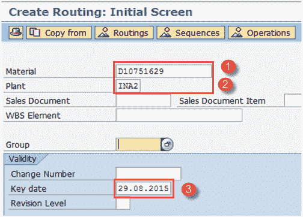
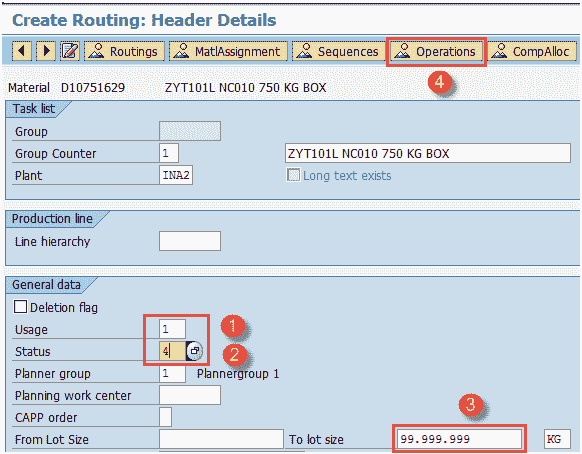
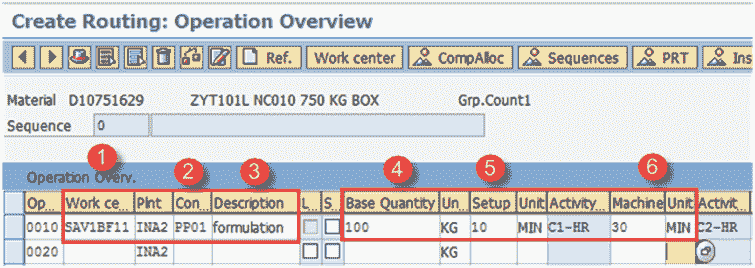
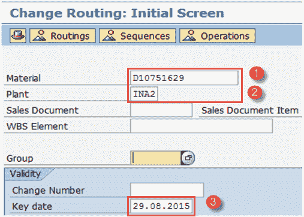
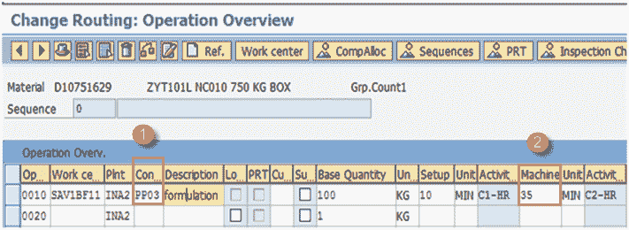
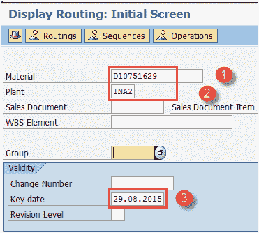
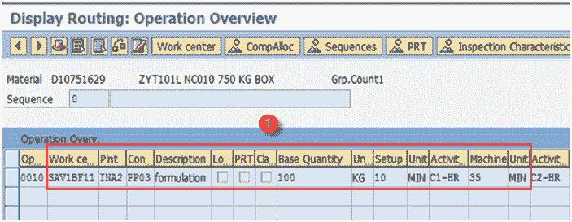

# 如何在 SAP PP 中创建/更改/显示工艺路线

> 原文： [https://www.guru99.com/create-change-routing-sap-pp.html](https://www.guru99.com/create-change-routing-sap-pp.html)

路由是对在生产和计划过程中必须执行哪些操作或活动列表的描述。

它还告诉需要在工作中心或机器上执行的活动/操作的顺序或顺序。

*   一个产品可能有几种替代路线。 例如，产品可以在 2 台手动操作的机器上（钻孔和磨削）制造，同时在 1 台自动机器（同时具有钻孔和磨削功能）上制造。在这种情况下，物料具有 2 种替代路线，即自动机器和手动 机。 ddfd

*   多个物料可以遵循同一工艺路线组，这意味着一组物料可以具有单个工艺路线。

*   生产中使用工艺路线来计划和计算半成品和半成品的成本。

*   工艺路线还用于通过计算成品的运营成本来计算成品的标准成本。
*   在创建工艺路线之前，必须在系统中使用 Work Center。

在本教程中-您将学习

*   [如何创建路由](#1)
*   [如何更改路由](#2)
*   [如何显示路由](#3)

## 如何创建路由

**步骤 1）**从 SAP 轻松访问菜单中，打开事务代码 CA01

1.  输入需要为其创建工艺路线的父物料。

2.  输入工厂代码。

3.  输入关键日期（从日期开始有效），这意味着路由将从该日期开始有效。

填写所有字段后，单击  或按 Enter 键进入下一个屏幕。 “标题详细信息”

**步骤 2）**在此步骤中，我们将维护路由报头数据，如下所示。

1.  输入用法为“ 1”，用于生产工艺路线，并将在生产订单中使用。 还有其他任务清单用途，适用于工厂维护和检查计划。

2.  输入状态为“ 4”，这是已释放状态。 它表明工艺路线对于物料需求计划和成本核算有效。

3.  输入手数大小为“ 99999999”，这表示工艺路线对于介于 0 到 99999999 之间的订单数量有效。

4.  按“操作”按钮添加操作顺序，然后执行下一步 3。

系统将自动填充一些信息，例如“描述”，“组计数器”和“基本单位计量”。

单击操作选项卡，它将打开“操作概述”屏幕。

**步骤 3）**在此步骤中，我们将维护操作数据。

1.  输入执行操作的工作中心代码。

2.  输入控制键，用于确定是否应计划操作，进行成本核算以及在进行生产确认时是否可以自动收货。 通常根据您的业务流程进行配置。

3.  输入操作说明。

4.  输入物料的基本数量或输出数量，该数量或数量指示在第 2 点提到的机器和人工时间内将生产多少数量的物料。 5 & 6。

5.  输入基本数量所需的设置时间（以分钟为单位）。

6.  输入基本数量所需的机器时间（分钟）。

单击  保存新的路由，系统将在左下角显示消息  。

## 如何更改路由

如果我们用新的工作中心替换了旧的工作中心或在制造过程中增加了一项操作，我们将更改工艺路线。 如果我们的机器生产率提高了，那么我们需要更改机器时间或基本数量。

**步骤 1）**从 SAP 轻松访问菜单中，打开事务 CA02

1.  输入需要更改工艺路线的父物料。

2.  输入工厂代码。

3.  关键日期（从有效日期开始），这意味着从该日期开始路由有效，并自动设置为当前日期。

**步骤 2）**填写所有字段后，从顶部菜单中单击（右标记）  进入下一个屏幕。

1.  将控制键从 PP01（无自动 GR 指示器）更改为 PP03（自动 GR 指示器）。自动收货表示在进行生产确认时，将自动进行物料收货。

2.  更改机器时间。

完成所有修改后，单击  保存路由。

## 如何显示路由

为了显示路由，我们将遵循以下步骤。

**步骤 1）**从 SAP 轻松访问屏幕在事务 CA03 中打开

1.  输入需要显示工艺路线的父物料。

2.  输入工厂代码。

3.  关键日期（从有效日期开始），这意味着从该日期开始路由有效，并自动设置为当前日期。

填写完所有字段后，单击顶部菜单中的  符号以转到下一个屏幕并显示路由。

**步骤 2）**在此屏幕中，我们将看到如何显示工艺路线的操作数据。

1.  屏幕将显示工艺路线的运行数据，例如–工作中心执行的运行，基本数量（100 EA），准备时间（10 分钟）和机器时间（35 分钟）。

**故障排除**

*   可能存在物料主记录不存在的情况。 为此，您需要在创建工艺路线之前为物料创建物料主数据。
*   某些用户可能会收到错误“工作中心不存在”。 在这种情况下，应事先创建工作中心。