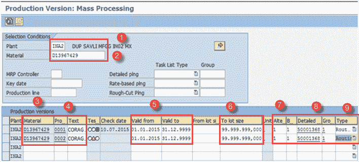
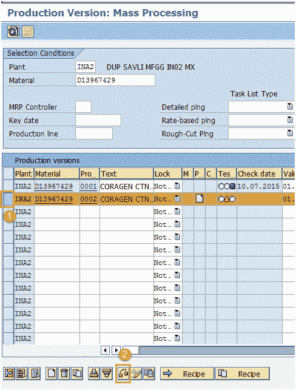
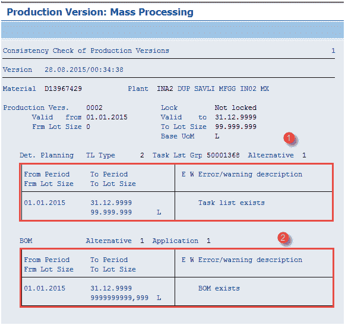
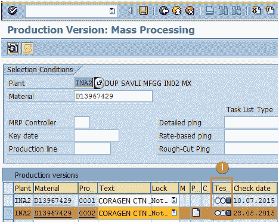

# 如何在 SAP PP C223 中创建生产版本

> 原文： [https://www.guru99.com/create-production-version-sap-pp.html](https://www.guru99.com/create-production-version-sap-pp.html)

生产版本是产品 BOM（物料清单）和流程工艺路线之间的链接。 它确定使用哪种备选 BOM 以及用于生产物料或计划物料的工艺路线。

根据批量大小和有效日期，可能会有不同的生产版本。

例如，如果您要生产 1 – 100 升的油漆而不是 100 – 1000 升的油漆，可能会有不同的版本，因此在两种情况下都可能需要不同的 BOM 组成。

*   它包含以下数据：

1.  到生产版本的路由分配

2.  将替代物料清单分配给生产版本

*   生产版本用于物料需求计划（MRP），生产订单创建和产品成本核算，以选择最合适的工艺路线和相应的物料清单。

为了创建生产版本，请执行以下步骤-

**步骤 1）**从 SAP 轻松访问屏幕打开的事务 **C223**

1.  输入工厂代码。

2.  输入需要为其创建生产版本的父物料。

3.  输入物料代码。

4.  输入生产版本代码和文本。

5.  输入生产版本的有效日期。

6.  输入有效的手数范围。

7.  输入生产物料清单的替代物料清单和物料清单用法为“ 1”。

8.  输入路由组和计数器。

9.  输入任务列表的类型，即路由。

填写所有字段后，单击  或按 Enter 键进入下一个屏幕。

**步骤 2）**在此屏幕中，

1.  选择新创建的生产版本的行。
2.  按下“一致性检查”以检查 BOM 和工艺路线是否有效。

**步骤 3）**在此屏幕中，您可以看到有关 BOM 有效性和物料路由的消息。

1.  检查生产版本的有效期内（2015.01.01 – 31.12.9999）和批量大小（0 – 99999999）是否存在任务列表路由。

2.  检查生产版本的有效期（01.01.2015 – 31.12.9999）和批量大小（0 – 9999999999999）是否存在 BOM。

单击  或从键盘按 F3 到上一个屏幕。

**步骤 4）**在此屏幕中，您可以看到测试状态由绿色指示。

1.  您可以看到绿色的一致性检查状态。

单击  保存新版本，系统将在左下角显示消息“生产版本已保存”。

**故障排除**

*   在生产版本有效期中，可能存在 BOM 表和工艺路线无效的情况。 确保生产的有效期介于 BOM 表和工艺路线的有效期之间。