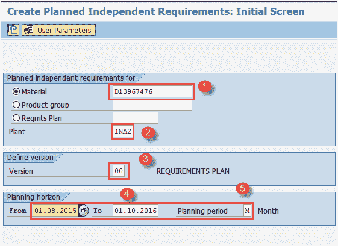
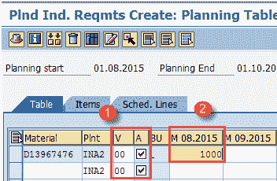
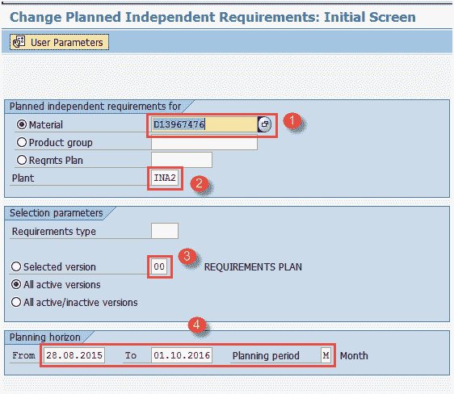
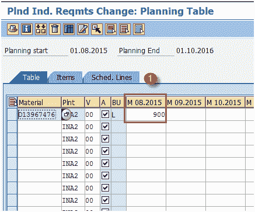
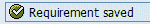
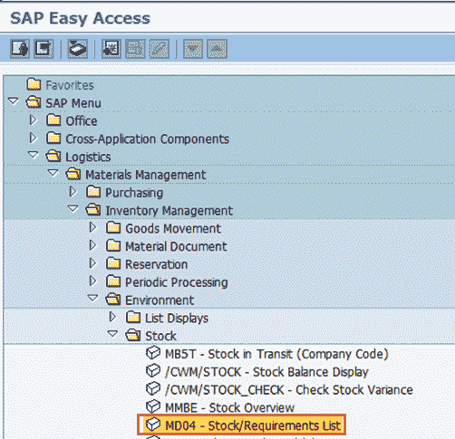
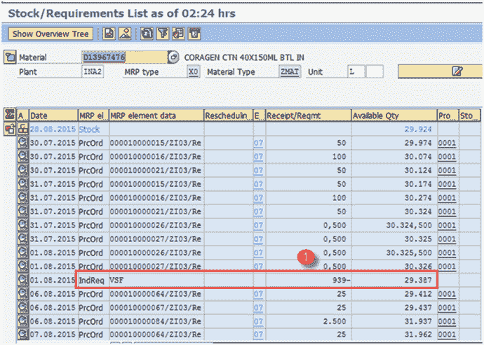
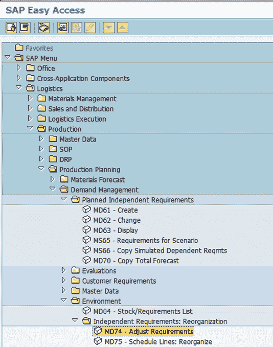
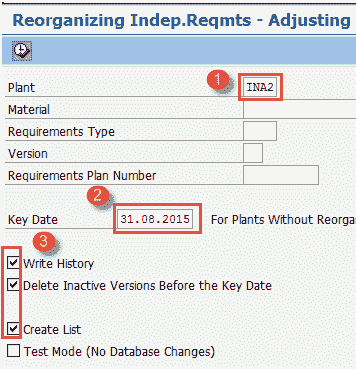
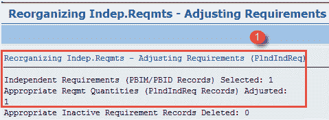

# SAP 需求管理教程：MD61，MD62，MD04，MD74，MD75

> 原文： [https://www.guru99.com/demand-management-tutorial-sap-pp.html](https://www.guru99.com/demand-management-tutorial-sap-pp.html)

### 什么是计划独立要求（PIR）？

计划独立需求（PIR）用于执行需求管理功能。

计划独立需求包含物料的一个计划数量和一个日期，或一个根据日期随时间划分的计划数量。

*   PIR 版本“ 00”具有一个活动指示器，该指示器指定在物料需求计划（MRP）中将考虑需求。

*   如果要维护计划独立需求的多个版本，但又不想在物料需求计划运行中包括所有版本，则可以将某些版本设置为活动版本，将其他版本设置为非活动版本，这些版本可以长期用于模拟 规划。

*   PIR 与需求类型相关联，该需求类型由物料主数据中的计划策略驱动，而需求类型决定了计划方法–按库存或按订单生产。
*   PIR 显示在库存需求列表中，以便计划器可以查看和计划生产。
*   PIR 通常用于按库存生产的环境中，企业要根据预测而不是根据销售订单来建立库存。

**规划策略的影响**

*   规划策略大致分为按库存生产（MTS）和按订单生产（MTO）。

**进行库存**

*   如果您在不等待销售订单到达的情况下生产库存，则将执行按库存生产，因为您想稍后使用该库存中的物料立即交付客户。 如果您预测不久的将来可能会有客户需求，那么您甚至可能想要建立没有销售订单的库存。
*   按库存生产策略通常与批量关键字或取整值相关联。 例如，您可能只想在一个月中一次生产整个月的全部金额，或者您想生产确切的 PIR 数量。
*   在计划策略 10 中，MRP 运行只考虑 PIR 数量，而销售订单被完全忽略。 当您将库存交付给客户时，PIR 会降低。 PIR 具有需求类型 LSF。
*   在计划策略 40 中，将 MRP 考虑为最多 2 个（PIR 和销售订单），并在输入销售订单后立即降低 PIR。 PIR 具有需求类型 VSF。

**订购**

*   在收到客户的销售订单之前，您不希望生产成品。
*   在 MTO 中不考虑 PIR，而在 MRP 中仅考虑销售订单。
*   您产生销售订单库存，并且仅在 MTS 方案中才能交付给特定客户。
*   计划策略（20）被广泛用于按订单生产流程，策略 25 被用于具有变式的 MTO，其中客户要求产品变型。

在本教程中，您将学习

*   [如何创建计划独立需求（PIR）](#1)
*   [如何更改 PIR](#2)
*   [如何显示库存/需求清单](#3)
*   [如何删除 PIR 数据](#4)

## 如何创建计划独立需求（PIR）

**步骤 1）**从 SAP 轻松访问屏幕打开事务 MD61

1.  输入需要为其创建需求的单一物料或需求计划（对于多种物料）。

2.  输入 MRP 区域和工厂代码“ INA2”。

3.  输入版本为“ 00”，这是活动版本，在 MRP 运行中将考虑要求。

4.  输入需要为其创建需求的计划范围日期。

5.  输入计划期间作为 M 月。

填写所有字段后，单击  或按 Enter 键进入下一个屏幕。

**步骤 2）**在此屏幕中，我们将在每月存储区中输入需求数量，

1.  版本“ 00”和“活动”复选框已标记为默认值，这意味着这是一项活动要求，将在 MRP 运行中予以考虑。

2.  在每月存储桶中输入需求数量

填写完所有数据后，单击  保存，系统将显示消息  。

*   如果要删除一种物料的需求，请单击该行的  ，然后单击删除按钮  。

## 如何更改 PIR

**步骤 1）**从 SAP 轻松访问屏幕打开事务 MD62

1.  输入需要更改其 PIR 的父物料。

2.  输入工厂代码。

3.  输入版本为“ 00”。

4.  输入计划期为 M 的计划期日期。

**步骤 2）**填写所有字段后，单击  进入下一个屏幕。

1.  如下所示将需求数量更改为 900。

完成所有修改后，单击  保存 PIR。 系统将在左下角显示一条消息，例如  更改。

## 如何显示库存/需求清单

**步骤 1）**从 SAP 轻松访问屏幕打开事务 MD04

1.  输入需要显示其库存/需求清单的物料。
2.  输入工厂代码。

**步骤 2）**填写所有字段后，单击  进入下一个屏幕，并显示库存/需求清单。

1.  显示物料的库存/需求清单，您可以在其中看到 PIR（物料主 MRP3 视图中从计划策略 40 驱动的需求类型 VSF）1000 EA 的数量被销售订单减少到 939。

## 如何删除 PIR 数据

**步骤 1）**从 SAP 轻松访问屏幕打开事务 MD74 / MD75

1.  输入工厂代码

2.  输入关键日期，如果在屏幕中未选择任何物料，则需要在此日期之前删除工厂的整个 PIR 数据。

3.  标记记录历史记录，删除非活动版本并创建列表复选框。

单击执行按钮以运行报告并移至下一个屏幕。

**步骤 2）**在下一个屏幕中，您将看到有关删除 PIR 的消息。

1.  检查有关删除 PIR 的消息。

**故障排除**

*   可能存在物料主记录不存在的情况。 为此，您需要在创建 PIR 之前为物料创建物料主数据。
*   确保物料主数据中已制定正确的计划策略，该策略驱动了 PIR 的需求类型，并基于此 MIR 运行中考虑了 PIR。