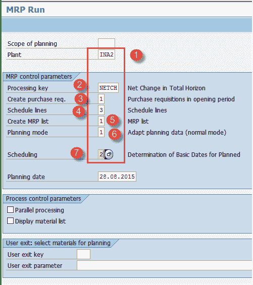
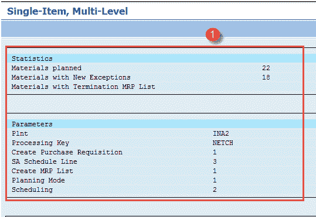
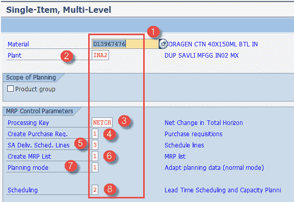
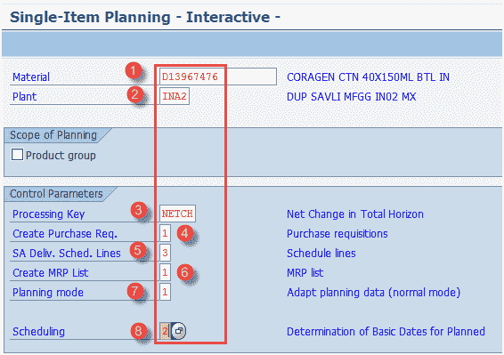
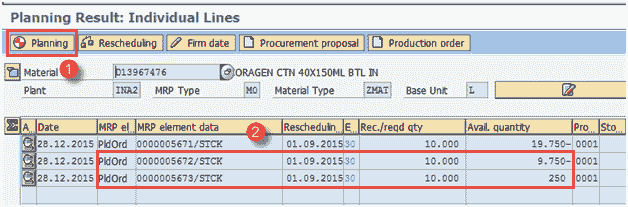
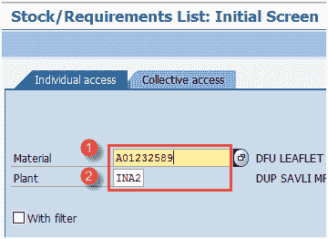
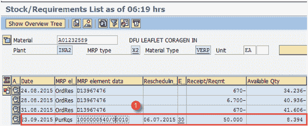

# SAP MRP（物料需求计划）教程：MD01，MD02，MD04

> 原文： [https://www.guru99.com/material-requirement-planning-sap-pp.html](https://www.guru99.com/material-requirement-planning-sap-pp.html)

MRP 的主要功能是保证按时供应材料。

为了内部使用或满足客户需求，MRP 需要按时采购或生产所需数量。

主要目标是根据需求计划供应量，并考虑现有库存并解决短缺问题。

在本教程中，您将学习

*   [MRP 处理流程](#2)
*   [主生产计划（MPS）](#3)
*   [MRP 计划参数](#4)
*   [如何为所有产品运行 MRP](#5)
*   [如何为单个物料](#6)运行 MRP
*   [如何运行主生产计划（MPS）](#7)
*   [如何进行 MRP 评估-库存/需求清单](#8)

## MRP 处理流程

*   使用 MRP，可以根据需要通过计划收货来优化库存，从而避免多余的库存。
*   销售和分销给市场带来了具体的客户需求。
*   在需求管理中，通过销售预测预先计划销售。 将销售预测以计划独立需求（PIR）的形式（即对成品的需求）输入到需求管理中。
*   为了满足这些要求，MRP 进行净需求计算并计划需要采购或生产物料的采购数量和日期。
*   如果是内部生产物料，则系统将爆炸 BOM 并计算从属需求，即生产成品所需的组件数量。
*   如果存在物料短缺，则会在每个 BOM 表级别创建计划订单以满足要求，并为外部采购的原材料生成采购申请。 您还可以为外部采购物料创建计划订单，这些订单可以转换为采购申请。
*   MRP 负责提前期调度，并根据路由时间计算计划的订单日期。 基本上，它从需求日期减去（GR 处理时间，内部生产时间，生产前的浮动时间）开始进行反向调度，并计算计划订单的持续时间。
*   在转换计划订单和采购申请之后分别创建生产订单或采购订单。
*   物料主 MRP 1 视图中的 MRP 类型“ PD”对于运行物料的 MRP 是必不可少的。 如果您不想在物料上运行 MRP，则可以在物料主数据中维护 MRP 类型“ ND”。

## 主生产计划（MPS）

它专用于关键材料，通常是高价值产品，您不希望在下一个 MPS 运行的计划时间范围内更改生产计划，并且与 MRP 运行不同，一旦进入计划时间范围，生产计划就会自动确定。

*   MPS 项目将单独运行。 它们不包括在 MRP 运行中。

*   基本上，它确保了关键资源的可用性，而这些资源不应通过维持库存而妨碍生产。

*   计划时间范围（从当前日期开始的天数）在 MPS 方案中非常有用，在该方案中，可以保存采购建议（计划订单）以免自上一次 MRP 运行以来进行任何更改。

*   采购建议一旦进入计划时间范围，便不会自动更改（PTF 在物料主数据中维护）。 因此，系统会自动确定计划时间范围内的所有计划订单。

*   应该维护物料主数据中的 MRP 类型“ P0”至“ P3”，以运行物料的 MPS。

## MRP 计划参数

MRP 运行需要 MRP 参数，这要考虑规划范围内的需求（PIR），调度参数以及 BOM 和路由数据的使用。

1.  **处理密钥**

1.  净更改（NETCH）：在此运行中，系统会考虑从上次 MRP 运行开始的计划运行中的物料，这些物料发生了与收货和发货有关的任何更改或任何库存更改。
2.  计划范围的净更改（NETPL）：在此运行中，系统会考虑从上次 MRP 运行开始的计划运行中那些发生了与收货和发货有关的更改或任何库存更改的物料。 它在预定义的计划范围内考虑需求，而 NETCH 键则考虑总的未来需求。
3.  再生计划（NEUPL）：它计划 MRP 运行的所有物料，无论它们经历的变更如何。 这个计划没有被广泛使用。 获得最终结果需要很长时间。

2.  **计划模式**

1.  调整计划数据：它仅处理更改的数据。
2.  重新分解物料清单和工艺路线：再次读取现有订单的物料清单和工艺路线数据。
3.  删除并重新创建计划数据：它将完全删除计划数据（所有收货）并再次创建。

3.  **安排**

1.  基本计划：MRP 仅计算订单的基本日期，并使用物料主数据的内部生产时间。
2.  提前期计划：生产日期由计划订单的提前期计划确定。 读取工艺路线以计划并计算工作中心的产能需求。

## 如何为所有产品运行 MRP

**步骤 1）**在 SAP 轻松访问屏幕中，打开事务 MD01，我们将在工厂级别运行 MRP。

1.  输入要执行 MRP 的制造工厂。

2.  输入处理密钥作为“ NETCH”（总水平的净变化）

3.  在创建采购要求中输入“ 1”。 这意味着对于外部采购物料，MRP 将生成采购申请而不是计划订单。

4.  在计划行中输入“ 3”，这表示 MRP 将为具有计划协议的原材料生成计划行。

5.  在 MRP 清单中输入“ 1”，系统将创建类似于库存/需求清单的 MRP 清单，以便以后分析先前的 MRP 运行。

6.  进入计划模式“ 3”，因为我们将删除并重新创建所有物料的所有计划数据。

7.  输入计划指标“ 2”，这表示 MRP 将进行提前期计划并考虑工艺路线时间以计算计划的订单日期。

填写所有字段后，单击  进入下一个屏幕。

按 Enter 忽略此消息。

系统会很好地要求您重新检查您的输入参数，因为 MRP 运行将重新计划并覆盖所有现有数据。 你确定吗？？？ 如果是这样，请按 Enter。

您真的，真的确定要继续吗？？？ 如果是这样，则再次按 Enter。

**步骤 2）**系统将需要一些时间来计算物料需求。

1.  计算完成后，将显示一个报告。 在这里，可以看到计划了多少材料以及在运行过程中给出了哪些参数。

## 单个物料的 MRP 运行

**步骤 1）**在事务 MD02 中，我们将对单个物料运行 MRP。

1.  输入要为其运行 MRP 的物料代码。

2.  输入要进行 MRP 运行的制造工厂代码。

3.  输入处理密钥作为“ NETCH”（总水平的净变化）

4.  在创建采购需求中输入“ 1”，这意味着对于外部采购物料，MRP 将生成采购申请，而不是计划订单。

5.  在计划行中输入“ 3”，这表示 MRP 将为具有计划协议的原材料生成计划行。

6.  在 MRP 清单中输入“ 1”，系统将创建类似于库存/需求清单的 MRP 清单，以便以后分析先前的 MRP 运行。

7.  进入计划模式“ 3”，因为我们将删除并重新创建所有物料的所有计划数据。

8.  输入计划指标“ 2”，这表示 MRP 将进行提前期计划并考虑工艺路线时间以计算计划的订单日期。

填写所有字段后，单击  进入下一个屏幕。

The system asks you nicely to re-check your input parameter because the MRP run is going to reschedule and overwrite all existing data. Are you sure??? If so, press enter.

您 100％确定要继续吗？？？ 如果是这样，则再次按 Enter。

**Step 2)** System will take some time to calculate the material requirement.

1.  计算完成后，将显示一个报告。 在这里，您可以看到计划了多少材料。

**注意**：由于工厂中有 22 种物料，因此仅计划了这 22 种物料。

## 主生产计划（MPS）运行

**步骤 1）**在事务 MD43 中，我们将为单个物料运行 MPS。

1.  输入要运行 MPS 的物料。 在这里，我们已获取 ID“ 13967476”。

2.  输入要运行 MPS 的制造工厂“ INA2”。

3.  输入处理密钥作为“ NETCH”（总水平的净变化）

4.  在创建采购要求中输入“ 1”。 这意味着对于外部采购的物料，MPS 将生成采购申请而不是计划订单。

5.  在计划行中输入“ 3”，这意味着 MPS 将为具有计划协议的原材料生成计划行。

6.  在 MRP 清单中输入“ 1”，系统将创建类似于库存/需求清单的 MRP 清单，以便以后对先前的 MPS 运行进行分析。

7.  进入计划模式“ 3”，因为我们将删除并重新创建所有物料的所有计划数据。

8.  输入计划指标“ 2”，这表示 MRP 将进行提前期计划并考虑工艺路线时间以计算计划的订单日期。

填写所有字段后，单击  进入下一个屏幕，系统将显示消息  ，如果一切正常，请再次单击  。

**步骤 2）**在此步骤中，我们将生成交互式计划数据，通过该数据您可以同时查看计划结果。

1.  按“计划”按钮，将为短缺数量生成计划订单。

2.  检查生成的计划订单。

## MRP 评估-库存/需求清单

在此列表中，您将看到需求，当前库存和计划的收货，即物料的订单。

**步骤 1）**在 SAP 轻松访问屏幕中，打开事务 MD04

1.  输入需要显示其库存/需求清单的物料。
2.  输入工厂代码。

**步骤 2）**在所有字段中输入信息后，单击  进入下一个屏幕，并显示库存/需求清单。

1.  已生成物料的显示库存/需求清单，您可以在其中查看

*   分解了物料 D13967476 的 BOM，
*   产生了 50 的采购申请（物料主代码 A01232589 中保持的固定批次大小 50），而净需求为– 41.606。

**故障排除**

*   可能存在物料主记录不存在的情况。 为此，您需要在运行 MPS / MRP 之前为物料创建物料主数据。
*   在运行 MRP 之前，请确保物料清单和工艺路线数据到位，以便根据所有物料清单级别的需求生成采购建议，否则，将生成不含物料清单的计划订单，因此会在进一步的消耗过程中产生问题。