# SAP PP 中的长期计划（LTP）教程：MS31，MS02，MD61

> 原文： [https://www.guru99.com/long-term-planning-sap-pp.html](https://www.guru99.com/long-term-planning-sap-pp.html)

长期计划（累积 MRP）用于模拟所有 BOM 级别的未来需求和供应情况。 主要功能是检查容量状况，物料需求和供应商在所需时间内提供物料的能力。

这不是实际运行，而是模拟运行，其中实际计划情况没有受到影响，我们可以及时看到工作中心的产能状况。 如果可以提前获得此类信息，那么我们可以尽早决定是否需要额外的机器来应对容量瓶颈。

*   LTP（长期计划）不过是在模拟版本中运行的 MRP，以模拟未来的生产计划。

*   如果通过仿真发现可以满足所有能力和要求，则可以将计划从模拟版本转换为执行版本“ 00”（实际计划）。

*   采购部门还可以利用长期计划的结果。 他们使用有关未来需求数量的信息来估计未来的采购订单。 这为他们提供了与供应商协商交货时间表和合同的机会。

*   供应商还可以从长期计划结果中受益，因为可以向他们发送未来估计的采购订单和交货计划的预览。

*   通常，计划独立需求（PIR）版本可以是活动的或不活动的。 对于 LTP，计划的独立版本应该是无效的，因为它是模拟版本。 仅活动 PIR 版本用于执行计划（MRP）。

*   现有主数据可用于 LTP。 但是也可以为 LTP 使用不同的主数据（BOM 和路由）。

*   如果要删除长期计划数据，则需要删除计划业务情景，并且可以在另一个非活动版本中使用新要求再次重新运行整个周期。

*   长期计划数据也可以用于将工艺路线活动数量传输到各个成本中心。 控制部门可以通过将成本中心预算值和活动数量（通过 LTP 运行计算）相除来计算活动价格，该活动数量用于标准成本计算。

在本教程中，您将学习

*   [如何创建非活动版本的独立需求（PIR）](#1)
*   [如何创建计划业务情景](#2)
*   [如何执行长期计划](#3)
*   [如何检查库存/需求清单](#4)
*   [如何检查容量状况](#5)
*   [如何分析模拟购买信息系统](#6)

## 如何创建非活动版本的独立需求（PIR）

**步骤 1）**从 SAP 轻松访问中，打开事务 MD61

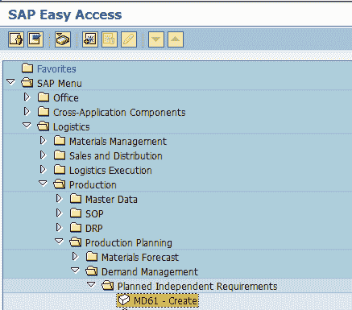

1.  输入需要为其创建需求的物料代码

2.  输入工厂代码。

3.  将版本输入为“ 02”，这是不活动的版本，并且在长期计划运行中将考虑要求，而不是 MRP。

4.  输入需要为其创建需求的计划范围日期。

5.  输入计划期间作为 M 月。

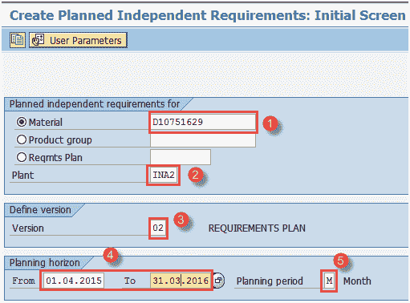

填写所有字段后，单击  或按 Enter 键进入下一个屏幕。

**步骤 2）**在此屏幕中，我们将按月存储量输入物料的需求数量。

1.  版本“ 02”和“活动”复选框未标记，这意味着它是非活动/模拟要求，仅在 LTP 运行中才考虑。

2.  在每月存储桶中输入需求数量。

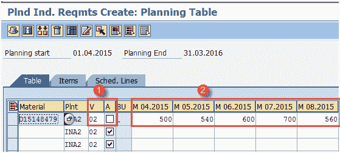

填写完所有数据后，单击  保存，系统将显示消息  。

## 如何创建计划方案

长期计划运行需要创建计划方案。 将 PIR 形式的年度模拟需求分配给计划方案。将物料清单选择 ID 分配给方案，以选择 LTP 运行中的相关 BOM。 我们还可以从 LTP 运行中包括或排除当前库存，现有计划收货。

**步骤 1）**在 SAP 轻松访问屏幕中打开事务 MS31

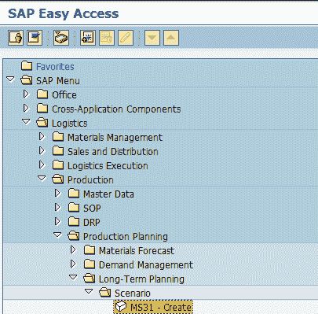

1.  Enter Planning scenario (numeric or alphanumeric of your choice) and give the description of the scenario.

    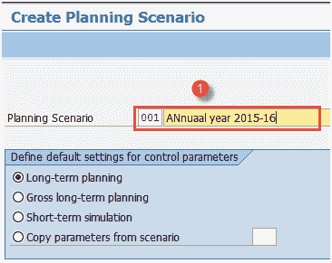

    在键盘上按 Enter 键可移至下一个屏幕。

**步骤 2）**在此屏幕中，

1.  输入需要进行 LTP 运行的计划期间。

2.  保留期初库存为空白，这意味着在 LTP 运行中不会考虑当前库存。

3.  BOM 选择 ID 为“ 01”表示将在 LTP 运行中分解活动的 BOM。

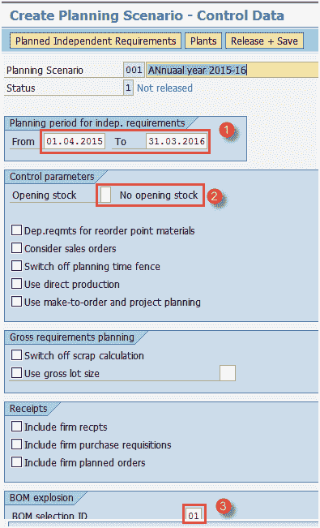

**步骤 3）**在同一屏幕中，

1.  按顶部的“计划的独立需求”按钮，将出现一个小的弹出窗口。

2.  在小的弹出屏幕中，输入版本“ 02”和计划期间。

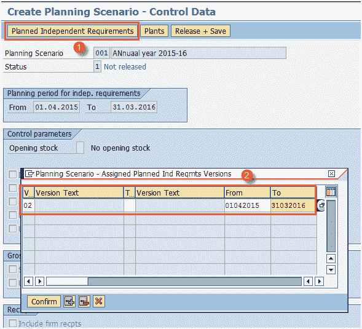

**步骤 4）**在同一屏幕中，

1.  按顶部的“植物”按钮，将出现一个小的弹出屏幕。

2.  输入您的制造工厂代码。

3.  确认所有详细信息后，按“确认”按钮

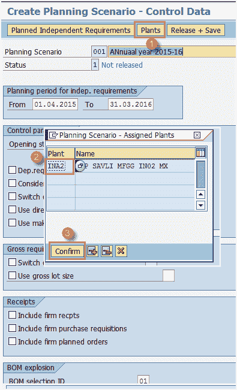

**步骤 5）**在同一屏幕中，

1.  按“发布+保存”按钮，将生成计划文件条目。

2.  在弹出窗口中单击“是”以释放该方案。

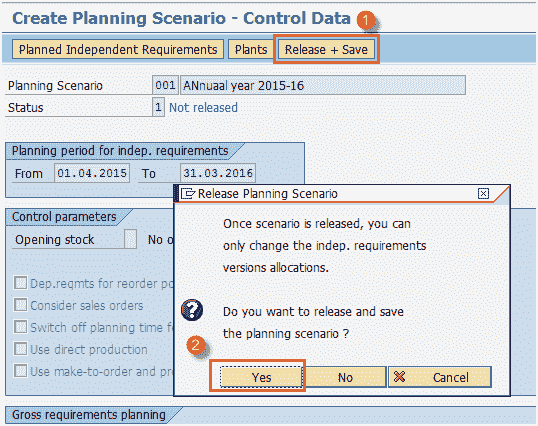

单击是按钮后，系统会要求您以在线模式或后台模式创建计划文件条目。

**步骤 6）**在此屏幕中，

1.  计划文件条目已生成。 单击按钮“立即”生成条目。

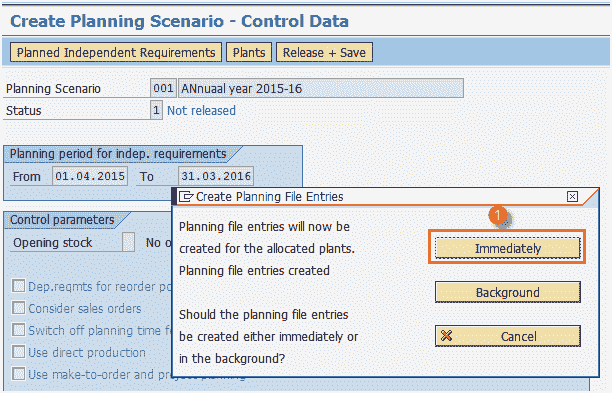

将生成有关计划文件条目的消息，这意味着系统已识别出与长期计划运行相关的材料数量。

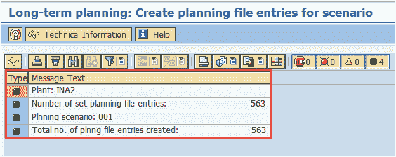

您可以关闭此屏幕，也可以移回轻松访问屏幕。

## 如何执行长期计划（LTP）

**步骤 1）**在事务 MS02 中，我们将运行 LTP。

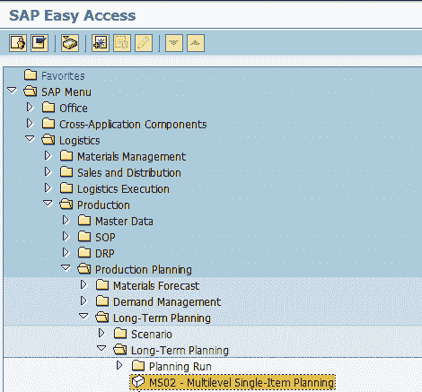

1.  输入您的计划方案。

2.  输入物料代码。

3.  输入您要运行 MRP 的制造工厂代码。

4.  输入处理密钥为“ NETCH”（总水平的净变化）

5.  在 MRP 清单中输入“ 1”，系统将创建类似于库存/需求清单的 MRP 清单，以供以后分析先前的 MRP 运行。

6.  进入计划模式“ 1”，因为我们将运行 LTP。

7.  输入调度指示器“ 2”，这表示 LTP 将进行提前期调度并考虑路由时间以计算模拟计划订单的持续时间。

8.  输入“ 1”以使用计划业务情景中的设置，即 LTP 运行中不会考虑已确认的收货。

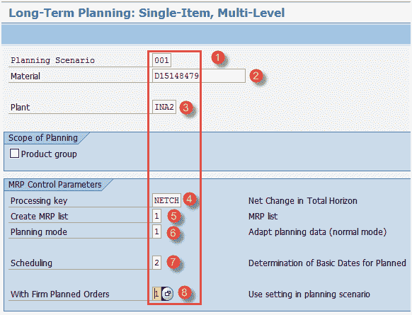

从键盘按两次 Enter 键以运行 LTP。 系统将需要一些时间来运行 LTP，并且会抛出有关计划的消息。

**Step 2)** In this screen,

1.  检查有关创建的采购建议数量的消息。

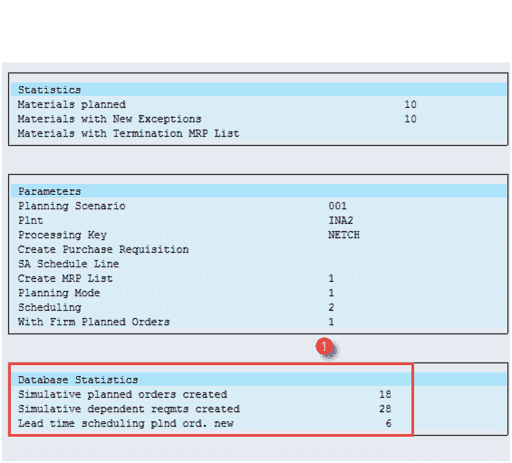

## 如何检查库存/需求清单

此列表将为您显示需求（无效的 PIR）和收货元素，例如计划方案的模拟计划订单。 该列表将显示所有模拟数据，而不是实时操作数据。

**步骤 1）**在事务 MS04 中

1.  输入计划业务情景。

2.  输入物料代码。

3.  输入工厂代码

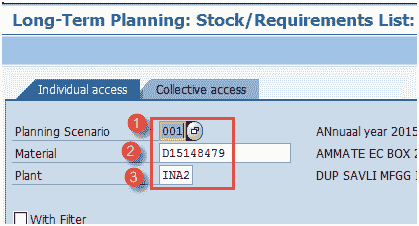

按 Enter 键进入下一个屏幕。

**Step 2)** In this screen,

1.  检查是否根据 PIR 生成了计划订单，并检查了计划订单中的重新计划日期。 这些都是模拟计划订单，与实时数据无关。

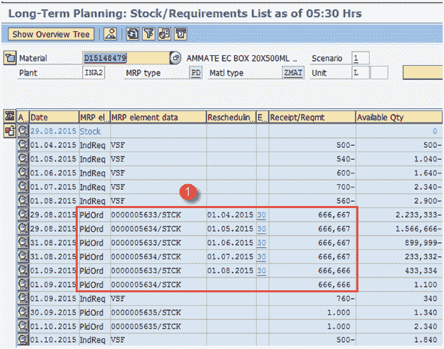

## 如何检查容量状况

**步骤 1）**从 SAP 轻松访问中，打开事务 CM38，以检查工作中心的能力需求。 工作中心将加载模拟计划订单，这导致了时间方面的容量需求。

1.  输入计划方案。
2.  输入工厂代码。

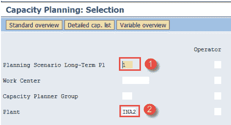

按 Enter 键进入下一个屏幕

**步骤 1）**在此屏幕中，

1.  检查工作中心的容量负荷，该负荷基本上是容量需求（以小时为单位）与可用容量（以小时为单位）之比。

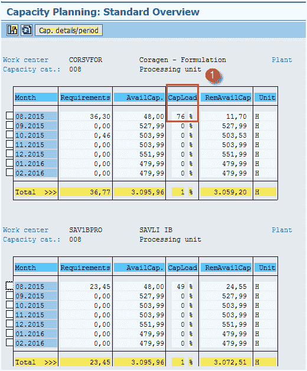

## 如何分析模拟购买信息系统

LTP 生成“计划订单”而不是采购申请，并且计划订单中没有“供应来源”。 但是，我们可以在标准信息系统报告中看到供应商。

在 LTP 活动之后，将创建 PURCHIS 信息系统的新版本。

**步骤 1）**在事务 MS70 中

1.  进入计划场景。

2.  选择选项“标准/移动平均价格”，这意味着将以标准/移动平均价格评估模拟计划订单。

3.  取消标记“测试模式”并执行。 版本信息结构 001 将自动创建。

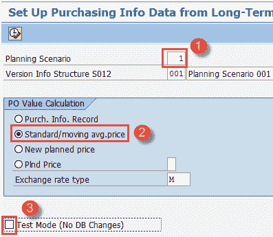

当您按下执行按钮时，系统会使用模拟采购订单数量和值来更新 001 版的采购信息系统，以便采购计划员可以计划全年的原材料并可以与供应商进行谈判。

当您按下执行按钮时，它将带您进入下一个屏幕。

**步骤 2）**在事务 MCEC 中，您可以看到在上一步中完成的购买信息系统的更新。 在给定期间内，可以从卖方的角度看待订单数量。 这些都是在仿真版本中完成的。

1.  输入计划业务情景。

2.  输入工厂代码。

3.  输入要分析的时间段

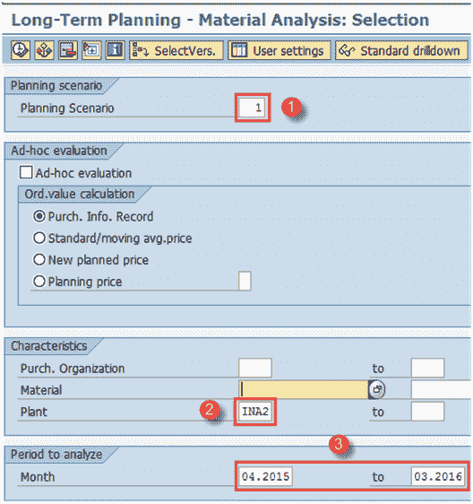

按顶部的执行按钮或按键盘上的 F8 键运行此报告。 该报告将在下一个屏幕中显示模拟采购订单数量。

**步骤 3）**此屏幕将显示基于模拟年度生产计划的原材料的预计采购数量和价值。

1.  检查仿真版本中的 PO 数量和值

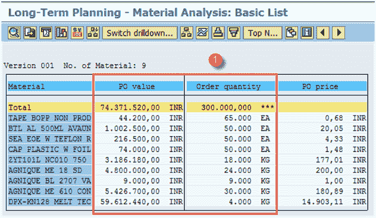

**故障排除**

*   必须正确放置所有 PP 主数据（例如 BOM 和工艺路线）以有效地进行长期计划，因为如果没有主数据，您将无法向下钻取和计划到 BOM 的最低级别，即原材料。

*   确保输入非活动版本的 PIR 数量，以避免真实数据中的任何冲突。