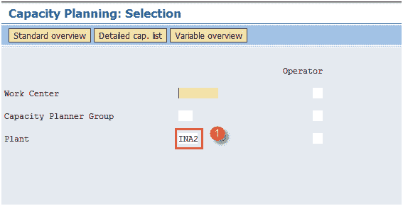
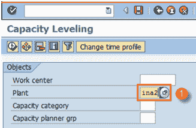
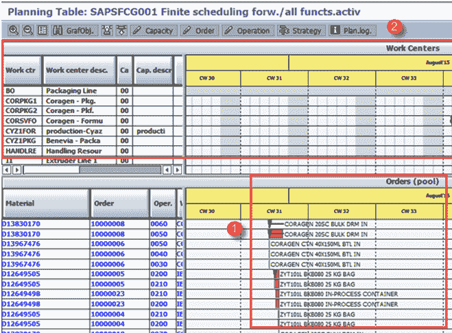
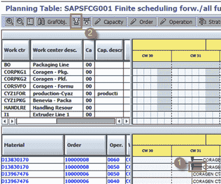
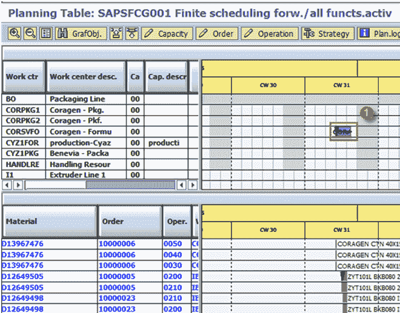

# SAP PP 容量计划：CM01，CM21

> 原文： [https://www.guru99.com/capacity-requirement-planning-sap-pp.html](https://www.guru99.com/capacity-requirement-planning-sap-pp.html)

容量规划的主要功能是检查 Work Center 的负载并进行容量均衡，即平衡 Work Center 的负载。 它有助于根据产品需求和工作中心的可用能力来计算生产能力。

*   MRP 假设工作中心始终可用，因此 MRP 具有无限的工作能力并同时在工作中心创建计划订单。 因此，尽管容量不足，它仍会根据需求在同一日期创建计划订单。 您可以在系统中的该工作中心上执行这些订单，这在车间实际上是不可行的。

*   能力均衡的主要目标包括在工作中心进行均衡过载，并实现工作中心的最佳利用率。

*   MRP 生成的计划订单被转换为生产订单，该生产订单确定要使用哪个工作中心，并因此在该工作中心上生成了产能需求。

*   生产订单级别的能力均衡用于详细的生产计划目的。 这是通过计划表完成的，该表用于将来随时间推移进行容量需求的详细计划。

*   需要在工作中心检查容量负荷，如果过载，则我们需要将订单提前移至同一工作中心或在不同的工作中心进行计划，以消除任何容量限制。

在本教程中，您将学习，

*   [如何检查容量负载](#1)
*   [如何进行容量均衡](#2)

## 如何检查容量负载

容量评估用于分析工作中心的负载，您可以查看负载百分比（在步骤 2 中），可用容量和要求。 您还可以查看已生成容量需求的订单。

**步骤 1）**在 SAP 轻松访问屏幕中，打开事务 CM01。

1.  输入要检查其产能负荷的制造工厂。

填写所有字段后，单击  进入下一个屏幕。

**步骤 2）**在此屏幕中，可以看到工作中心的产能状况。

1.  在工作中心检查能力要求（根据生产订单生成），可用能力（根据工作中心主数据确定）和能力负荷百分比。

## 如何进行容量均衡

通过计划表完成产能均衡，并且您需要按照应该在车间进行处理的顺序将订单发送到工作中心。

**步骤 1）**在 SAP 轻松访问屏幕中，打开事务 CM21

1.  输入要为其平衡容量的工厂

填写所有字段后，单击顶部的执行按钮转到下一个屏幕。

**步骤 2）**在此屏幕中，您可以在计划表的底部看到订单池，在上半部分看到工作中心池。

1.  检查订单池中的几个订单。

2.  检查工作中心池中的工作中心列表。

**步骤 3）**在计划表的同一屏幕中，选择以下数据。

1.  从订单池中选择一个订单。

2.  单击调度按钮以将该订单分配给工作中心。

**步骤 4）**在同一屏幕中，

1.  在工作中心池中检查分派的订单。 同样，您可以将其他订单分派到工作中心池，该中心将转移到先前分派的订单附近。

这是进行容量均衡的方法。

**故障排除**

*   确保将带有“容量要求”指示器的右控制键放置在工艺路线的操作数据中。
*   确保在工作中心的容量选项卡中，“有限计划”指示器已标记。