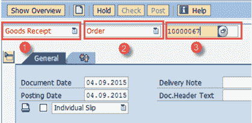
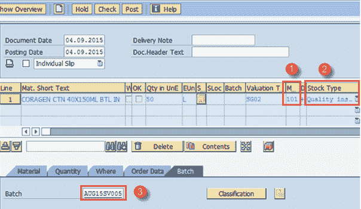
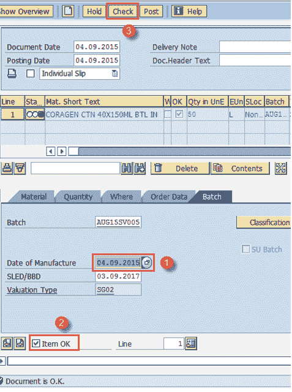
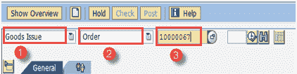
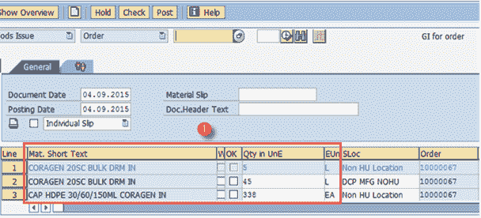
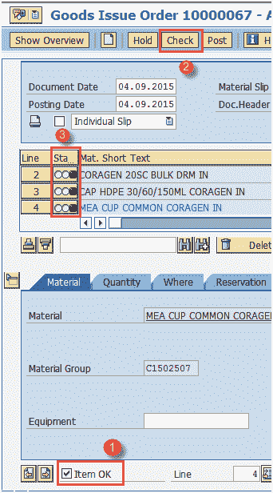

# SAP PP 中针对生产订单的货物移动：MIGO

> 原文： [https://www.guru99.com/goods-movement-production-order-sappp.html](https://www.guru99.com/goods-movement-production-order-sappp.html)

违反生产订单的货物移动有两种类型，这会影响物料的库存。 这些移动是通过 SAP 中的移动类型完成的。

*   针对订单的收货（GR）使用移动类型 101 执行，这在我们生产物料时完成。 收货后，系统会在相关的存储地点增加物料的库存。

*   针对订单的发货（GI）是使用移动类型 261 执行的，只要我们消耗组件物料来生产其他物料，就会执行该动作。 发货后，系统会减少相关存储位置中的组件库存。

在本教程中，您将学习

*   [如何根据订单](#1)创建收货（GR）
*   [如何根据订单](#2)创建发货（GI）

让我们开始-

## 如何针对订单创建收货（GR）

**步骤 1）**从 SAP 轻松访问屏幕打开事务 MIGO

1.  在准备收货时选择收货。

2.  在根据生产订单收货时选择订单。

3.  输入您的生产订单号。

填写所有字段后，单击  或按 Enter 键进入下一个屏幕。

**步骤 2）**在此屏幕中

1.  根据订单检查与 GR 相关的移动类型“ 101”。

2.  如果物料要进行质量检查，则库存类型将显示为“质量检查”。

3.  如果物料是分批处理的，则输入将在其中更新库存的批号。

**步骤 3）**在同一屏幕中，

1.  输入制造日期，即材料生产的日期。

2.  检查“项目确定”的标志。

3.  单击顶部的“检查”按钮，您将在屏幕底部看到该消息。

单击  保存文档。 系统将显示类似  的消息。

## 如何根据订单创建发货（GI）

**步骤 1）**从 SAP 轻松访问屏幕打开事务 MIGO

1.  在第一个框中选择“发货”。

2.  在第二个框中选择“订单”，这意味着我们将对订单执行 GI。

3.  输入生产订单。

填写所有字段后，单击  进入下一个屏幕

**步骤 2）**在此屏幕中，

1.  您可以看到从订单中自动获取的组件列表以及所需数量。 您可以根据实际消耗量更改数量。

**步骤 3）**在同一屏幕中，

1.  检查“项目确定”的标志。

2.  单击顶部的“检查”按钮，您将在屏幕底部看到该消息。

3.  您可以看到绿色状态，表明该文档可以发布。

单击  保存文档。 系统将显示类似  的消息

**故障排除**

*   对于手动发货，物料主数据应该没有任何反冲洗指示器，这意味着我们将在确认期间执行手动发货而不是自动发货。

*   对于人工收货，路由操作数据应具有不带自动 GR 标志的控制键，这意味着我们将在确认期间执行人工收货，而不是自动收货。