# SAP 中的生产订单：CO01，MD16，CO02，CO15

> 原文： [https://www.guru99.com/production-order-sap-pp.html](https://www.guru99.com/production-order-sap-pp.html)

生产订单定义了要处理的材料，在什么位置，什么时间，需要多少数量。 它还定义了要使用的组件和操作顺序，以及如何结算订单成本。

*   计划订单是运行 MRP 的结果。 用于内部采购的物料短缺将创建计划订单，可以将其转换为生产订单。 生产订单是“硬拷贝”； 无法再通过 MRP 运行来调整它们。

*   材料的 BOM 和工艺路线数据被复制到生产订单中，该生产订单确定订单中的组件和操作数据列表。

*   计划成本还可以通过组件价格和工艺路线活动价格在生产订单中更新。

*   您可以对生产订单运行可用性检查，以确定该订单中是否缺少任何组件，以便可以将这些缺少的组件带到车间执行订单。

*   您可以打印车间的生产订单，该订单指示要消耗的组件的列表以及在工作中心按顺序执行的哪种操作。

*   实际生产物料后，您可以通过订单确认来声明生产，该确认会更新订单上的机器运行价格，人工价格等活动成本。

*   您可以根据 BOM 决定在订单确认期间自动对组件进行反冲（消耗）。 消耗将减少组件的库存，这是使用 SAP 中的移动类型 261 进行的。

*   您也可以在订单确认期间自动过帐物料的收货。 收货会增加物料的库存，这是在 SAP 中使用移动类型 101 进行的。

*   订单确认后，所有成本（例如组件成本和活动成本）将从借方中扣除，一旦您过帐收货，成本将记入订单中。

*   一旦生产订单被完全确认并交付，或者企业决定不执行该订单，则需要在技术上关闭该订单，这意味着该订单将不再在 MRP 运行中考虑，并将从库存/需求清单中删除。 组件的订单保留也将被删除。

在本教程中，您将学习

*   [如何创建和下达生产订单](#1)
*   [如何通过转换计划订单来创建生产订单](#2)
*   [如何更改生产订单](#3)
*   [如何确认生产订单](#4)
*   [如何获得 TECO（技术上完整的）生产订单](#5)

## 如何创建和下达生产订单

需要创建生产订单来生产材料并消耗所使用的组件，并且还指定要在工作中心执行的操作顺序。

下达订单表示该订单已准备好在车间执行。 您也可以在创建模式下通过使用带有自动下达指示器集的物料主数据中的相关生产计划配置文件来自动下达订单。

**步骤 1）**从 SAP 轻松访问屏幕打开事务 CO01

1.  输入需要为其创建生产订单的物料代码。

2.  输入工厂代码。

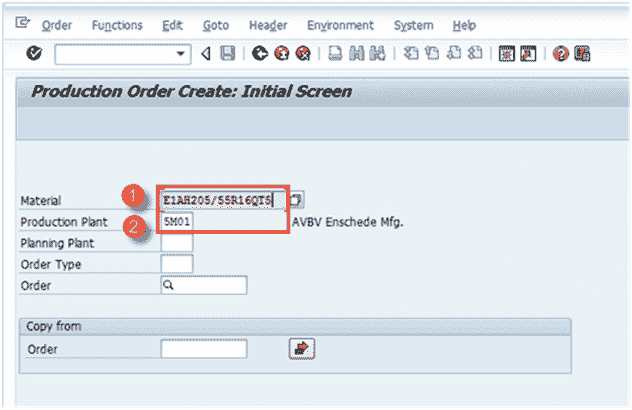

填写所有字段后，单击  或按 Enter 键进入下一个屏幕。

**步骤 2）**在此屏幕中

1.  输入订单数量。

2.  在计划子屏幕中选择选项“当前日期”。

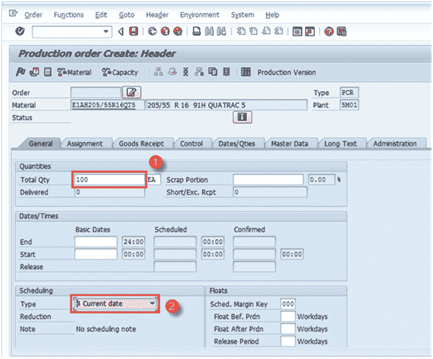

填写完所有字段后，单击  进行确认，然后系统将按顺序复制 BOM 和工艺路线数据。

**步骤 3）**在同一屏幕中，

1.  单击  释放订单。 以下消息将出现在左下角：  。

2.  单击  检查材料可用性。 系统将显示有关组件可用性的消息。

注意：如果在可用性检查中找不到零件，您也可以决定不下达订单。

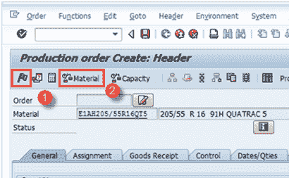

单击按钮  保存，以下消息将显示在左下角：  。

## 如何通过转换计划订单来创建生产订单

计划订单是 MRP 运行的结果，应将其转换为生产订单以进一步执行流程。

您不能使用计划订单直接声明生产，因此需要将其转换为生产订单。

一旦计划订单转换为生产订单，计划订单将从系统中删除，并且不再可在 MRP（物料需求计划）中考虑。

**步骤 1）**从 SAP 轻松访问屏幕打开事务 MD16

1.  从列表中选择单选按钮“ MRP 控制器”，这是一组材料。

2.  按顶部的右标记，或按键盘上的 Enter。

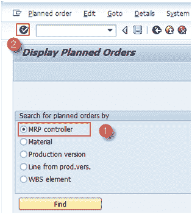

系统将显示以下屏幕。

**步骤 2）**在此屏幕中，我们将基于 MRP 控制器和选择日期获取计划订单。

1.  输入工厂代码。

2.  输入 MRP 控制器

3.  输入结束选择日期，直到将提取所有计划订单为止。

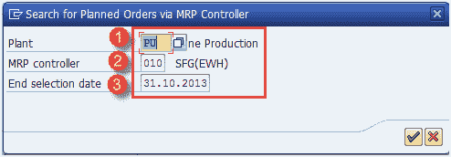

从底部单击右标记符号，或从键盘输入以转到下一个屏幕。

**步骤 3）**在此屏幕中，

1.  选择要为其转换计划订单的网格

2.  Press "convert to production order" button for the conversion.

    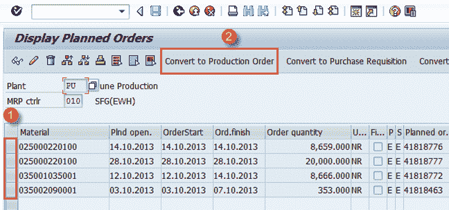

生产订单将在计划订单转换后创建。

## 如何更改生产订单

如果您的企业想要更改某些计划数量，或者在创建订单后更改了 BOM /工艺，则可能需要更改生产订单。

**步骤 1）**从 SAP 轻松访问屏幕打开事务 CO02

1.  输入要修改的生产订单号。

在同一窗口中，您可以看到已选中“显示概述”按钮，默认情况下处于选中状态。

填写所有字段后，单击  进入下一个屏幕。

**步骤 2）**在此屏幕中，订单将被修改。

1.  将订单数量更改为 9000 或您的要求如下所示。

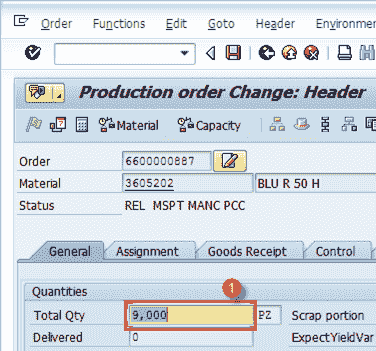

完成所有修改后，单击按钮  保存订单。 系统将在左下角显示一条消息，例如  已保存的订单号 6600000887。

## 如何确认生产订单

**步骤 1）**在 SAP 轻松访问屏幕打开的事务 CO15 中，同时进行三个活动并确认。

1.  生成确认文件

2.  消耗原材料或半成品

3.  成品或半成品的良好收货

1.  输入生产订单号

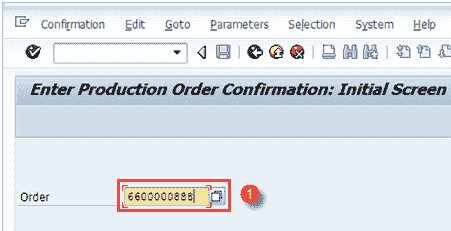

填写所有字段后，单击  进入下一个屏幕

**步骤 2）**在此屏幕中，我们将输入要确认的实际产量。

1.  输入产量数量，这是您要声明的生产数量

2.  按下顶部的“货物移动”按钮以检查自动货物移动以及确认

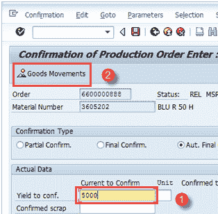

**步骤 3）**在此屏幕中，您将看到母物料的收货和组件的发货。

如果订单中最后一个操作的控制键指定自动收货，则系统自动将生产的物料过帐到非限制库存。

也可以通过物料主计划表视图中的生产计划配置文件激活自动收货。

如果您在物料主数据 MRP1 视图中确认组件中设置了“反冲”指示器的订单，系统将自动为这些组件过帐发货（GI）。

1.  自动收货（GR），使用移动类型 101 进行物料生产。

2.  汽车用品发货（GI），使用移动类型 261 进行的组件消耗。

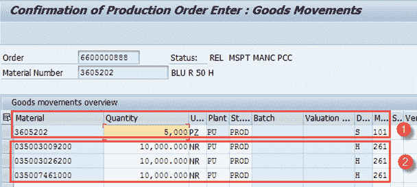

单击按钮  保存。

系统将在左下角显示  之类的消息，以提示成功或失败过账了多少货物移动。

因库存不足而消耗的失败货物移动将手动进行重新处理。

## 如何完成 TECO（技术上完整）的生产订单

当生产订单已完全交付或不再在车间进一步处理时，需要对订单进行技术上的填写。

技术完成订单状态更改为 TECO 后，将无法对该订单进行进一步的货物移动。

订单在 MRP 运行中不再可用，并从库存/需求清单中删除。

然后，控制部门可以在获得 TECO 状态后对生产订单进行差异计算。

**步骤 1）**从 SAP 轻松访问中，打开事务 CO02

1.  输入您想要 TECO 的订单号。

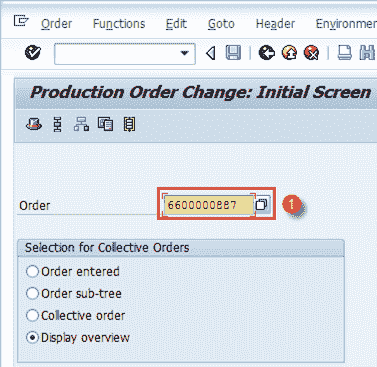

填写所有字段后，单击  进入下一个屏幕，

**步骤 2）**在此屏幕中，我们将了解如何将生产订单下达 TECO 状态，

1.  在菜单中单击功能**->** 限制处理**->** 技术上完整的系统将在状态中显示消息-TECO

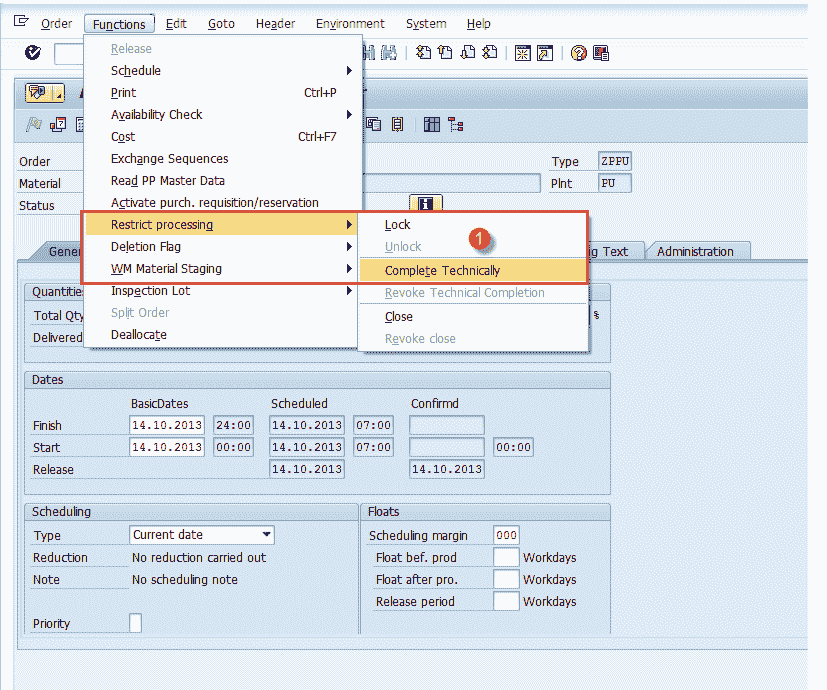

2.  系统将在状态中显示消息-TECO

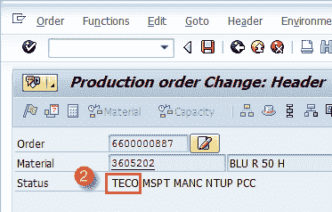

**故障排除**

*   BOM 和工艺路线必须在创建生产订单之前存在，否则它不会被复制到生产订单中，并且可能在确认过程中导致计划的成本更新和组件消耗方面的问题，从而影响组件的库存。

*   在确认订单之前必须下达生产订单，因为订单的下达状态允许进行确认。

*   如果在确认流程中的货物移动期间收到任何[会计](/accounting.html)错误，则请确保在物料主数据[会计](/accounting.html)视图中设置了正确的评估类别，或与财务团队联系。

*   确保更新物料的标准成本，以避免在生产订单确认期间发生任何与成本相关的错误，例如活动价格缺失等。

*   如果在确认过程中由于库存不足而导致某些货物移动失败，则应在组件入库后分别处理它们。