# SAP PP 报告教程：COOIS，MB52，CS15，CS12

> 原文： [https://www.guru99.com/reports-used-sap-pp.html](https://www.guru99.com/reports-used-sap-pp.html)

SAP 中有许多报告涉及主数据，生产订单和针对订单的货物移动。

*   它可以帮助用户轻松查看工厂的整体情况

*   通过 PP 报告，您可以查看特定时间段内有关物料的生产和消耗数据。 当前工厂库存也可以实时显示

*   您还可以查看要执行的目标订单数量，并通过标准 SAP 报告通过各种订单状态跟踪订单

在本教程中-您将学习，

*   [如何显示订单信息系统](#1)
*   [如何显示物料凭证清单](#2)
*   [如何显示多种物料的库存](#3)
*   [如何在 BOM 表](#4)中显示“使用位置清单”
*   [如何显示汇总的多级 BOM](#5)

## 如何显示订单信息系统

该订单信息系统显示订单列表以及数量，日期及其状态。 您还可以在订单上看到货物移动。

这为车间人员提供了计划和执行优先订单的视图，并且您可以根据计划查看实际交货数量。

**步骤 1）**从 SAP 轻松访问屏幕打开事务 COOIS

1.  在列表字段中选择选项“订单标题”

2.  标记生产订单复选框

3.  输入您的制造工厂代码。

4.  输入要为其获取生产订单的订单类型。如果您不输入任何订单类型，则报告将显示工厂所有订单类型的数据。

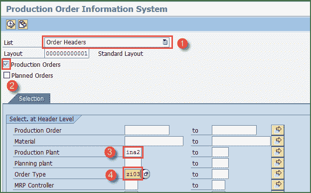

填写所有字段后，单击顶部的执行按钮或从键盘按 F8 转到下一个屏幕。

**步骤 2）**在此屏幕中，您将看到订单列表。

1.  显示带有物料代码和目标数量的订单清单。

2.  为计划者显示订单的基本开始日期和结束日期。

3.  显示订单状态，通过它们可以识别订单是已交付还是尚未在车间执行。

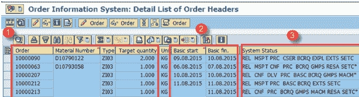

按返回按钮以退出报告。

**步骤 3）**在生产订单信息系统（COOIS）的初始屏幕中，您还可以查看针对该订单发生的货物移动。

1.  从列表字段中选择“凭证货物移动”

2.  检查“生产订单”的标志

3.  输入您的生产工厂代码

4.  输入要显示其已记录货物移动的生产订单类型。 如果您不输入任何订单类型，则报告将显示工厂所有订单类型的数据。

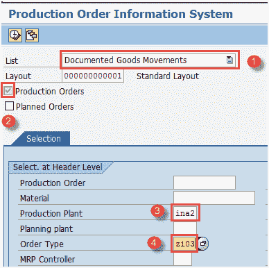

单击顶部的执行按钮或按键盘上的 F8 键运行报告。

运行报告时，它将打开另一个显示货物移动的屏幕。

**步骤 4）**在此屏幕中，显示记录的针对订单的货物移动。

1.  显示订单清单以及父物料及其组成物料。

2.  您可以看到针对订单发生的移动类型 261 和 101 以及批号。

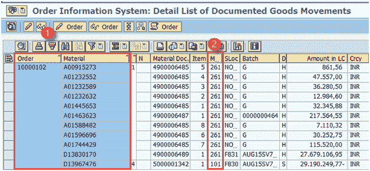

Press back button in order to exit from the report.

## 如何显示物料凭证清单

每当您进行任何类型的货物移动（例如收货，针对生产订单的发货）时，都会生成物料凭证。

我们可以查看物料文档清单，该清单指定了工厂数据的生产和消耗。

**步骤 1）**在 SAP 轻松访问屏幕中，打开事务 MB51。

1.  输入您的制造工厂代码。

2.  如果要查看所有物料的生产数据（收货），请输入移动类型 101。

3.  输入要显示其生产的过帐期间。

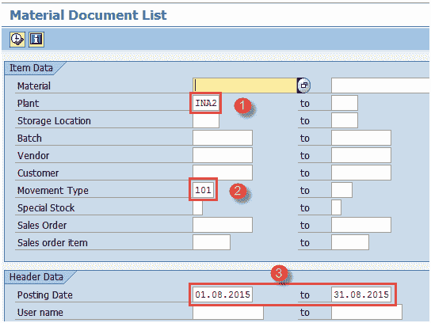

按顶部的执行按钮或按键盘上的 f8 移至下一个屏幕。

**步骤 2）**在此屏幕中，您将看到所有物料的生产数据。

1.  显示物料代码清单以及移动类型 101。

2.  显示移动量以及过帐日期。

按键盘上的 F3 键退出报告。现在，我们返回 SAP 轻松访问屏幕以运行其他事务。

**步骤 3）**在 SAP 轻松访问屏幕中，打开事务 MB51。

1.  输入您的制造工厂代码。

2.  输入移动类型 261 以查看所有物料的消耗数据（发货）。

3.  输入要显示其消耗量的过帐期间。

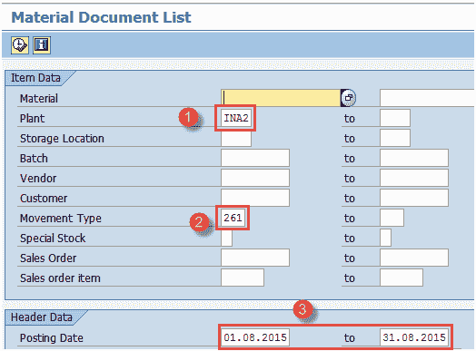

按顶部的执行按钮或按键盘上的 f8 移至下一个屏幕。

**步骤 2）**在此屏幕中，您将看到所有物料的消耗数据。

1.  显示物料代码清单以及移动类型 261。
2.  移动量和过账日期一起显示。

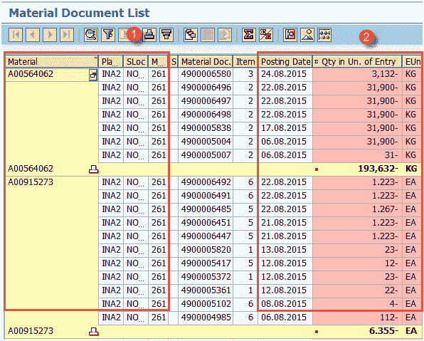

从键盘按 F3 退出报告。

## 如何显示多种物料的库存

完成所有货物移动后，它会更新物料库存。此报告中的实时库存可一次性使用。

**步骤 1）**在 SAP 轻松访问屏幕中，打开事务 MB52。

1.  输入单个物料代码或物料代码范围，或将其保留为空白以提取所有物料的报告。

2.  输入您的制造工厂代码。

3.  输入存储地点代码或将其保留为空白以在工厂级别提取所有存储地点的报告。

[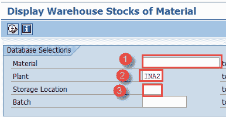 ](/images/SAP_PP/092815_0538_Reportsused9.png) 

从顶部按执行按钮或从键盘按 F8 移至下一个屏幕。

**步骤 2）**在此屏幕中，您将看到所有物料的库存。

1.  显示物料代码清单以及存储位置的库存数量和价值。

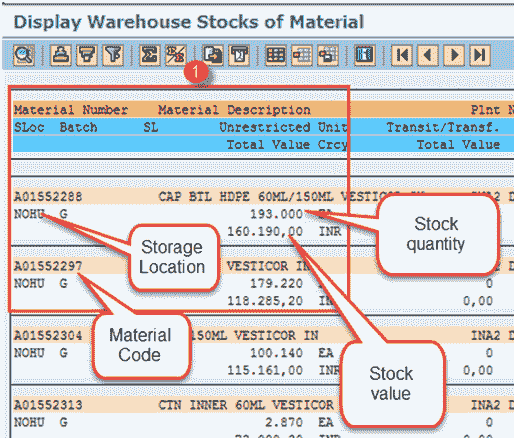

Press F3 from the keyboard to exit the report.

## 如何在 BOM 表中显示“使用位置清单”

此报告用于查找 BOM 表中是否存在组件。 通过此报告，您可以找到将零部件用作 BOM 表项目的父物料。

这基本上是反向 BOM 爆炸，这意味着可以通过组件子代码找到母材料代码。 例如，胎面等零部件被用作轮胎 BOM 表中的一项。

**步骤 1）**在 SAP 轻松访问屏幕中，打开事务 CS15。

1.  输入要查看其父物料的单一物料代码。

2.  标记“直接”复选框。

3.  在材料 BOM 中查找组件时，标记“材料 BOM”。

4.  按“下一步”按钮移至下一屏幕。

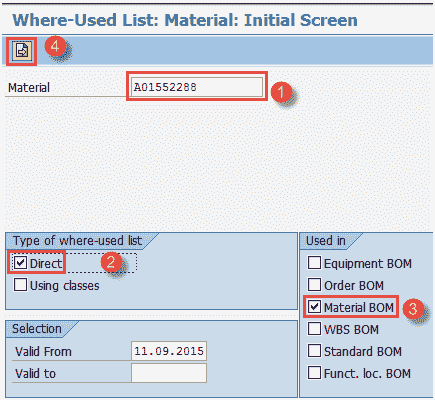

**步骤 2）**在此屏幕中，

1.  输入所需数量为“ 1”。

2.  输入您的制造工厂。

3.  标记“多级”表示您想查看该组件的所有较高 BOM 表级别。

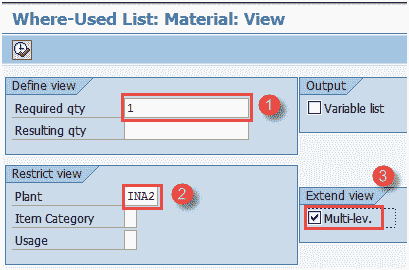

按顶部的执行按钮或按键盘上的 F8 移至下一个屏幕。

**步骤 3）**在此屏幕中，

1.  您可以看到此组件存在的 BOM 表的不同级别

2.  您可以看到组件所在的父材料。

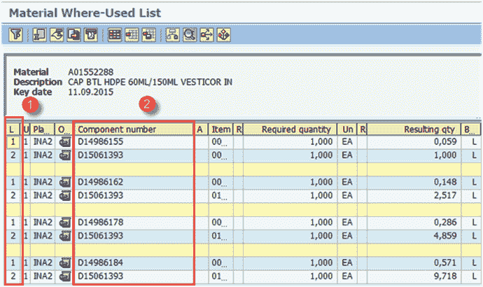

Press F3 from the keyboard to exit the report.

## 如何显示汇总的多层 BOM

此报告用于分解产品的多级 BOM。 使用此报告，您可以在一个屏幕中查看所有 BOM 级别的所有组件。

**步骤 1）**在 SAP 轻松访问屏幕中，打开事务 CS12。

1.  输入要查看其 BOM 表所有级别的组件列表的单一物料代码。

2.  输入您的制造厂代码

3.  输入 BOM 应用程序“ PP01”，这意味着您将爆炸生产 BOM。

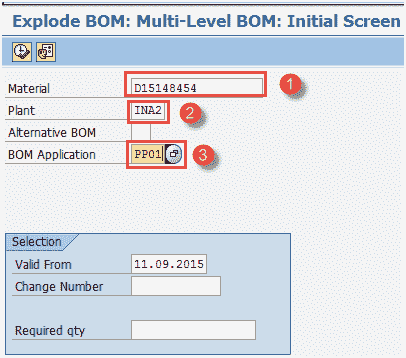

Press execute button from top or press F8 from the keyboard to move to next screen.

**Step 2)** In this screen,

1.  您将看到所有 BOM 爆炸级别的组件列表以及数量。

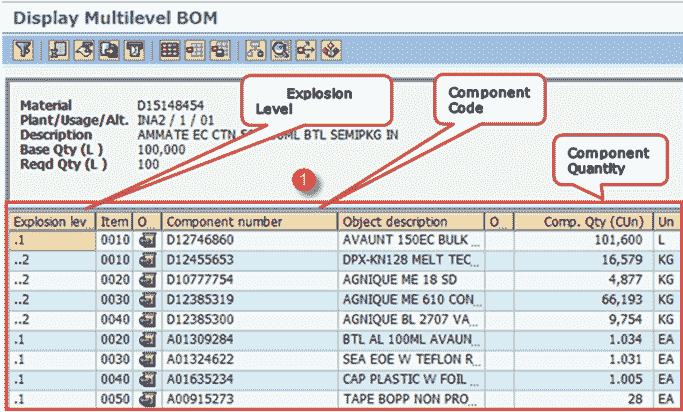

Press F3 from the keyboard to exit the report.

**故障排除**

*   如果无法执行任何报告，请确保选择标准正确，并且系统中存在要显示其报告的交易数据。

*   对于 BOM 表报表，确保物料主数据到位并且 BOM 表已存在于系统中，那么只有您才能在 SAP 中显示此类报表。

*   在查看 SAP 中的任何生产或消费报告之前，请确保您了解移动类型。