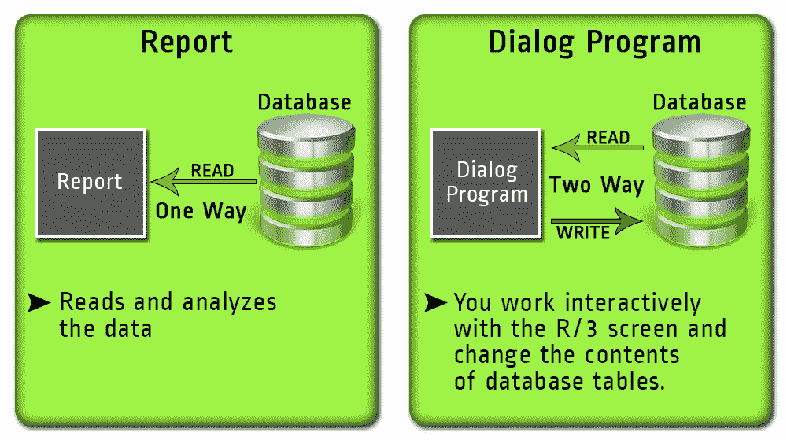
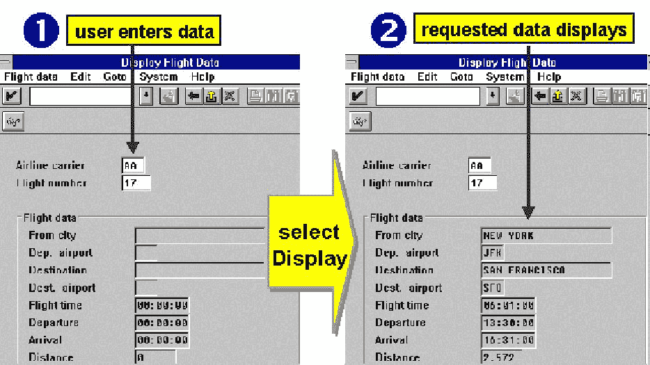
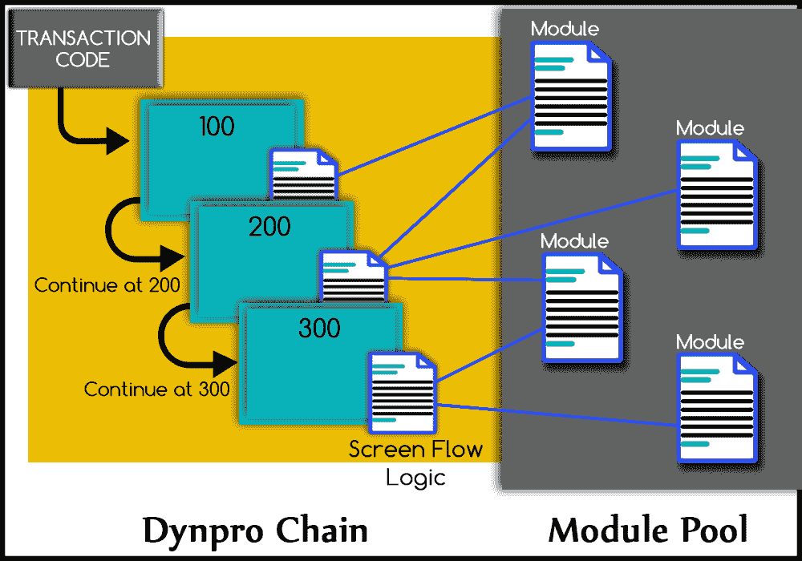
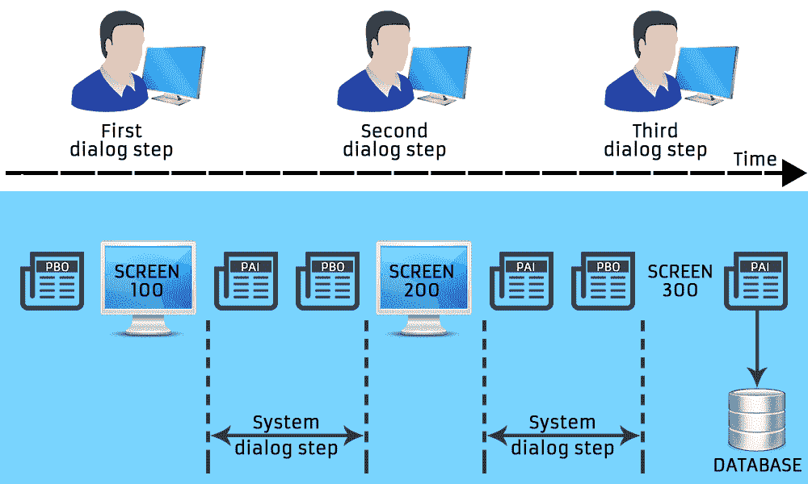

# 对话框编程教程：SAP ABAP 中的模块池

> 原文： [https://www.guru99.com/dialog-programming-tutorial.html](https://www.guru99.com/dialog-programming-tutorial.html)

SAP-ABAP 支持两种类型的程序-报告程序和对话程序。

如果 ABAP 程序需要用户输入，则使用对话框编程。

在本教程中，您将学习：

*   [报告程序和对话框程序之间的区别](#1)
*   [对话框编程](#2)中的示例事务处理
*   [对话程序](#3)的组件

A  user dialog is any form of interaction between the user and the program and could be any of the following

*   输入数据
*   选择菜单项
*   点击一个按钮
*   单击或双击一个条目

当我们需要在屏幕之间来回导航时，也会使用对话程序。

创建的对话程序的类型为'M'-模块池。 它们不能独立执行，必须附加到至少一个您在其中指定初始屏幕的交易代码。

## 报告程序和对话框程序之间的区别

***报告程序：***

报告是一种程序，通常在不更改数据库的情况下读取和分析数据库表中的数据。

***对话程序：***

对话程序可让您与系统交互工作并更改数据库表的内容。 每个对话程序都有一定的屏幕顺序，由系统依次处理。

## 对话框编程中的示例事务处理

## 对话程序的组件

与通常需要创建一个可以独立于其他对象执行的自治程序的报告不同，对话程序开发需要开发多个对象，而这些对象不能单独执行。 ***而是将所有对象按层次结构链接到主程序，并按照对话框主程序*** 规定的顺序执行。

对话程序的组件为：

**事务代码**

*   交易代码开始一个屏幕序列。
*   您可以在 ABAP 工作台的存储库浏览器中或使用事务 SE93 创建事务代码。
*   交易代码链接到 ABAP 程序和初始屏幕。
*   您可以使用 CALL SCREEN 语句从任何 ABAP 程序启动屏幕序列。

**屏幕**

*   SAP 系统中的每个对话框均由一个或多个屏幕控制。
*   您可以通过事务 SE51 在 ABAP 工作台中使用 Screen Painter 创建屏幕
*   每个屏幕都属于一个 ABAP 程序。
*   这些屏幕由“屏幕蒙版”或“布局”及其流程逻辑组成。 屏幕具有确定输入/输出字段和其他图形元素（如复选框和单选按钮）位置的布局。 流逻辑确定屏幕内的逻辑处理。

**GUI 状态**

*   每个屏幕都有一个 GUI 状态，它们是程序的独立组件。
*   它控制*菜单栏，标准工具栏，应用程序工具栏*，用户可以使用它们选择应用程序中的功能。
*   您可以使用 Menu Painter 在 ABAP 工作台中创建它们。

**ABAP 程序**

*   R / 3 系统中的每个屏幕和 GUI 状态都属于一个 ABAP 程序。
*   ABAP 程序包含由屏幕流逻辑调用的对话框模块，并且还处理来自 GUI 状态的用户输入。
*   使用屏幕的 ABAP 程序也称为对话框程序。
*   在模块池中（M 型程序）； 要调用的第一个处理块始终是对话框模块。 但是，您也可以在其他 ABAP 程序中使用屏幕，例如可执行程序或功能模块。 然后，第一个处理块被不同地调用； 例如，通过运行时环境或过程调用。 然后使用 CALL SCREEN 语句启动屏幕序列。

**屏幕流逻辑**

屏幕流逻辑主要分为四个部分。

*   输出之前处理（ **PBO** ）事件：在显示屏幕之前进行处理
*   输入后处理（ **PAI** ）事件：用户在屏幕上执行操作后处理
*   帮助请求中的处理（ **POH** ）：按下 F1 时处理
*   值请求处理（ **POV** ）：按下 F4 时处理

**Dynpro**

*   屏幕及其流逻辑一起称为 Dynpro（“动态程序”，因为屏幕流逻辑会影响程序流）
*   每个 dynpro 都只控制对话框程序的一个步骤。
*   属于程序的画面以**编号为**。 屏幕流序列可以是线性的也可以是循环的。 您甚至可以从一个屏幕链中调用另一个屏幕链，并在对其进行处理之后返回到原始屏幕链。 您也可以从 ABAP 程序的对话框模块中覆盖静态定义的下一个屏幕。

**ABAP 模块池**

*   在 PBO 或 PAI 事件中，Dynpro 会调用 ABAP 对话程序。 此类程序的集合称为 ABAP 模块池。
*   例如，在 PAI 事件中调用的模块用于检查用户输入并触发适当的对话框步骤，例如更新任务。
*   从**事务中调用的所有 dynpros 均指一个公共模块池。**

***对话程序的结构***

***对话程序*** 的处理流程

