# SAP 中的主数据是什么？ QS21，QP01，QS31，QDV1，QI01

> 原文： [https://www.guru99.com/master-data-sap-qm.html](https://www.guru99.com/master-data-sap-qm.html)

在 SAP 质量管理模块中以及对于其他 SAP 应用程序，我们需要维护与检验计划和检验批处理有关的数据。

在创建检验批并记录检验结果之前，应维护用于检验计划的基本 SAP 主数据。

在检查任何物料之前，应建立以下 SAP QM 主数据。

**主检验特性（MIC）**

需要主检验特性来描述材料的检验规格，例如长度，宽度，粘度等。

我们在工厂级别创建主检验特性，以简化检验计划活动并使之标准化。

它还有助于组织主检查特征，以避免重复创建 MIC。

这些特性可以在工艺路线，主配方，检查计划和维护任务列表中使用。 我们还可以为单个 MIC 创建不同的版本。

检验方法和目录可以附加到检验特性上。

以下是 SAP 中可用的主检查特征的类型。

**a）定量的**

定量特征用于记录定量检查的结果。

在执行结果记录时，可以将检查值直接输入这些类型的特征。 可以在主级别或创建检查计划时为每个检查特征定义特征规格限制，例如上限，下限和中心限制。

检验方法也可以附加到检验特性级别。

**b）定性**

定性特征用于记录属性检查的结果，例如“确定”或“不正确”。

可以使用代码组/目录类型 1 的选定集记录定性检查特征的结果。 可以将适当的检查方法附加到检查特性上。

**检验方法**

检查方法描述了执行检查的程序。

您可以将“检查方法”分配给主检查特征或直接分配给检查计划中的检查特征。

也可以在一个工厂中创建检查方法，并且可以使用检查方法的原始工厂在另一工厂的检查计划中使用该检查方法。

**采样程序**

抽样程序是确定检验批的样本量的程序。 可以在检查计划中使用。

采样过程可以是固定样本，百分比样本，100％或使用采样方案。 抽样方案是抽样计划的集合。

抽样计划根据特定的检验批数量定义样本大小，并定义确定是否接受样本以及如何拒绝样本的标准。

根据业务需求确定抽样大小。 例如，如果需要测试一批药品，则根据所生产药品的数量，计划进行检查的抽样。

**检验计划**

如果要捕获使用的质量结果，则必须定义检查计划，

*   例如，要定义检查方法，
    *   检验材料
    *   如何进行材料检查
    *   要检查的特征，工作中心和检查规范。

*   Inspection plans define how a quality inspection of one or multiple materials will be taken place. In the inspection plan, we define the

    检查操作的顺序和可用于检查主要检查特征的规格范围，用于计算检查样本量的抽样程序，用于检查 MIC 的检查方法等。

*   可以维护检查计划的“状态”和“使用情况”，以检查计划是活动的还是不活动的。 我们可以使用 SAP 系统生成的组编号（客户级别）和组计数器（工厂级别）来确定检验计划。 如果要检查的参数相同，可以将多种材料附加到一个计划中。

**质量信息记录**

为“物料－供应商关系”维护质量信息记录。 当特定供应商提供的产品质量受到损害时，它用于阻止物料通过某个供应商进行采购。

在此 SAP 主数据中，我们将维护供应商和物料组合的质量体系。

仅当物料主数据中的 QM 采购密钥处于活动状态时，此 SAP 主数据才成为强制性的。

创建报价或采购订单后，SAP 系统将检查是否需要 Q-info 记录并将其用于物料和供应商的组合。

进行检查以确定是否可以根据 Q-info 记录下达采购订单。

如果我们想使用源检验功能，这意味着需要维护质量信息记录，这意味着材料将在材料到达收货（GR）工厂之前进行检查。

该检查将完全基于 SAP 系统中针对物料-供应商-工厂组合创建的采购订单。 如果物料已通过源检验清除，则不会进行任何 GR（收货）检验。

Q 信息记录在检查受限的情况下也很有用。 这意味着，如果检查是从“ xyz”供应商处采购的，则应继续进行检查，但如果是由“ abc”供应商进行采购，则不应继续进行检查。

在本教程中，您将学习-

*   [如何创建主检验特征](#1)
*   [如何创建检查方法](#2)
*   [如何创建采样过程](#3)
*   [如何创建检验计划](#4)
*   [如何创建质量信息记录](#5)

## 如何创建主检验特征

**步骤 1）**从 SAP 轻松访问菜单中，打开事务代码 QS21

1.  输入工厂代码。

2.  输入需要创建的主检验特征码。

3.  输入密钥日期（从日期开始有效），这意味着 MIC 从该日期开始有效。

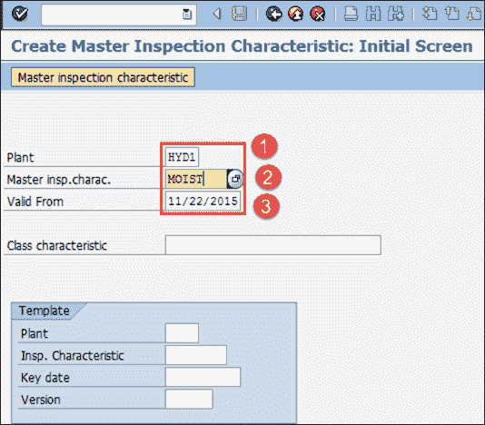

填写所有字段后，单击  或按 Enter 键进入下一个屏幕。

**步骤 2）**在此步骤中，我们将维护如下所示的主检验特性常规数据。

1.  如果我们要创建可以测量的定量特征，请勾选定量复选框。

2.  输入状态为“已发布”。

3.  输入“完全复制模型”，因为需要完全维护 MIC 数据。

4.  输入您选择的短文本。

5.  按下控制指示器按钮以维护其他重要数据，例如上下限，即可接受材料的规格范围。

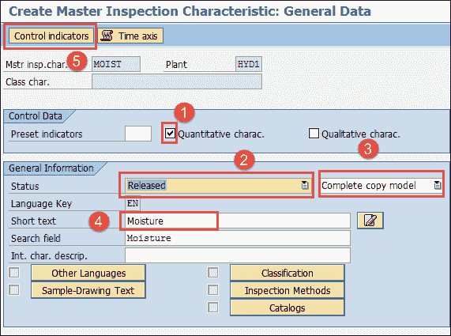

**步骤 3）**在此步骤中，按下控制指示器按钮后，将弹出小屏幕，在此我们将维护上下限数据。

1.  选中复选框“下限规格”。

2.  标记复选框以指定规格上限。

3.  标记用于采样过程的复选框，因为我们将为此 MIC 使用采样过程。

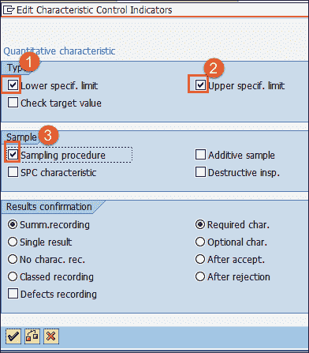

按 Enter 键进入下一个 SAP 屏幕。

**步骤 4）**在此步骤中，我们将维护绝对的上下限数据。

1.  输入 MIC 的小数位数和测量单位

2.  输入规格下限为 4

3.  输入规格上限 4.5。

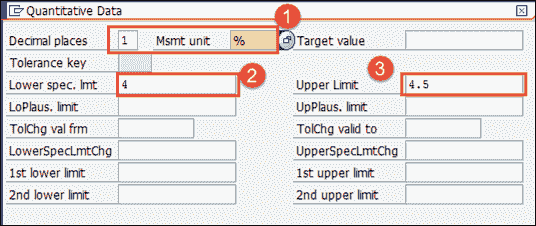

按 Enter 键进入初始 SAP 屏幕并保存数据。 您将看到消息为  。

## 如何创建检查方法

**步骤 1）**从 SAP 轻松访问菜单中，打开事务代码 QS31

1.  输入工厂代码。

2.  输入需要创建的检验方法代码。

3.  输入自该日期起的有效日期，这意味着检查方法将从该日期起有效。

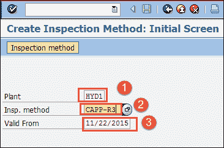

按 Enter 键转到下一个 SAP QM 屏幕。

**步骤 2）**在此 SAP QM 屏幕中，

1.  输入状态为“已发布”。

2.  输入检验方法的简短文本，并在搜索字段中搜索检验方法。

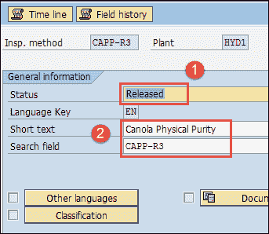

按保存按钮保存检查方法。

## 如何创建采样过程

**步骤 1）**在 SAP 轻松访问屏幕中打开事务 QDV1

1.  输入我们需要创建的采样过程代码。

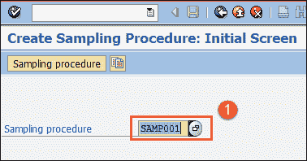

**步骤 2）**填写所有字段后，从顶部菜单中单击（右标记符号）  符号以转到下一个 SAP 屏幕。

1.  选择抽样类型为“固定样本”，但您也可以选择 100％检查或抽样方案。

2.  选择评估模式“属性检查非确认单位”，该模式定义了接受和拒绝特征的规则。

3.  按下一步按钮转到下一个 SAP 屏幕。

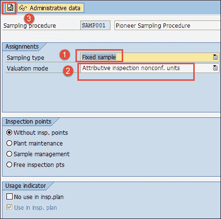

**步骤 3）**在此 SAP 屏幕中，

1.  按下“样品”按钮，这将打开一个小的弹出屏幕以定义样品量。

2.  将样本大小定义为“ 5”。

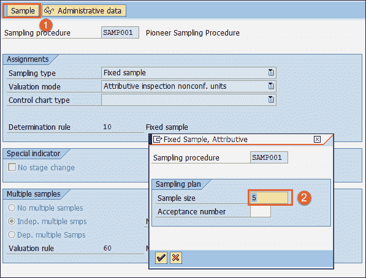

按保存按钮保存采样程序。

## 如何创建检验计划

**步骤 1）**在 SAP 轻松访问屏幕中打开事务 QP01

1.  输入我们需要创建检验计划的物料代码。

2.  输入工厂代码。

3.  输入检验计划有效的关键日期（有效期自）。

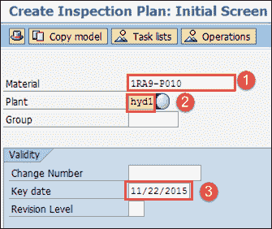

按键盘上的 Enter 键进入下一个屏幕。

**步骤 2）**在此 SAP 屏幕中，我们将维护标题数据

1.  输入用法为“ 5”，表示检验计划对收货有效，状态为“ 4”，表示检验计划已下达。

2.  输入批量大小为“ 99999999”，表示检验计划对 99999999 的检验批数量有效。

3.  按下“操作”按钮，移至下一个屏幕。

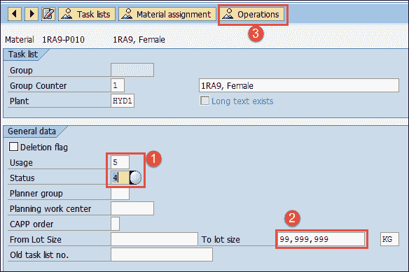

**步骤 3）**在此 SAP 屏幕中，我们将维护将维护检查特征的操作数据。

1.  输入质量实验室工作中心。

2.  输入控制键“ QM01”，表示该操作用于质量检查。

3.  按“检查特征”按钮移至下一个 SAP 屏幕。

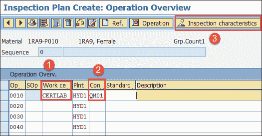

**步骤 4）**在此 SAP 屏幕中，我们将维护操作的检查特征

1.  输入主检查特征名称“ MOIST”。

2.  输入检验方法。

3.  输入采样以确定样品的程序。

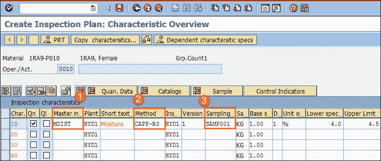

输入所有字段后，将自动填充下限和上限。

按保存按钮保存物料的检验计划。

## 如何创建质量信息记录

**步骤 1）**在 SAP 轻松访问屏幕中打开事务 QI01

1.  输入创建质量信息记录所需的物料代码。

2.  输入供应商代码。

3.  输入工厂代码。

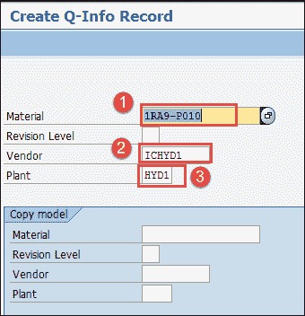

按键盘上的 Enter 键进入下一个屏幕。

**步骤 2）**在此 SAP 屏幕中，我们将维护发布日期

1.  在此日期之前输入发布，这意味着可以在发布日期之前从供应商订购物料。

2.  如果您要阻止从该特定供应商处订购此物料，请输入“阻止功能”。

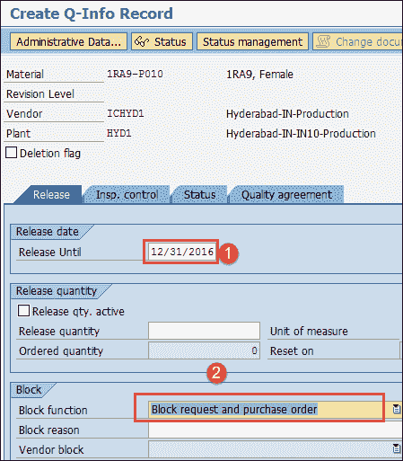

按 Insp。 Control-Tab 移至下一个屏幕。

**步骤 3）**在此 SAP 屏幕中，我们将维护检查控制数据。

1.  如果您不想检查该特定供应商的物料，则将检查控制输入为“不检查”。

2.  如果要使用源检查，则标记源检查复选框，并将源检查类型输入为“ 01”，否则将其保留为空白。

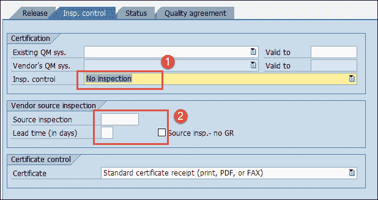

按保存按钮保存质量信息记录。

**故障排除**

*   在创建检验计划和质量信息记录之前，SAP 系统中应提供主检验特性，抽样程序，检验方法，物料主数据，供应商主数据。