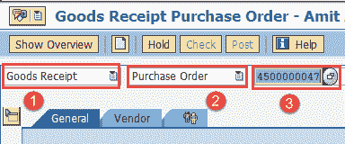
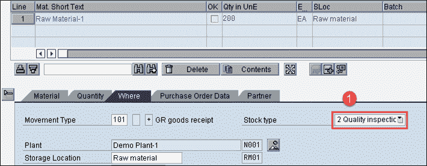
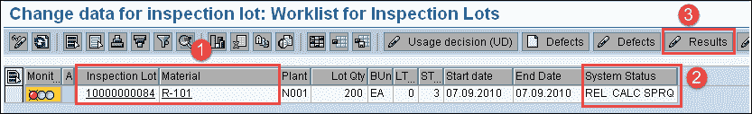
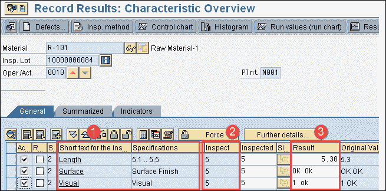
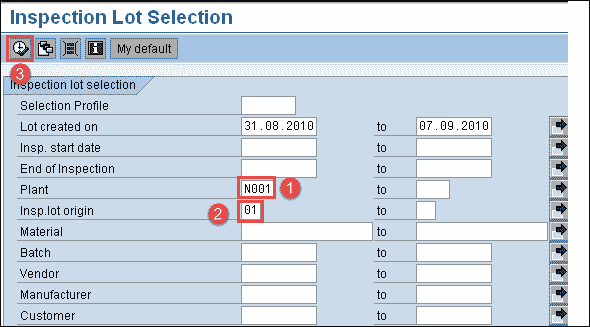
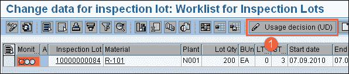
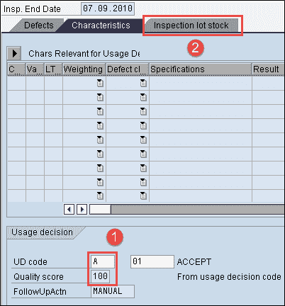
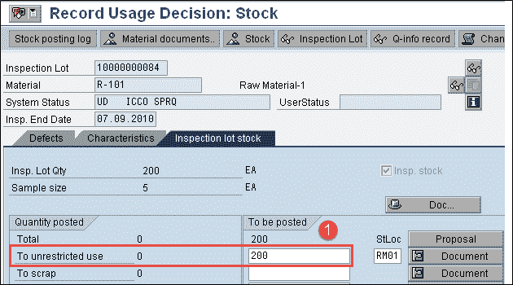

# SAP QM 进/原材料检查程序：MIGO，QA32

> 原文： [https://www.guru99.com/incoming-inspection-material-sap-qm.html](https://www.guru99.com/incoming-inspection-material-sap-qm.html)

根据 SAP 中的采购订单，收货检验通常称为**原材料检验**。 通过在 Material Master 中维护 SAP QM 数据，将在原材料中激活此检查。

为了确定基于业务流程的检查触发，在 SAP 中维护检查类型。

收货检验在 SAP 系统中要遵循以下步骤，例如

*   **根据采购订单在收货中创建检验批**

采购过程中会在采购过程中产生良好的收货。 收货通常是根据采购订单或计划协议达成的。

针对每个 GR 订单项，SAP 系统将自动生成一个检验批，其中包含采购的详细信息，例如供应商，采购日期，检验规格和抽样明细。

*   **检验批清单**

要列出检验批，您可以使用事务代码 QA33。 搜索条件可以是

1.  材料
2.  检验批创建日期
3.  检验日期
4.  厂
5.  检验类型
6.  批量
7.  供应商

*   **Attaching inspection plan and release the inspection lot**

    如果只有一个任务列表类型为'05'的检验计划（收货检验）可用于处于已下达状态的物料，则 SAP 系统自动将计划分配给该物料。 如果针对该材料存在多个检验计划，我们必须

1.  为物料分配适当的检验计划
2.  计算样本
3.  释放批次以进行检查处理。

*   **Sample calculation**

    如果抽样程序附有检验计划/材料/特征，则 SAP 系统将自动计算样本，否则将手动转到批次并计算样本。

*   **Result recording**

    结果记录将针对收货时创建的检验批进行。

    所有特性将显示在 SAP 记录屏幕中以供输入。 SAP 系统将进行 f4 搜索以获取用于属性检查的代码值。

    对于定量数据，基于公差极限（上下限），SAP 系统将提出评估。 在这两种情况下，检查员都可以接受或拒绝建议（手动）。

*   **Usage Decision**

    当我们做出使用决策时，您将根据检查结果决定是否接受检验批中的货物。一旦做出使用决策，检查便完成了。

*   **Stock posting**

    如果在使用决策时已进行库存管理，我们可以将“优质库存”转移到相关库存类别中，例如，

1.  不受限制的使用
2.  受阻
3.  废料
4.  材质不同
5.  样品
6.  返回供应商

## 如何过帐采购订单中的收货

在此交易中，我们将针对采购订单过帐收货，这将触发检验批。

**步骤 1）**从 SAP 轻松访问菜单中，打开事务代码 MIGO，然后输入以下详细信息。

1.  从下拉框中选择收货。

2.  从下拉框中选择采购订单。

3.  输入采购订单编号。

填写所有字段后，单击  或按 Enter 键转到下一个 SAP 屏幕。

**步骤 2）**在此步骤中，我们将根据采购订单过帐收货。

1.  您可以看到库存类型，因为在对物料进行质量检查时会自动生成“质量检查”。

通过单击保存按钮保存 SAP 屏幕后，物料凭证将过帐。

在针对采购订单过帐收货的物料凭证后，下一步是质量结果记录。

## 如何进行结果记录

**步骤 1）**从 SAP Easy 访问菜单中，打开事务代码 QA32。

在这里，我们将检查材料并根据检查规范记录结果。

1.  输入工厂代码。

2.  输入检验批原点“ 01”，这是用于原材料检验的标准 SAP 检验类型。

3.  按执行以显示检验批清单。

**步骤 2）**在此 SAP 屏幕中，

1.  您可以看到先前步骤中生成的检验批以及物料

2.  检查 SAP 系统状态为 REL CALC SPRQ，这表明检验计划已复制到检验批中，已计算的样本量以及所需的库存从合格库存过账到非限制库存或任何其他库存类别。

3.  按下“结果”按钮，然后移至下一个 SAP 屏幕以进行结果记录。

**步骤 3）**在此 SAP 屏幕中，您将看到检验批的结果

1.  您可以看到“主检验”特征的简短文本以及诸如长度，表面，外观等规格。

2.  如果在检查计划中指定了抽样程序，则可以看到系统自动计算的样本数量为 5。

3.  根据检查规格输入您的实际结果。

按保存按钮保存检查结果。

## 如何进行使用决策

**步骤 1）**在 SAP Easy 访问屏幕中，打开与我们在上一步中完成结果记录的事务 QA32。

在这里，我们将对检验批进行使用决策，确定该批是接受还是拒绝，并将库存移出质量检验。

1.  在此 SAP 屏幕中输入工厂代码。

2.  输入检验批原点“ 01”，这是用于原材料检验的标准 SAP 检验类型。

3.  按下执行按钮以显示检验批清单以及批号。

**Step 2)** In this SAP screen,

1.  按使用决策按钮移动到下一个 SAP 屏幕

**步骤 3）**在此 SAP 屏幕中，

1.  将 UD 代码选择为“ A”以接受该批次，基于使用决策代码，您可以看到质量得分为“ 100”。

2.  选择检验批库存 TAB 在下一个 SAP 屏幕中进行库存过账。

**步骤 4）**在此 SAP 屏幕中，我们将从优质库存到任何其他库存类别进行库存过账。

1.  如果质量结果在预期的规格范围内，则可以将 200 的质量库存移动到非限制库存（即用库存），这将在后台达到移动类型 321。 （移动类型 321 表示质量库存到非限制库存的移动）。

按保存按钮保存使用决策。

因此，如上所述，从质量检验到无限制库存的库存移动表明原料检查已完成。

在下一个 SAP QM 教程中，我们将看到如何执行“过程中检查”。

**故障排除**

*   检验计划必须复制到检验批中，否则我们将无法进行结果记录和使用决策。
*   如果在检验批之后创建检验计划，则检验批将获得 CRTD 状态。 我们需要手动分配检查计划，以将状态从已创建（CRTD）更改为已发布（REL）。 检验批下达后，我们可以执行结果记录和使用决策。
*   必须在检验计划中指定抽样程序以进行任何结果记录和使用决策，否则我们需要手动计算检验批中的样本。