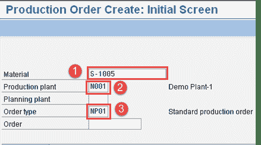
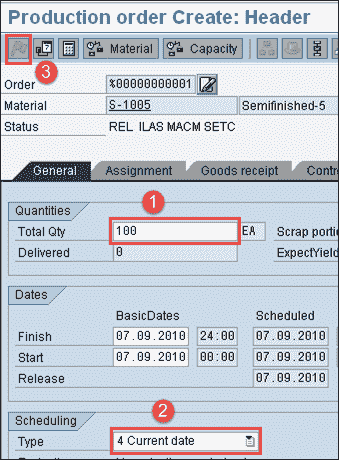
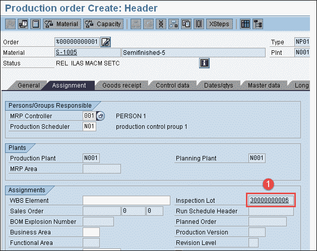
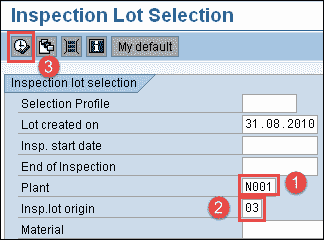
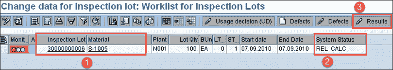
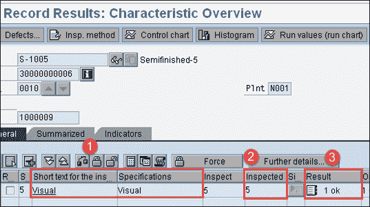
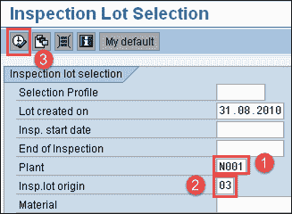
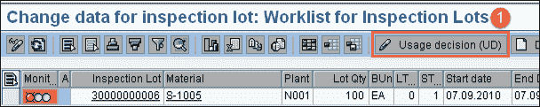
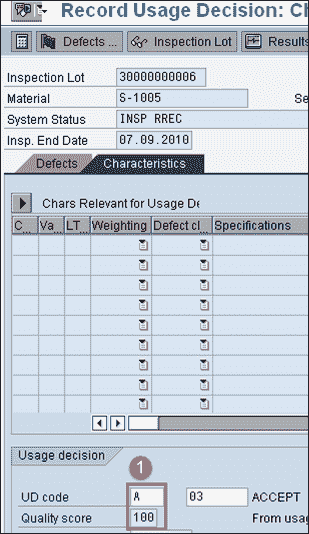

# 流程中检查 SAP QM：CO01 & QA32

> 原文： [https://www.guru99.com/inprocess-inspection-sap-qm.html](https://www.guru99.com/inprocess-inspection-sap-qm.html)

过程中检查（基于时间）用于记录结果，以便在生产过程中对中间产品和最终产品进行过程中质量检查。

例如，每两个小时检查一次，每个班次检查一次，等等。我们将讨论这一进展。

“过程中检验”批次将具有指向 SAP 系统中生产订单的参考/链接。

路由操作将包含在过程中检查期间需要检查的检查特征。

生产订单下达时将生成检验批。 进行中检查的检查类型为“ 03”。

**注意**：这种类型的检查将不会控制库存，但会控制生产过程。

过程中检查具有以下过程步骤，例如

*   **在流程订单发布中创建检验批**

生产订单下达时，将自动在 SAP 系统中创建检验批。

*   **检验批清单**

要列出检验批，您可以使用事务代码 QA33。 搜索条件可以是

1.  材料
2.  检验批创建日期
3.  检验日期
4.  厂
5.  检验类型 03

*   **将任务清单分配给检验批**

任务清单将从物料的工艺路线中自动分配。

*   **样本计算**

如果在主配方的质量操作中附加了抽样程序的特征，则 SAP SAP 系统将在批次创建/工厂分配期间自动计算样品（如果有多个物料计划）。

*   **结果记录**

结果记录将针对根据生产订单创建的检验批进行。

所有特性将显示在 SAP 记录屏幕中以供输入。 SAP 系统将进行 f4 搜索以获取用于属性检查的代码值。

对于定量数据，基于公差极限（上下限），SAP 系统将提出评估。 在这两种情况下，检查员都可以接受或拒绝建议（手动）。

*   **使用决策**

当我们做出使用决策时，您将根据检查结果决定是接受还是拒绝检验批中的货物。 做出使用决策后，检查便完成了。 库存过帐仅限于过程中检查。

## 如何创建和下达生产订单

在此 SAP 事务中，我们将创建并下达生产订单，这将触发 SAP 系统中的质量检验批。

**步骤 1）**从 SAP 轻松访问菜单中，打开事务代码 CO01，然后输入以下详细信息。

1.  输入需要为其创建生产订单的物料代码。

2.  在 SAP 屏幕中输入生产工厂。

3.  输入您的生产订单类型。

填写所有字段后，单击  或按 Enter 键转到下一个 SAP 屏幕。

**步骤 2）**在下一个 SAP 屏幕中，输入以下详细信息。

1.  在 SAP 屏幕中输入生产数量。

2.  从下拉框中选择“当前日期”。

3.  按“下达”按钮下达订单。

现在，我们将通过单击“任务”选项卡检查是否已生成检验批并将其移至下一个 SAP 屏幕。

**步骤 3）**在此 SAP 屏幕中，

1.  您可以看到在下达生产订单时触发的检验批。

检查检验批后，单击保存按钮保存订单。

## 如何进行结果记录

**步骤 1）**从 SAP Easy 访问菜单中，打开事务代码 QA32。

在这里，我们将进行材料的过程检查，并根据检查规范记录结果。

1.  在 SAP 屏幕中输入工厂代码。

2.  输入检验批原点“ 03”，这是用于过程中检验的标准 SAP 检验类型。

3.  按执行以显示检验批清单。

**步骤 2）**在此 SAP 屏幕中，

1.  您可以看到先前步骤中生成的检验批以及物料

2.  将 SAP 系统状态检查为 REL CALC，这表明检验规范已复制到检验批中，并且已计算出样本量。 我们无法在此处看到 SPRQ 状态（库存过帐），因为将质量库存转移到任何非限制或其他库存类别以进行过程检查不适用/不需要。

3.  按下“结果”按钮，然后移至下一个 SAP 屏幕以进行结果记录。

**步骤 3）**在此 SAP 屏幕中，您将看到生成检验批的结果。

1.  您可以看到定性的 Master Inspection 特性的简短文本，例如“ Visual”。

2.  如果在检查计划中指定了抽样程序，则可以看到 SAP 系统自动计算的样本量“ 5”。

3.  根据检验规范手动输入实际结果。

按保存按钮保存检查结果。

## 如何进行使用决策

**步骤 1）**在 SAP Easy 访问屏幕中，打开与我们在上一步中完成结果记录的事务 QA32。

在这里，我们将对检验批进行使用决策，并决定是否接受或拒绝检验批。

在 SAP 屏幕中执行以下步骤，

1.  输入工厂代码。

2.  输入检验批原点作为“ 03”，这是用于过程检验的标准 SAP 检验类型。

3.  按下执行按钮以显示检验批清单以及批号。

**Step 2)** In this SAP screen,

1.  按使用决策按钮移至下一个屏幕

**步骤 3）**在此 SAP 屏幕中，

1.  将 UD 代码选择为“ A”以接受该批次，基于使用决策代码，您可以看到质量得分为“ 100”。 您可以看到没有“检验批库存”选项卡可以进行任何库存过账，就像我们在原材料检验中看到的那样。

按保存按钮保存使用决策，从而完成了过程检查。

在下一个 SAP QM 教程中，我们将了解如何在生产后执行最终检查。

**故障排除**

*   路由数据中的检验特征必须复制到检验批中，否则，我们将无法进行结果记录和使用决策。
*   如果在检验批之后的工艺路线中添加了检验特性，则检验批将获得 CRTD 状态。 在这种情况下，我们需要手动分配检查规范以将状态从已创建（CRTD）更改为已发布（REL）。 检验批下达后，我们可以执行结果记录和使用决策。
*   必须在检查计划中指定抽样程序，以便在手动确定使用决策时记录所有结果。 我们需要在检验批中计算样本。